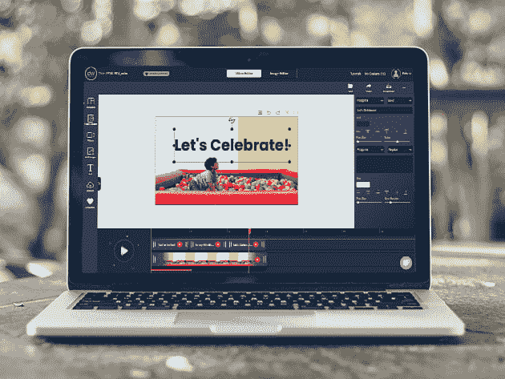
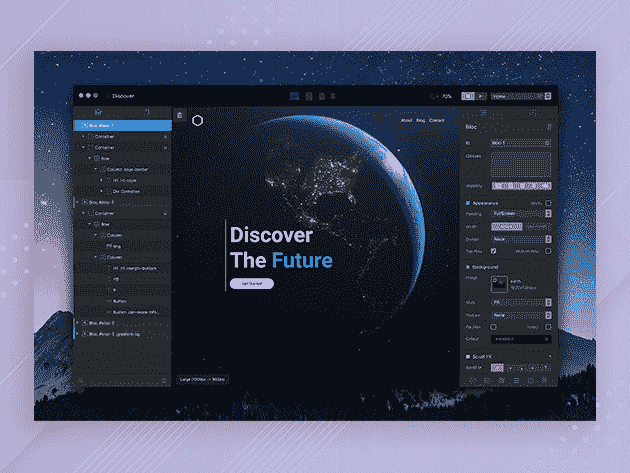
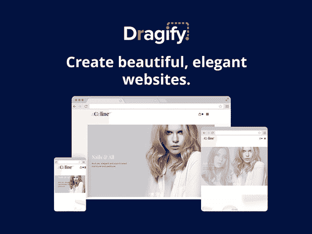
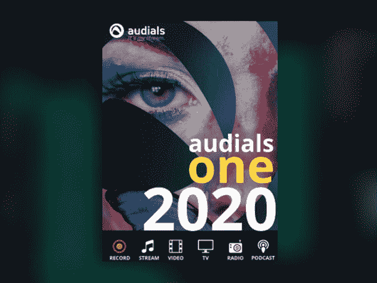
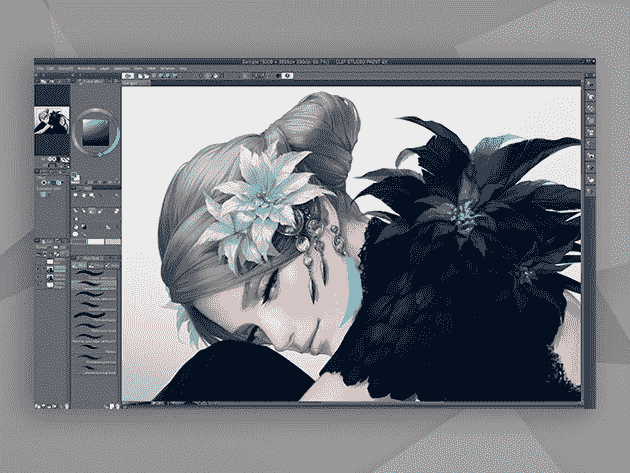

# 在预算范围内提升品牌形象的 10 个简单方法

> 原文：<https://www.xda-developers.com/10-easy-ways-to-boost-your-brand-image-on-a-budget/>

对任何企业来说，发展一个强大的品牌都很重要。你展示公司的方式会影响人们如何看待你的价值，甚至你的能力。支付这方面的专业帮助超出了许多初创公司和自由职业者的预算。但是，有了 XDA 开发者仓库的这些工具，你可以在预算内提升你的品牌形象。

## **Designs.ai Logomaker 高级计划**

用 [商标师](https://depot.xda-developers.com/sales/create-your-next-premium-logo-with-ease-with-logomaker?utm_source=xda-developers.com&utm_medium=referral&utm_campaign=create-your-next-premium-logo-with-ease-with-logomaker&utm_term=scsf-360948&utm_content=a0x1P000004N4fT&scsonar=1) 只需两分钟就能打造出一个惊艳的新品牌。你只需输入你的公司名称，选择你的颜色和字体。在那里，您可以下载各种格式的徽标。 [现在订购 18.99 美元](https://depot.xda-developers.com/sales/create-your-next-premium-logo-with-ease-with-logomaker?utm_source=xda-developers.com&utm_medium=referral&utm_campaign=create-your-next-premium-logo-with-ease-with-logomaker&utm_term=scsf-360948&utm_content=a0x1P000004N4fT&scsonar=1) 即可跳上超值计划，价值 99 美元。

## **我的全新 Logo:自动 Logo 生成器**

****

遵循顶级品牌机构开发的设计原则，该平台使用人工智能为您的品牌创建独特的标志。您可以自定义所提供的任何选项， [我的全新 Logo](https://depot.xda-developers.com/sales/my-brand-new-logo-automatic-logo-generator?utm_source=xda-developers.com&utm_medium=referral&utm_campaign=my-brand-new-logo-automatic-logo-generator&utm_term=scsf-372023&utm_content=a0x1P000004N4fT&scsonar=1) 提供完全商业版权。价值 12500 美元，终身访问现在 [只要 39.99 美元](https://depot.xda-developers.com/sales/my-brand-new-logo-automatic-logo-generator?utm_source=xda-developers.com&utm_medium=referral&utm_campaign=my-brand-new-logo-automatic-logo-generator&utm_term=scsf-372023&utm_content=a0x1P000004N4fT&scsonar=1) 。

## **设计向导:股票视频捆绑**

视频是一个强大的营销平台， [设计向导](https://depot.xda-developers.com/sales/design-wizard-stock-video-bundle?utm_source=xda-developers.com&utm_medium=referral&utm_campaign=design-wizard-stock-video-bundle&utm_term=scsf-372024&utm_content=a0x1P000004N4fT&scsonar=1) 让你进入一个庞大的高清库存剪辑库。选择包括光滑的动画和真实世界的镜头，您可以下载并在任何项目中使用。 [现在订购 49 美元](https://depot.xda-developers.com/sales/design-wizard-stock-video-bundle?utm_source=xda-developers.com&utm_medium=referral&utm_campaign=design-wizard-stock-video-bundle&utm_term=scsf-372024&utm_content=a0x1P000004N4fT&scsonar=1) 即可获得 50 个高清视频积分，价值 999.50 美元。

## **PixTeller PRO 在线编辑:1 年订阅**

****

从社交媒体帖子到博客标题，[pix teller](https://depot.xda-developers.com/sales/pixteller-pro-1-yr-subscription-2?utm_source=xda-developers.com&utm_medium=referral&utm_campaign=pixteller-pro-1-yr-subscription-2&utm_term=scsf-372025&utm_content=a0x1P000004N4fT&scsonar=1)帮你用最少的努力创造视觉内容。作为专业用户，您可以在一个易于使用的编辑器中访问 134，000 个模板、150 万张照片和 100，000 个形状。正常售价为 108 美元，一年期订阅费为 [现在仅需 19.99 美元](https://depot.xda-developers.com/sales/pixteller-pro-1-yr-subscription-2?utm_source=xda-developers.com&utm_medium=referral&utm_campaign=pixteller-pro-1-yr-subscription-2&utm_term=scsf-372025&utm_content=a0x1P000004N4fT&scsonar=1) 。

## **Blocs 3:Mac 网站构建器**

****

要建立一个品牌，你需要强大的网络影响力。 [Blocs 3](https://depot.xda-developers.com/sales/blocs-3?utm_source=xda-developers.com&utm_medium=referral&utm_campaign=blocs-3&utm_term=scsf-372026&utm_content=a0x1P000004N4fT&scsonar=1) 让你不用编码就能创建一个漂亮的响应式站点。该应用程序结合了简单的所见即所得控件和强大的功能，包括动画和 CMS 支持。正常售价 99.99 美元的 app[现在 39.99 美元](https://depot.xda-developers.com/sales/blocs-3?utm_source=xda-developers.com&utm_medium=referral&utm_campaign=blocs-3&utm_term=scsf-372026&utm_content=a0x1P000004N4fT&scsonar=1) 。

## **Dragify 网站建设者:1 年订阅**

****

上述选项的替代选项是。这个在线平台提供了一系列搜索优化模板，以及自定义字体和有用的集成。还提供托管，SSL 和无限流量。一年的服务价值 72 美元，但你现在可以花 29.99 美元 注册 [。](https://depot.xda-developers.com/sales/dragify-starter-plan?utm_source=xda-developers.com&utm_medium=referral&utm_campaign=dragify-starter-plan&utm_term=scsf-372027&utm_content=a0x1P000004N4fT&scsonar=1)

## **现代数字文案&营销剧本捆绑**

****

如果你要推销产品或服务，创造一个坚实的卖点是非常重要的。通过 55 个小时的培训， [这一捆](https://depot.xda-developers.com/sales/the-modern-digital-copywriting-and-marketing-playbook-bundle?utm_source=xda-developers.com&utm_medium=referral&utm_campaign=the-modern-digital-copywriting-and-marketing-playbook-bundle&utm_term=scsf-372028&utm_content=a0x1P000004N4fT&scsonar=1) 向你展示了如何单单用文字来勾住潜在客户。总共价值 2000 美元，课程有 [现在只需 35 美元](https://depot.xda-developers.com/sales/the-modern-digital-copywriting-and-marketing-playbook-bundle?utm_source=xda-developers.com&utm_medium=referral&utm_campaign=the-modern-digital-copywriting-and-marketing-playbook-bundle&utm_term=scsf-372028&utm_content=a0x1P000004N4fT&scsonar=1) 。

## **audiels One 2020:Windows 音频录制软件**

****

当有人在网上提到你的品牌时，你可能会想捕捉这一瞬间。[Audials One 2020](https://depot.xda-developers.com/sales/audials-one-2020?utm_source=xda-developers.com&utm_medium=referral&utm_campaign=audials-one-2020&utm_term=scsf-372029&utm_content=a0x1P000004N4fT&scsonar=1)帮助您录制几乎任何来源的音频，包括电视和流媒体网站。该软件目前全价 66 折[19.99 美元](https://depot.xda-developers.com/sales/audials-one-2020?utm_source=xda-developers.com&utm_medium=referral&utm_campaign=audials-one-2020&utm_term=scsf-372029&utm_content=a0x1P000004N4fT&scsonar=1) 。

## **创意包 Ft。剪辑工作室出道**

****

想要用独特的视觉效果让你的品牌脱颖而出吗？ [创意捆绑](https://depot.xda-developers.com/sales/the-creativity-bundle-ft-clip-studio-debut?utm_source=xda-developers.com&utm_medium=referral&utm_campaign=the-creativity-bundle-ft-clip-studio-debut&utm_term=scsf-372031&utm_content=a0x1P000004N4fT&scsonar=1) 可以帮忙。它包括最受欢迎的数字艺术应用程序之一，加上有用的资产和两个小时的世界级培训。该捆绑包价值 179.95 美元，但您现在只需 25 美元 就可以获得 [。](https://depot.xda-developers.com/sales/the-creativity-bundle-ft-clip-studio-debut?utm_source=xda-developers.com&utm_medium=referral&utm_campaign=the-creativity-bundle-ft-clip-studio-debut&utm_term=scsf-372031&utm_content=a0x1P000004N4fT&scsonar=1)

## **超级矢量器 2:终身许可**

****

如果您的品牌资产存储为常规图像文件，您可能需要将其转换为高分辨率显示和打印。 [超级矢量器 2](https://depot.xda-developers.com/sales/super-vectorizer-2-lifetime-license?utm_source=xda-developers.com&utm_medium=referral&utm_campaign=super-vectorizer-2-lifetime-license&utm_term=scsf-372032&utm_content=a0x1P000004N4fT&scsonar=1) 使用任何人都可以使用的简单跟踪工具，使过程变得简单。正常售价 60 美元，该应用程序是 [目前在 Mac 上售价 19 美元](https://depot.xda-developers.com/sales/super-vectorizer-2-lifetime-license?utm_source=xda-developers.com&utm_medium=referral&utm_campaign=super-vectorizer-2-lifetime-license&utm_term=scsf-372032&utm_content=a0x1P000004N4fT&scsonar=1) 。

*价格随时变化*