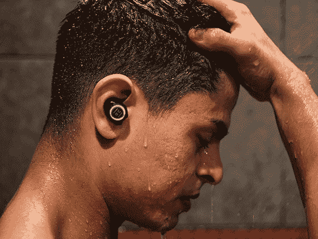
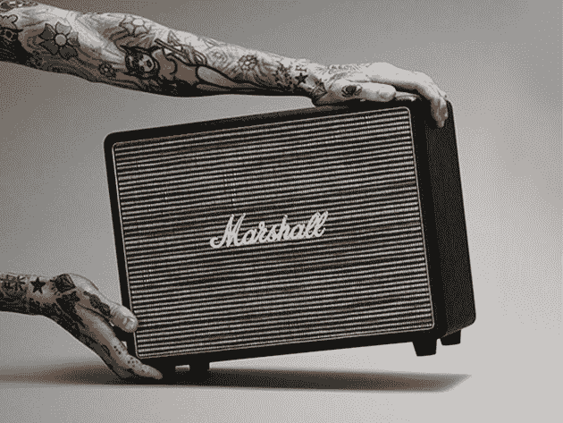
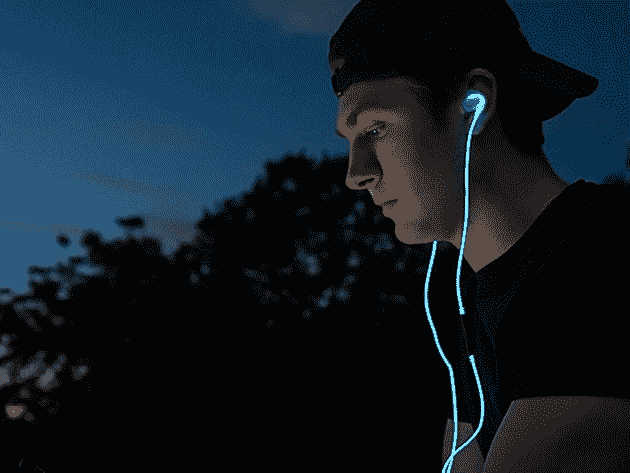

# 10 种基本的音频升级产品现在就可以上市

> 原文：<https://www.xda-developers.com/10-essential-audio-upgrades-you-can-get-on-sale-now/>

有了充足的空闲时间，我们中的许多人比平时更喜欢音乐和播客。如果你想改善你的听觉体验，现在可能是升级你的扬声器或耳机的好时机。以下是 XDA 开发人员仓库的十个音频设备大优惠，现在的建议零售价高达 75%。

## **1) Skullcandy Jib 无线耳塞**

Skullcandy的这些 [时尚无线耳塞提供 6 小时的电池续航时间，非常适合在家锻炼和在旅途中听音乐。它们还有一个麦克风，可以免提通话，音乐控制可以帮助你毫不费力地切换曲目。平时 29.99 美元，现在](https://depot.xda-developers.com/sales/skullcandy-jib-wireless-bt-earbuds-black?utm_source=xda-developers.com&utm_medium=referral&utm_campaign=skullcandy-jib-wireless-bt-earbuds-black&utm_term=scsf-390767&utm_content=a0x1P000004XoMpQAK&scsonar=1) [56 折 12.99 美元](https://depot.xda-developers.com/sales/skullcandy-jib-wireless-bt-earbuds-black?utm_source=xda-developers.com&utm_medium=referral&utm_campaign=skullcandy-jib-wireless-bt-earbuds-black&utm_term=scsf-390767&utm_content=a0x1P000004XoMpQAK&scsonar=1) 。

## **2)文化音频 V1 降噪蓝牙耳机**

****

[Culture Audio V1 耳机](https://depot.xda-developers.com/sales/culture-audio-v1-noise-cancellation-bluetooth-headphones-black?utm_source=xda-developers.com&utm_medium=referral&utm_campaign=culture-audio-v1-noise-cancellation-bluetooth-headphones-black&utm_term=scsf-391832&utm_content=a0x1P000004XoMpQAK&scsonar=1) 采用卓越的 98%噪音消除技术，非常适合在家屏蔽干扰。它们还有 40 毫米的驱动器，AptX 和 AAC 技术，用于最小化音频延迟，以及一个智能传感器，当你摘下它们时，它会暂停音乐。原来 200 美元，它们是 [现在只有 49.99 美元](https://depot.xda-developers.com/sales/culture-audio-v1-noise-cancellation-bluetooth-headphones-black?utm_source=xda-developers.com&utm_medium=referral&utm_campaign=culture-audio-v1-noise-cancellation-bluetooth-headphones-black&utm_term=scsf-391832&utm_content=a0x1P000004XoMpQAK&scsonar=1) 。

## **3) HCG1 Pro 游戏耳机**

****

这款 [专业级游戏耳机](https://depot.xda-developers.com/sales/hcg1-pro-gaming-headset?utm_source=xda-developers.com&utm_medium=referral&utm_campaign=hcg1-pro-gaming-headset&utm_term=scsf-391834&utm_content=a0x1P000004XoMpQAK&scsonar=1) 在亚马逊上的评级为 4.3 星，拥有巨大的 53 毫米驱动器和减震耳垫，带来非凡的舒适性。 [HCG1](https://www.youtube.com/watch?v=aN666T-TZ2Q) 可与 PC、PS4 和 Xbox 配合使用，带有可拆卸的麦克风和内置控件。平时 189.99 美元，耳机是 [现在 103.99 美元](https://depot.xda-developers.com/sales/hcg1-pro-gaming-headset?utm_source=xda-developers.com&utm_medium=referral&utm_campaign=hcg1-pro-gaming-headset&utm_term=scsf-391834&utm_content=a0x1P000004XoMpQAK&scsonar=1) 。

## **4)连 H4 无线耳机带耳纹技术**

[这些尖端的罐子](https://depot.xda-developers.com/sales/matte-black-finish?utm_source=xda-developers.com&utm_medium=referral&utm_campaign=matte-black-finish&utm_term=scsf-391836&utm_content=a0x1P000004XoMpQAK&scsonar=1) 通过蓝牙提供 20 小时的无线监听，40 毫米铍涂层驱动器提供丰富的声音。由于独特的耳纹技术，它们还可以适应您的声波偏好。在亚马逊上被评为 4.3 星的连 H4 耳机 [现在只要 79.99 美元](https://depot.xda-developers.com/sales/matte-black-finish?utm_source=xda-developers.com&utm_medium=referral&utm_campaign=matte-black-finish&utm_term=scsf-391836&utm_content=a0x1P000004XoMpQAK&scsonar=1) 当你使用代码 **SAVE60EVENH4** 。

## **5)集线器:高保真无线降噪耳塞**

****

很容易看出 [HUB 耳塞](https://depot.xda-developers.com/sales/hub-hifi-wireless-noise-cancellation-earbuds-with-100-hours-playtime?utm_source=xda-developers.com&utm_medium=referral&utm_campaign=hub-hifi-wireless-noise-cancellation-earbuds-with-100-hours-playtime&utm_term=scsf-391837&utm_content=a0x1P000004XoMpQAK&scsonar=1) 如何在 Indiegogo 上筹集了超过 100 万美元的资金。它们的电池续航时间为 8 小时，充电盒续航时间为 100 小时。这些耳塞也是防水的，而 [智能环境音](https://www.youtube.com/watch?v=q4Mo2UmOvLo) 可以让你放大对话或屏蔽干扰。价值 250 美元，它们目前 [只需 71.99 美元](https://depot.xda-developers.com/sales/hub-hifi-wireless-noise-cancellation-earbuds-with-100-hours-playtime?utm_source=xda-developers.com&utm_medium=referral&utm_campaign=hub-hifi-wireless-noise-cancellation-earbuds-with-100-hours-playtime&utm_term=scsf-391837&utm_content=a0x1P000004XoMpQAK&scsonar=1) 。

## **6)ATH 音频技术公司-ANC7bSV 静音耳机**

****

如果你想要专业级的声音而不要高价标签，试试 Audio-Technica 的这些 [认证翻新耳机](https://depot.xda-developers.com/sales/audio-technica-ath-anc7bsv-rb-quietpoint-active-noise-cancelling-closed-back-headphones-silver-certified-refurbished?utm_source=xda-developers.com&utm_medium=referral&utm_campaign=audio-technica-ath-anc7bsv-rb-quietpoint-active-noise-cancelling-closed-back-headphones-silver-certified-refurbished&utm_term=scsf-391838&utm_content=a0x1P000004XoMpQAK&scsonar=1) 。它们有宽孔径 40 毫米驱动器和主动噪音消除功能，可阻挡 90%的背景声音。在前景中，您可以获得分辨率出色的 [丰富声音](https://www.youtube.com/watch?v=FzMhMUVSJOM) 。它们是 199.99 美元新的，但是 [拒绝者仅仅是 69.99 美元](https://depot.xda-developers.com/sales/audio-technica-ath-anc7bsv-rb-quietpoint-active-noise-cancelling-closed-back-headphones-silver-certified-refurbished?utm_source=xda-developers.com&utm_medium=referral&utm_campaign=audio-technica-ath-anc7bsv-rb-quietpoint-active-noise-cancelling-closed-back-headphones-silver-certified-refurbished&utm_term=scsf-391838&utm_content=a0x1P000004XoMpQAK&scsonar=1) 。

## **7) Audio-Technica 无线耳挂式高清耳机**

****

更新的 [ATH-SR6BT 耳机](https://depot.xda-developers.com/sales/audio-technica-ath-sr6btbk-bluetooth-wireless-over-ear-high-resolution-headphones-with-mic-control-black?utm_source=xda-developers.com&utm_medium=referral&utm_campaign=audio-technica-ath-sr6btbk-bluetooth-wireless-over-ear-high-resolution-headphones-with-mic-control-black&utm_term=scsf-391839&utm_content=a0x1P000004XoMpQAK&scsonar=1) 通过蓝牙无线传输相同的音频技术声音。这些 [高级罐](https://www.youtube.com/watch?v=OPo3gLaYHXM) 支持高通 aptX、AAC 和 SBC 编解码器，以及 NFC 连接。一次充电可以播放 30 个小时，令人印象深刻。通常售价 169.99 美元，它们现在 [只需 101.99 美元](https://depot.xda-developers.com/sales/audio-technica-ath-sr6btbk-bluetooth-wireless-over-ear-high-resolution-headphones-with-mic-control-black?utm_source=xda-developers.com&utm_medium=referral&utm_campaign=audio-technica-ath-sr6btbk-bluetooth-wireless-over-ear-high-resolution-headphones-with-mic-control-black&utm_term=scsf-391839&utm_content=a0x1P000004XoMpQAK&scsonar=1) 。

## **8)马歇尔沃本蓝牙音箱**

****

受摇滚传奇使用的经典放大器的启发， [马歇尔·沃本](https://depot.xda-developers.com/sales/marshall-woburn-bluetooth-speaker?utm_source=xda-developers.com&utm_medium=referral&utm_campaign=marshall-woburn-bluetooth-speaker&utm_term=scsf-391840&utm_content=a0x1P000004XoMpQAK&scsonar=1) 结合了出色的声音和风格。 [这款美颜](https://www.youtube.com/watch?v=YUDjCS6fbNg) 可以 110dB 泵出你喜欢的曲子，内置控件可以让你调整高音和低音的混合。此外，它支持四种不同的输入。正常情况下 599.99 美元，音箱是 [现在只需 269.99 美元](https://depot.xda-developers.com/sales/marshall-woburn-bluetooth-speaker?utm_source=xda-developers.com&utm_medium=referral&utm_campaign=marshall-woburn-bluetooth-speaker&utm_term=scsf-391840&utm_content=a0x1P000004XoMpQAK&scsonar=1) 带免运费。

## **9)渴望辛烷蓝牙耳机**

****

防汗， [渴望辛烷耳机](https://depot.xda-developers.com/sales/silver-3?utm_source=xda-developers.com&utm_medium=referral&utm_campaign=silver-3&utm_term=scsf-391841&utm_content=a0x1P000004XoMpQAK&scsonar=1) 非常适合在家活动。它们也有符合人体工程学的耳钩，这意味着它们不会掉出来。在充满电的情况下，你可以播放 8 个小时，低音强劲，高音清脆。价值 49.99 美元，它们目前 [只需 29.99 美元](https://depot.xda-developers.com/sales/silver-3?utm_source=xda-developers.com&utm_medium=referral&utm_campaign=silver-3&utm_term=scsf-391841&utm_content=a0x1P000004XoMpQAK&scsonar=1) 。

## **10) Spark 耳机**

****

晚上出门以避开人群？ [Spark 耳机](https://depot.xda-developers.com/sales/spark-headphones-blue?utm_source=xda-developers.com&utm_medium=referral&utm_campaign=spark-headphones-blue&utm_term=scsf-391842&utm_content=a0x1P000004XoMpQAK&scsonar=1) 内置 LED 灯，帮助你在天黑后保持可见，并且它们可以 [甚至是脉搏跳动](https://www.youtube.com/watch?v=lBBcPKzp3eI) 。音质极佳，噪音消除有助于阻挡过往车辆。正常情况下 99 美元，他们现在 [只要 29.99 美元](https://depot.xda-developers.com/sales/spark-headphones-blue?utm_source=xda-developers.com&utm_medium=referral&utm_campaign=spark-headphones-blue&utm_term=scsf-391842&utm_content=a0x1P000004XoMpQAK&scsonar=1) 。

*价格随时变化*

**来自 XDA 开发者仓库的更多信息**