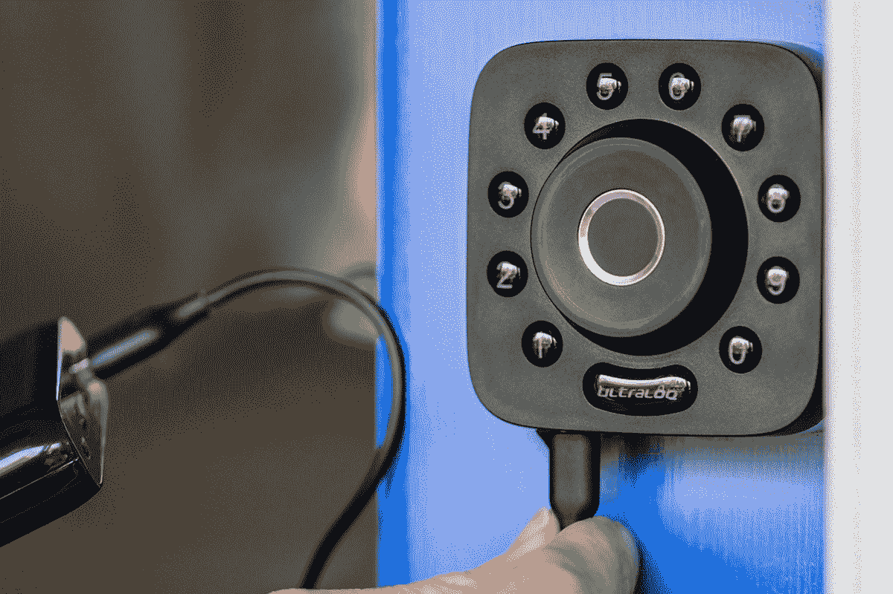
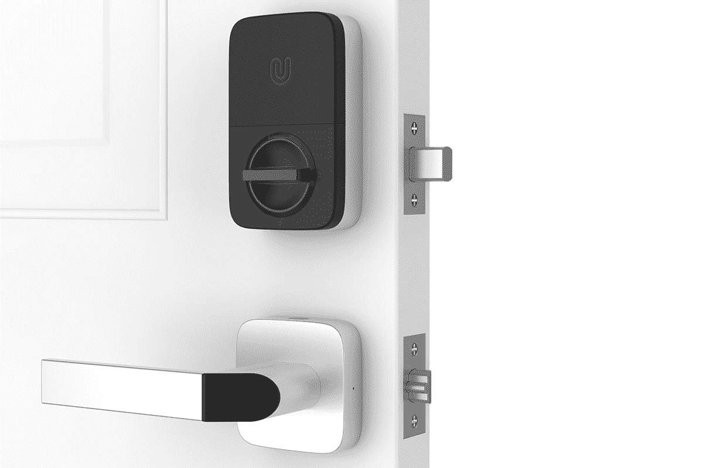
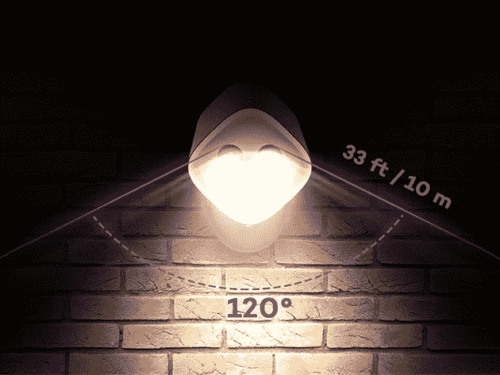
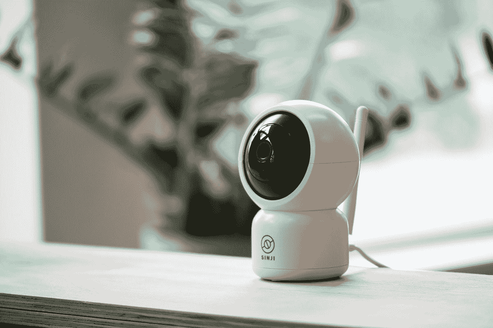
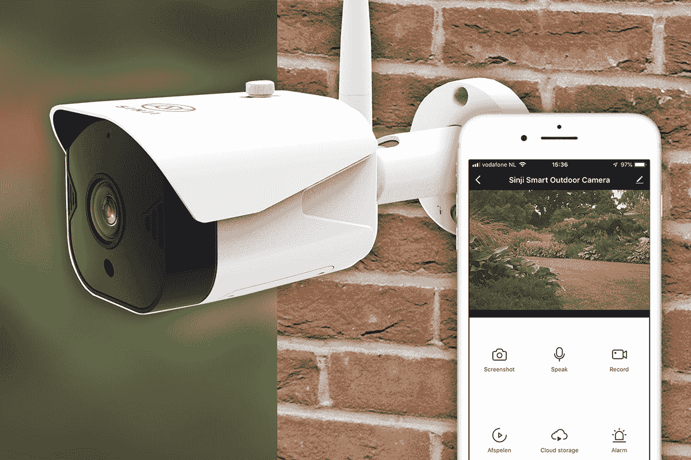

# 本周销售的 10 款出色的家庭安全设备

> 原文：<https://www.xda-developers.com/10-great-home-security-devices-that-are-on-sale-this-week/>

如果你打算花钱买什么东西，保护你的家可能是最优先考虑的事情。从智能锁到运动感应摄像头，XDA Developers Depot 目前正在出售一些很棒的家庭安全设备。现在，你可以在这十种产品上节省高达 70%的费用。

## **U-Bolt Pro:终极 6 合 1 智能插销**

****

在亚马逊上被评为 4.3 星， [这款智能插销](https://depot.xda-developers.com/sales/u-bolt-pro-the-ultimate-6-in-1-smart-deadbolt?utm_source=xda-developers.com&utm_medium=referral&utm_campaign=u-bolt-pro-the-ultimate-6-in-1-smart-deadbolt&utm_term=scsf-430641&utm_content=a0x1P000004Y5PtQAK&scsonar=1) 拥有 360 个指纹传感器，让无钥匙进入变得简单明了。你也可以通过智能手机进入，锁真的很容易适合自己。U-Bolt Pro 的零售价为 189 美元，但你现在可以用 169.99 美元 买到它。

## **TOKK 指纹智能锁**

****

完美保护外屋， [TOKK 智能锁](https://depot.xda-developers.com/sales/tokk-fingerprint-smart-lock?utm_source=xda-developers.com&utm_medium=referral&utm_campaign=tokk-fingerprint-smart-lock&utm_term=scsf-430656&utm_content=a0x1P000004Y5PtQAK&scsonar=1) 可在半秒钟内开启多达 20 个识别指纹。它内部有一个可充电电池，可持续 100 次解锁或待机六个月。正常 49 美元，锁现在 [五折 24.99 美元](https://depot.xda-developers.com/sales/tokk-fingerprint-smart-lock?utm_source=xda-developers.com&utm_medium=referral&utm_campaign=tokk-fingerprint-smart-lock&utm_term=scsf-430656&utm_content=a0x1P000004Y5PtQAK&scsonar=1) 。

## **Ultraloq Combo 智能锁&钥匙扣**

****

使用这款智能组合锁，您可以通过智能手机、指纹或随附的非接触式钥匙链进入。 [Ultraloq](https://depot.xda-developers.com/sales/bluetooth-enabled-fingerprint-key-fob-two-point-smart-lock?utm_source=xda-developers.com&utm_medium=referral&utm_campaign=bluetooth-enabled-fingerprint-key-fob-two-point-smart-lock&utm_term=scsf-430652&utm_content=a0x1P000004Y5PtQAK&scsonar=1) 具有三种模式和两个独立的锁定点，确保整体安全性，手柄可翻转，便于 DIY 安装。价值 369 美元， [该套件目前为 329.99 美元](https://depot.xda-developers.com/sales/bluetooth-enabled-fingerprint-key-fob-two-point-smart-lock?utm_source=xda-developers.com&utm_medium=referral&utm_campaign=bluetooth-enabled-fingerprint-key-fob-two-point-smart-lock&utm_term=scsf-430652&utm_content=a0x1P000004Y5PtQAK&scsonar=1) 。

## **户外国度太阳能供电 22 LED 安全泛光灯**

****

有 22 个发光二极管， [这种强大的泛光灯](https://depot.xda-developers.com/sales/outdoor-nation-solar-powered-22-led-security-floodlight-black?utm_source=xda-developers.com&utm_medium=referral&utm_campaign=outdoor-nation-solar-powered-22-led-security-floodlight-black&utm_term=scsf-430653&utm_content=a0x1P000004Y5PtQAK&scsonar=1) 在天黑后保护你家门前的草坪。它的特点是 6.5 英尺内的热量检测和 16 英尺范围内的运动检测，灯实际上可以移动以聚焦入侵者。通常是 59 美元，但你现在可以花 25.99 美元 [得到泛光灯](https://depot.xda-developers.com/sales/outdoor-nation-solar-powered-22-led-security-floodlight-black?utm_source=xda-developers.com&utm_medium=referral&utm_campaign=outdoor-nation-solar-powered-22-led-security-floodlight-black&utm_term=scsf-430653&utm_content=a0x1P000004Y5PtQAK&scsonar=1) 。

## **带集线器的 XC 安全摄像头+ 2 个门传感器**

****

这款 [数码安全卫士](https://depot.xda-developers.com/sales/xc-security-camera-with-hub-2-door-sensors?utm_source=xda-developers.com&utm_medium=referral&utm_campaign=xc-security-camera-with-hub-2-door-sensors&utm_term=scsf-430654&utm_content=a0x1P000004Y5PtQAK&scsonar=1) 通过一个兼作基站的智能摄像头，时刻守护着你的家。它采用夜视技术，以 1080p 的分辨率提供 360 度的室内视角。此外，你还可以用两个传感器来捕捉不速之客。价值 79 美元的 [XC 套装现在只需 56.99 美元](https://depot.xda-developers.com/sales/xc-security-camera-with-hub-2-door-sensors?utm_source=xda-developers.com&utm_medium=referral&utm_campaign=xc-security-camera-with-hub-2-door-sensors&utm_term=scsf-430654&utm_content=a0x1P000004Y5PtQAK&scsonar=1) 。

## **Kami 1080p 无线室内/室外家用摄像机套件**

****

以这个价格提供“稳定的性能”据 TechCrunch 报道， [Kami 摄像机](https://depot.xda-developers.com/sales/kami-1080p-wire-free-indoor-outdoor-home-camera-kit?utm_source=xda-developers.com&utm_medium=referral&utm_campaign=kami-1080p-wire-free-indoor-outdoor-home-camera-kit&utm_term=scsf-430655&utm_content=a0x1P000004Y5PtQAK&scsonar=1) 以全高清分辨率提供 140°的覆盖范围。双向音频允许您挑战入侵者，外壳防水，适合户外使用。它的零售价为 119 美元，但你现在可以以 74.99 美元 的价格 [获得相机套件。](https://depot.xda-developers.com/sales/kami-1080p-wire-free-indoor-outdoor-home-camera-kit?utm_source=xda-developers.com&utm_medium=referral&utm_campaign=kami-1080p-wire-free-indoor-outdoor-home-camera-kit&utm_term=scsf-430655&utm_content=a0x1P000004Y5PtQAK&scsonar=1)

## **VAVA 防水运动传感器 LED 聚光灯**

****

[这种防水聚光灯](https://depot.xda-developers.com/sales/vava-motion-sensor-spotlight-300-lumens-ip65-waterproof-outdoor-lights-with-japan-made-sensor-fully-adjustable-head?utm_source=xda-developers.com&utm_medium=referral&utm_campaign=vava-motion-sensor-spotlight-300-lumens-ip65-waterproof-outdoor-lights-with-japan-made-sensor-fully-adjustable-head&utm_term=scsf-430657&utm_content=a0x1P000004Y5PtQAK&scsonar=1) 探测 33 英尺内的运动，用灵敏的 300 流明传感器扫描该区域。led 提供强光，你可以调整头部找到最佳角度。更好的是，它可以在任何温度下依靠电池运行。平时 30 美元的 [VAVA 聚光灯现在只要 19.99 美元](https://depot.xda-developers.com/sales/vava-motion-sensor-spotlight-300-lumens-ip65-waterproof-outdoor-lights-with-japan-made-sensor-fully-adjustable-head?utm_source=xda-developers.com&utm_medium=referral&utm_campaign=vava-motion-sensor-spotlight-300-lumens-ip65-waterproof-outdoor-lights-with-japan-made-sensor-fully-adjustable-head&utm_term=scsf-430657&utm_content=a0x1P000004Y5PtQAK&scsonar=1) 。

## **Hombli 智能室内摄像机**

****

当你不在家的时候，你可以用 [和](https://depot.xda-developers.com/sales/hombli-smart-indoor-camera?utm_source=xda-developers.com&utm_medium=referral&utm_campaign=hombli-smart-indoor-camera&utm_term=scsf-430658&utm_content=a0x1P000004Y5PtQAK&scsonar=1) 来照看你的家。配套应用支持谷歌和 Alexa，这意味着你可以单独使用你的声音设置功能。它价值 99 美元，但你现在可以花 39.95 美元 [买到这款相机。](https://depot.xda-developers.com/sales/hombli-smart-indoor-camera?utm_source=xda-developers.com&utm_medium=referral&utm_campaign=hombli-smart-indoor-camera&utm_term=scsf-430658&utm_content=a0x1P000004Y5PtQAK&scsonar=1)

## **Sinji 云台室内摄像机**

****

通过自动跟踪房间内人群的镜头，提供了令人难以置信的覆盖范围。该相机还具有红外夜视功能，128GB 的存储空间，双向音频和一个直播视频应用程序。它通常是 119 美元，但这款相机现在 [比建议零售价低 66%，仅售 39.95 美元](https://depot.xda-developers.com/sales/sinji-pan-tilt-indoor-camera?utm_source=xda-developers.com&utm_medium=referral&utm_campaign=sinji-pan-tilt-indoor-camera&utm_term=scsf-430659&utm_content=a0x1P000004Y5PtQAK&scsonar=1) 。

## **Sinji 智能户外摄像机**

用这个 [辛吉装置可以在外面得到类似的功能。](https://depot.xda-developers.com/sales/sinji-smart-outdoor-camera?utm_source=xda-developers.com&utm_medium=referral&utm_campaign=sinji-smart-outdoor-camera&utm_term=scsf-430660&utm_content=a0x1P000004Y5PtQAK&scsonar=1) 它还具有运动检测、红外夜视和封装在防水外壳内的大量存储空间。你自己安装也很容易。这款相机通常售价 199 美元，但你现在只需 59.95 美元就能买到。

*价格随时变化*