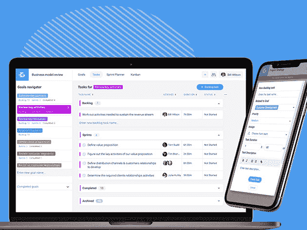
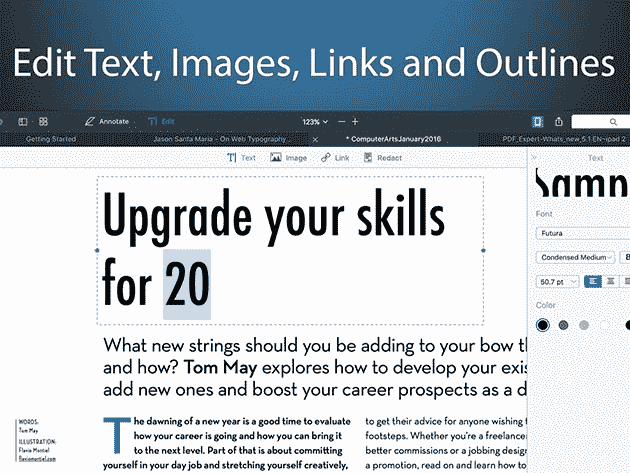
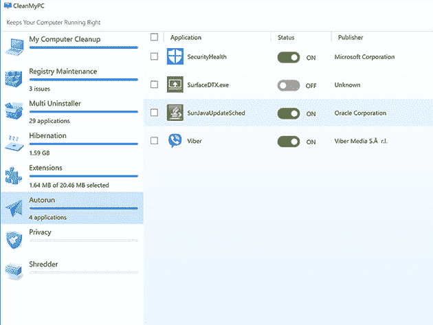
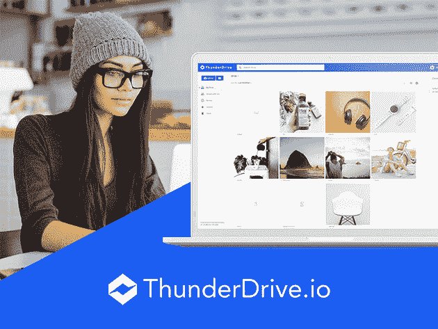

# 10 个有用的应用程序，让疫情期间的远程工作更加高效

> 原文：<https://www.xda-developers.com/10-helpful-apps-to-make-working-remotely-during-the-pandemic-more-efficient/>

在家工作通常是一种奢侈。但随着冠状病毒的蔓延，我们中的许多人现在被要求远离办公室，但仍保持同样的产量。为了帮助您构建最终的远程工作流，我们编制了一份基本应用列表，现在，当您在 XDA 开发者仓库使用促销代码 **SPRINGSAVE15** 时，可以额外享受 15%的折扣。

## **NordPass 密码管理器:1 年订阅**

远程工作时，保持安全的互联网连接非常重要。 [NordPass](https://depot.xda-developers.com/sales/nordpass-1-yr-subscription?utm_source=xda-developers.com&utm_medium=referral&utm_campaign=nordpass-1-yr-subscription&utm_term=scsf-380000&utm_content=a0x1P000004NOhp&scsonar=1) 为您的密码提供一个加密的数字保险库，设备间自动同步。价值 59.88 美元的一年期套餐 [现为 25.49 美元](https://depot.xda-developers.com/sales/nordpass-1-yr-subscription?utm_source=xda-developers.com&utm_medium=referral&utm_campaign=nordpass-1-yr-subscription&utm_term=scsf-380000&utm_content=a0x1P000004NOhp&scsonar=1) 随码。

## **keep solid 商业计划的目标:终身订阅**

****

远程团队的理想选择，[KeepSolid 的目标](https://depot.xda-developers.com/sales/goals-by-keepsolid-lifetime-subscritpion?utm_source=xda-developers.com&utm_medium=referral&utm_campaign=goals-by-keepsolid-lifetime-subscritpion&utm_term=scsf-380003&utm_content=a0x1P000004NOhp&scsonar=1) 帮助您与同事一起计划和跟踪任何项目。该平台有一些真正创新的功能，包括思维导图工具和看板。正常情况下 2999 美元，终身订阅 [现在是 42.49 美元](https://depot.xda-developers.com/sales/goals-by-keepsolid-lifetime-subscritpion?utm_source=xda-developers.com&utm_medium=referral&utm_campaign=goals-by-keepsolid-lifetime-subscritpion&utm_term=scsf-380003&utm_content=a0x1P000004NOhp&scsonar=1) 带码。

## **种子 4。Me VPN: 3 年订阅**

****

通过掩盖自己的真实身份， [Seed4。Me VPN](https://depot.xda-developers.com/sales/seed4-me-3-year-subscription-unlimited-devices?utm_source=xda-developers.com&utm_medium=referral&utm_campaign=seed4-me-3-year-subscription-unlimited-devices&utm_term=scsf-380004&utm_content=a0x1P000004NOhp&scsonar=1) 帮助您在家安全私密地工作。这项服务可以在所有主要的桌面和移动平台上运行，一次订阅可以覆盖您的所有设备。 [现在订购 16.99 美元](https://depot.xda-developers.com/sales/seed4-me-3-year-subscription-unlimited-devices?utm_source=xda-developers.com&utm_medium=referral&utm_campaign=seed4-me-3-year-subscription-unlimited-devices&utm_term=scsf-380004&utm_content=a0x1P000004NOhp&scsonar=1) 随码获得三年服务，价值 107.55 美元。

## **PDF 专家:获奖软件**

如果你经常处理 PDF 文件，这款 Mac 应用是必备的。[PDF Expert](https://depot.xda-developers.com/sales/pdf-expert-award-winning-software?utm_source=xda-developers.com&utm_medium=referral&utm_campaign=pdf-expert-award-winning-software&utm_term=scsf-380005&utm_content=a0x1P000004NOhp&scsonar=1)有一系列很棒的编辑工具，允许你添加内容、修改、填写表格、签署文档等等。平时 79.99 美元，这个苹果编辑的选择是 [目前 25.49 美元](https://depot.xda-developers.com/sales/pdf-expert-award-winning-software?utm_source=xda-developers.com&utm_medium=referral&utm_campaign=pdf-expert-award-winning-software&utm_term=scsf-380005&utm_content=a0x1P000004NOhp&scsonar=1) 带码。

## **KeepSolid VPN Unlimited:终身订阅**

****

受到超过 1000 万用户的信任， [VPN 无限](https://depot.xda-developers.com/sales/vpn-unlimited-lifetime-subscription?utm_source=xda-developers.com&utm_medium=referral&utm_campaign=vpn-unlimited-lifetime-subscription&utm_term=scsf-380006&utm_content=a0x1P000004NOhp&scsonar=1) 用军用级加密保护您的连接。凭借遍布全球的 400 台服务器，它还可以解锁网飞、iPlayer 和 Hulu 等网站的地理屏蔽内容，用于午休流媒体播放。价值 199.99 美元的 [终身服务现为 33.15 美元的](https://depot.xda-developers.com/sales/vpn-unlimited-lifetime-subscription?utm_source=xda-developers.com&utm_medium=referral&utm_campaign=vpn-unlimited-lifetime-subscription&utm_term=scsf-380006&utm_content=a0x1P000004NOhp&scsonar=1) 同代码。

## **Pagico 9:任务&数据管理软件**

****

用 [Pagico 9](https://depot.xda-developers.com/sales/pagico-9?utm_source=xda-developers.com&utm_medium=referral&utm_campaign=pagico-9&utm_term=scsf-380007&utm_content=a0x1P000004NOhp&scsonar=1) ，你可以把任何任务相关的所有信息和文件都存储在一个地方。此外，这款管理应用还能帮助您对多个项目中的任务进行优先级排序，并与您的远程团队进行协作。通常售价 50 美元， [这款 app 现在 21.25 美元](https://depot.xda-developers.com/sales/pagico-9?utm_source=xda-developers.com&utm_medium=referral&utm_campaign=pagico-9&utm_term=scsf-380007&utm_content=a0x1P000004NOhp&scsonar=1) 带代码。

## **Ivacy VPN:终身订阅**

****

BestVPN.com 最快 VPN 奖得主， [Ivacy](https://depot.xda-developers.com/sales/ivacy-lifetime-subscription-10-devices?utm_source=xda-developers.com&utm_medium=referral&utm_campaign=ivacy-lifetime-subscription-10-devices&utm_term=scsf-380008&utm_content=a0x1P000004NOhp&scsonar=1) 保护您的隐私，不会让您变慢。你可以从 50 个国家的 1000 台服务器中选择，零日志，支持 P2P 和 Kodi。价值 2338 美元，对 10 台设备的终身保护是 [现在 50.99 美元](https://depot.xda-developers.com/sales/ivacy-lifetime-subscription-10-devices?utm_source=xda-developers.com&utm_medium=referral&utm_campaign=ivacy-lifetime-subscription-10-devices&utm_term=scsf-380008&utm_content=a0x1P000004NOhp&scsonar=1) 随码。

## **CleanMyPC:Windows 垃圾清理器**

****

通过清除硬盘上的垃圾，[CleanMyPC](https://depot.xda-developers.com/sales/cleanmypc-1-pc?utm_source=xda-developers.com&utm_medium=referral&utm_campaign=cleanmypc-1-pc&utm_term=scsf-380009&utm_content=a0x1P000004NOhp&scsonar=1)让电脑恢复到最佳性能。该应用程序针对缓存、旧应用程序更新和本地化文件，此外，它还可以找出并删除恶意软件。通常是 89.95 美元，这个有用的工具是 [只需 57.79 美元](https://depot.xda-developers.com/sales/cleanmypc-1-pc?utm_source=xda-developers.com&utm_medium=referral&utm_campaign=cleanmypc-1-pc&utm_term=scsf-380009&utm_content=a0x1P000004NOhp&scsonar=1) 与代码。

## **Degoo Premium:终生 3TB 备份计划**

****

这款 [云存储解决方案](https://depot.xda-developers.com/sales/degoo-premium-lifetime-3tb-backup-plan?utm_source=xda-developers.com&utm_medium=referral&utm_campaign=degoo-premium-lifetime-3tb-backup-plan&utm_term=scsf-380010&utm_content=a0x1P000004NOhp&scsonar=1) 提供了比 Dropbox、OneDrive 和 Google Drive 加起来还要多的空间，非常适合备份您的工作。由于文件更改检测，您永远不会丢失最新的草稿。通常售价 1500 美元，终身 3TB 计划是 [现在 59.49 美元](https://depot.xda-developers.com/sales/degoo-premium-lifetime-3tb-backup-plan?utm_source=xda-developers.com&utm_medium=referral&utm_campaign=degoo-premium-lifetime-3tb-backup-plan&utm_term=scsf-380010&utm_content=a0x1P000004NOhp&scsonar=1) 随码。

## **ThunderDrive 云存储:终身订阅**

****

另一个实惠的选择是[ThunderDrive](https://depot.xda-developers.com/sales/thunderdrive-pro-2tb-lifetime-subscription?utm_source=xda-developers.com&utm_medium=referral&utm_campaign=thunderdrive-pro-2tb-lifetime-subscription&utm_term=scsf-380011&utm_content=a0x1P000004NOhp&scsonar=1)，使用比亚马逊的服务器快 6 倍的服务器。每当您想要存储或共享文件时，只需将它们拖放到安全的在线应用程序中。价值 1200 美元，Pro 2TB 终身计划是 [目前 50.15 美元](https://depot.xda-developers.com/sales/thunderdrive-pro-2tb-lifetime-subscription?utm_source=xda-developers.com&utm_medium=referral&utm_campaign=thunderdrive-pro-2tb-lifetime-subscription&utm_term=scsf-380011&utm_content=a0x1P000004NOhp&scsonar=1) 随码。

*价格随时变化*