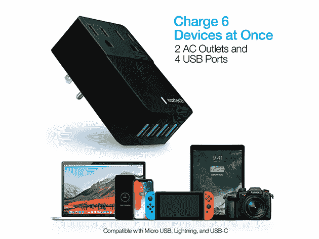
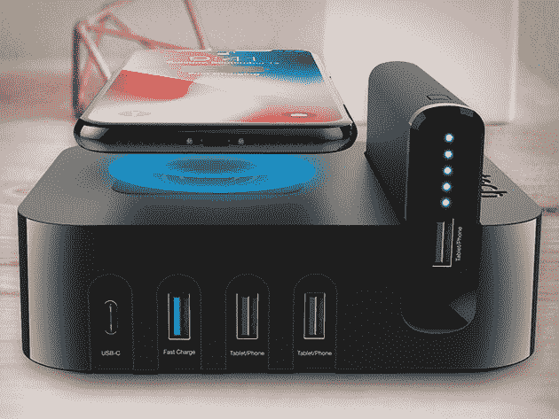
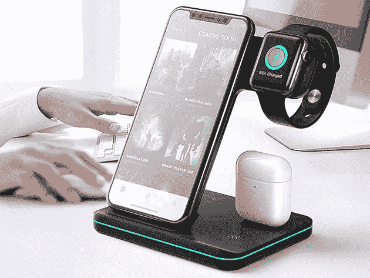
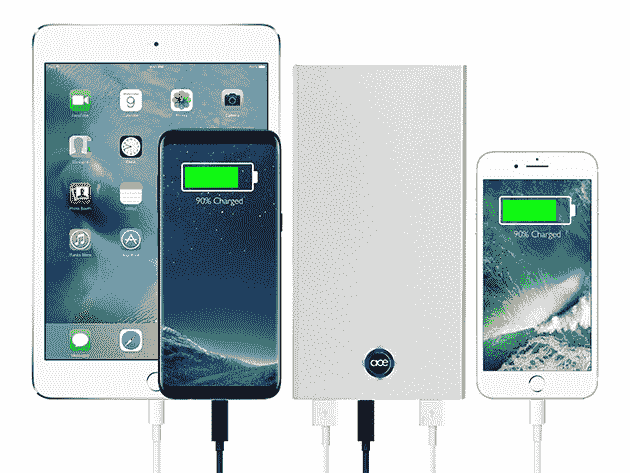
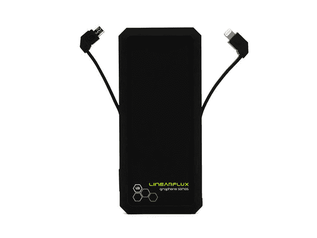
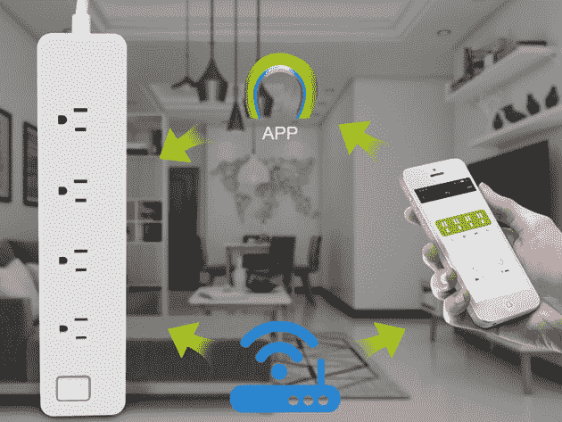

# 10 个高科技充电器，最大化您的空间和生产力

> 原文：<https://www.xda-developers.com/10-high-tech-chargers-to-maximize-your-space-and-productivity/>

你购买的每台新设备都配有某种形式的充电器。然而，这种附件并不总是最有效或最方便的动力传递形式。如果你想更快地充电并节省空间，XDA Developers Depot 的这些选项绝对值得你关注——现在的 MSRP 高达 71%。

## **Naztech 快速多端口壁式充电器**

****

Naztech 充电器提供两个交流电源插座和四个 USB 端口，从一个墙上插座获取电能。IntelliQ 智能芯片为每个设备提供正确的电量，而 OmniProtect 功能可防止短路和过度充电。正常售价 39.99 美元，充电器为 [现在仅售 25 美元](https://depot.xda-developers.com/sales/naztech-fast-multi-device-charger-black?utm_source=xda-developers.com&utm_medium=referral&utm_campaign=naztech-fast-multi-device-charger-black&utm_term=scsf-372011&utm_content=a0x1P000004NIll&scsonar=1) 。

## **Naztech 无线电源集线器 5**

****

通过四个 USB 端口和一个内置充电板， [这个小巧的集线器](https://depot.xda-developers.com/sales/naztech-wireless-power-hub-5?utm_source=xda-developers.com&utm_medium=referral&utm_campaign=naztech-wireless-power-hub-5&utm_term=scsf-372042&utm_content=a0x1P000004NIll&scsonar=1) 可以为你所有的设备供电。与支持 Qi 的设备兼容，pad 可以以常规 Qi 充电器的两倍速度为您的 iPhone 或 Android 手机充电。通常售价 54.99 美元，Power Hub 5 现在 [仅售 44.99 美元](https://depot.xda-developers.com/sales/naztech-wireless-power-hub-5?utm_source=xda-developers.com&utm_medium=referral&utm_campaign=naztech-wireless-power-hub-5&utm_term=scsf-372042&utm_content=a0x1P000004NIll&scsonar=1) 。

## **纳兹泰克终极发电站**

****

[终极电站](https://depot.xda-developers.com/sales/naztech-ultimate-power-station-5-usb-charging-hub-qi-enabled-and-an-ultra-compact-portable-battery?utm_source=xda-developers.com&utm_medium=referral&utm_campaign=naztech-ultimate-power-station-5-usb-charging-hub-qi-enabled-and-an-ultra-compact-portable-battery&utm_term=scsf-372043&utm_content=a0x1P000004NIll&scsonar=1) 从单个插座汲取高达 50W 的电能，可以同时为六个设备充电。除了无线 Qi 充电板和五个 USB 端口，它还内置了一个 4000 毫安时的电池，可以在移动中充电。正常情况下 59.99 美元，Naztech 充电器是 [现在 49.99 美元](https://depot.xda-developers.com/sales/naztech-ultimate-power-station-5-usb-charging-hub-qi-enabled-and-an-ultra-compact-portable-battery?utm_source=xda-developers.com&utm_medium=referral&utm_campaign=naztech-ultimate-power-station-5-usb-charging-hub-qi-enabled-and-an-ultra-compact-portable-battery&utm_term=scsf-372043&utm_content=a0x1P000004NIll&scsonar=1) 。

## **三合一 Qi 无线充电座**

****

这款 [优雅的充电座](https://depot.xda-developers.com/sales/3-in-1-wireless-charging-stand?utm_source=xda-developers.com&utm_medium=referral&utm_campaign=3-in-1-wireless-charging-stand&utm_term=scsf-372044&utm_content=a0x1P000004NIll&scsonar=1) 有助于清理杂乱的线缆，非常适合放在任何床头柜或书桌上。它为任何支持 Qi 的手机提供了一个直立的充电板，还为你的 Apple Watch 和无线耳塞提供了基座。该支架目前的零售价为 29.95 美元[打六折。](https://depot.xda-developers.com/sales/3-in-1-wireless-charging-stand?utm_source=xda-developers.com&utm_medium=referral&utm_campaign=3-in-1-wireless-charging-stand&utm_term=scsf-372044&utm_content=a0x1P000004NIll&scsonar=1)

## **Power slim 6 6000 mah 电源组:2 组**

****

厚度仅为 0.33 英寸，重量为 5.3 盎司的[power slim 6](https://depot.xda-developers.com/sales/powerslim6-6000mah-power-bank-2-pack?utm_source=xda-developers.com&utm_medium=referral&utm_campaign=powerslim6-6000mah-power-bank-2-pack&utm_term=scsf-372045&utm_content=a0x1P000004NIll&scsonar=1)名副其实。这种便携式电源银行有两个 USB 充电端口和 6,000mAh 的容量，足以为大多数智能手机充电两次以上。 [现在下单，售价 39.99 美元](https://depot.xda-developers.com/sales/powerslim6-6000mah-power-bank-2-pack?utm_source=xda-developers.com&utm_medium=referral&utm_campaign=powerslim6-6000mah-power-bank-2-pack&utm_term=scsf-372045&utm_content=a0x1P000004NIll&scsonar=1) 抢一个两个装，价值 140 美元。

## **浪涌 DUO 双 USB &双浪涌充电站**

****

如果你的办公桌上总是布满电缆，你可能想投资购买这款桌面集线器。 [浪涌双](https://depot.xda-developers.com/sales/surge-duo-dual-usb-dual-surge-charging-station-white-grey?utm_source=xda-developers.com&utm_medium=referral&utm_campaign=surge-duo-dual-usb-dual-surge-charging-station-white-grey&utm_term=scsf-372046&utm_content=a0x1P000004NIll&scsonar=1) 提供两个 USB 端口和两个交流电源插座的快速接入，带有单独的开关来控制电源。正常售价 49.99 美元，充电站 [现在只要 18.99 美元](https://depot.xda-developers.com/sales/surge-duo-dual-usb-dual-surge-charging-station-white-grey?utm_source=xda-developers.com&utm_medium=referral&utm_campaign=surge-duo-dual-usb-dual-surge-charging-station-white-grey&utm_term=scsf-372046&utm_content=a0x1P000004NIll&scsonar=1) 。

## **power stick:2200 mah 充电电池**

****

[power stick](https://depot.xda-developers.com/sales/power-stick-2200mah-yellow?utm_source=xda-developers.com&utm_medium=referral&utm_campaign=power-stick-2200mah-yellow&utm_term=scsf-372047&utm_content=a0x1P000004NIll&scsonar=1)很容易小到可以放进口袋。然而，这种电力银行相当于手机或平板电脑的 150%电量。该电池有三种颜色可供选择，由于采用了橡胶外壳，因此具有良好的耐用性。价值 25 美元的 PowerStick 现在 [只要 14.99 美元](https://depot.xda-developers.com/sales/power-stick-2200mah-yellow?utm_source=xda-developers.com&utm_medium=referral&utm_campaign=power-stick-2200mah-yellow&utm_term=scsf-372047&utm_content=a0x1P000004NIll&scsonar=1) 。

## **HyperCharger PRO V.2 多功能一体充电器**

****

通过内置 Apple Lightning、micro-USB 和 USB-C 电缆，[HyperCharger PRO v . 2](https://depot.xda-developers.com/sales/hypercharger-pro-v-2-all-in-one-charger?utm_source=xda-developers.com&utm_medium=referral&utm_campaign=hypercharger-pro-v-2-all-in-one-charger&utm_term=scsf-372048&utm_content=a0x1P000004NIll&scsonar=1)几乎可以为任何便携式设备供电。它的重量只有 5.5 盎司，但充电器的容量为 8,000mAh，输出功率为 25W。您现在可以以 24.99 美元 的价格 [抢一台，在标准价格的基础上节省 50%。](https://depot.xda-developers.com/sales/hypercharger-pro-v-2-all-in-one-charger?utm_source=xda-developers.com&utm_medium=referral&utm_campaign=hypercharger-pro-v-2-all-in-one-charger&utm_term=scsf-372048&utm_content=a0x1P000004NIll&scsonar=1)

## **super Charger X 无线充电器:2 个装**

****

这款时尚的电源组可以兼作 7.5W 无线充电板，并带有一个 15W USB 端口，可用于旧设备。 [超级充电器 X](https://depot.xda-developers.com/sales/hypercharger-x-wireless-charger-2-pack?utm_source=xda-developers.com&utm_medium=referral&utm_campaign=hypercharger-x-wireless-charger-2-pack&utm_term=scsf-372049&utm_content=a0x1P000004NIll&scsonar=1) 与 iPhone X 大小差不多，但它包含一个 6000 毫安时的电池，用于在移动中充电。 [现在订购只需 34.99 美元](https://depot.xda-developers.com/sales/hypercharger-x-wireless-charger-2-pack?utm_source=xda-developers.com&utm_medium=referral&utm_campaign=hypercharger-x-wireless-charger-2-pack&utm_term=scsf-372049&utm_content=a0x1P000004NIll&scsonar=1) 即可获得一个双包装，价值 60 美元。

## **iPM 智能家居电源板**

****

看起来可能像一个普通的插线板，但 iPM 的这款 [智能家居配件](https://depot.xda-developers.com/sales/ipm-smart-home-power-strip?utm_source=xda-developers.com&utm_medium=referral&utm_campaign=ipm-smart-home-power-strip&utm_term=scsf-372050&utm_content=a0x1P000004NIll&scsonar=1) 可以与 Alexa 和谷歌助手无缝合作。这意味着您可以使用语音命令或智能时间表来控制任何插入式设备的电源。iPM 插线板正常售价 49.99 美元，现在 [只要 19.99 美元](https://depot.xda-developers.com/sales/ipm-smart-home-power-strip?utm_source=xda-developers.com&utm_medium=referral&utm_campaign=ipm-smart-home-power-strip&utm_term=scsf-372050&utm_content=a0x1P000004NIll&scsonar=1) 。

*价格随时变化*