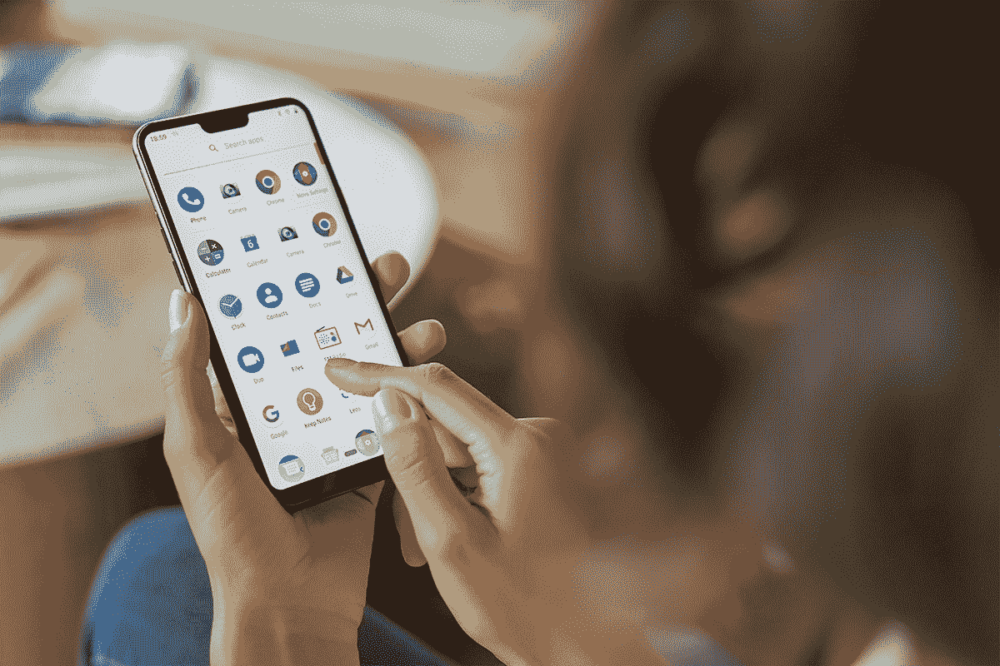
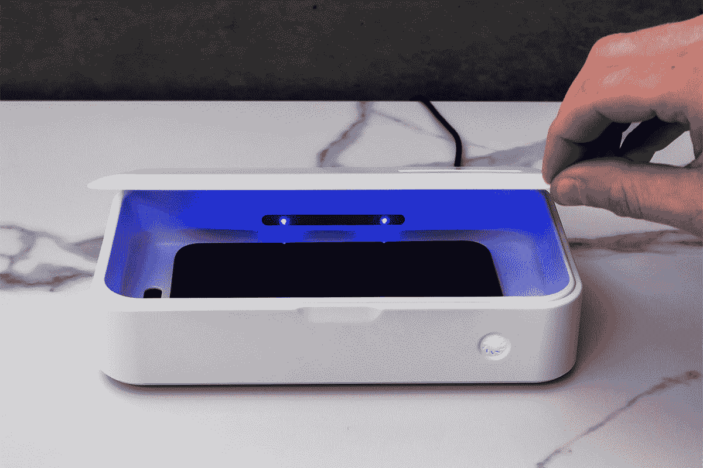
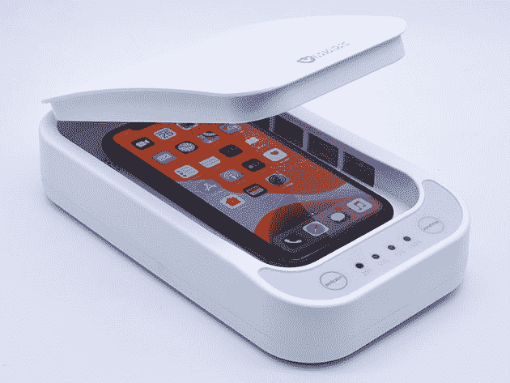
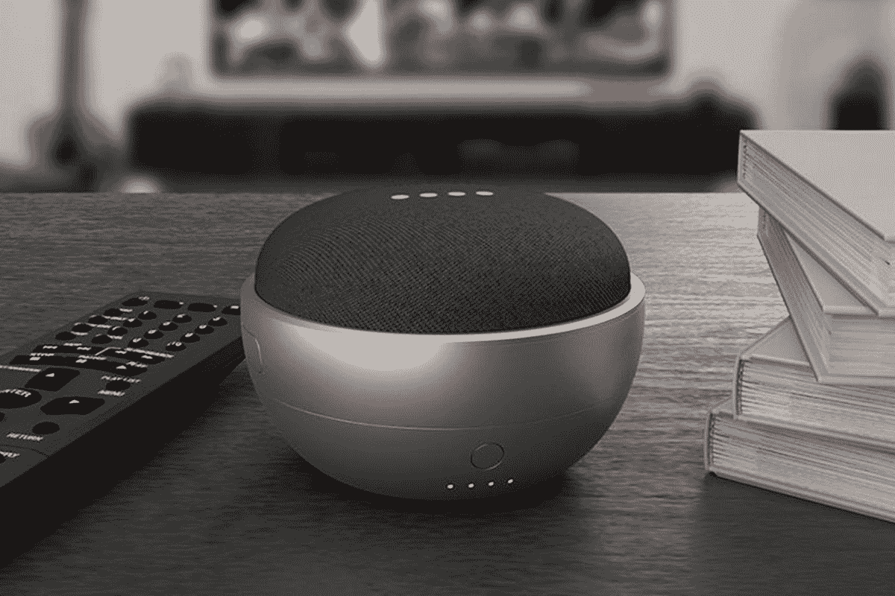
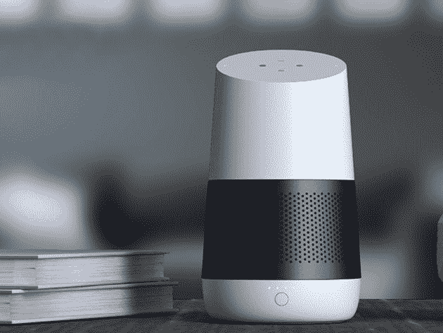
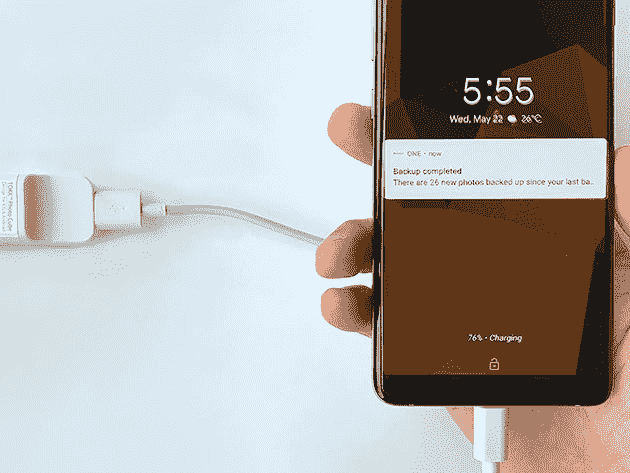
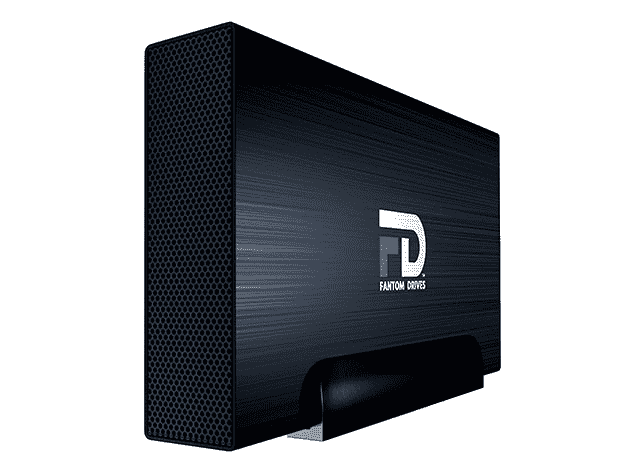

# 7 月 4 日周末网上的 10 个令人难以置信的交易

> 原文：<https://www.xda-developers.com/10-incredible-deals-on-the-web-this-fourth-of-july-weekend/>

和每个假日周末一样，这个 7 月 4 日的周末，科技产品上有一些很棒的交易。以下是 XDA 开发者仓库的一些亮点——现在，当您花费 50 美元或以上时，代码**7 月 15 日** 可享受额外的 15%的折扣。

## **Teracube 智能手机**

在 CES 2020 最佳名单中， [Teracube](https://depot.xda-developers.com/sales/teracube-smartphone-gsm-unlocked-6gb-ram-128gb-storage-dual-sim-sd-card?utm_source=xda-developers.com&utm_medium=referral&utm_campaign=teracube-smartphone-gsm-unlocked-6gb-ram-128gb-storage-dual-sim-sd-card&utm_term=scsf-413431&utm_content=a0x1P000004sgSqQAI&scsonar=1) 是一款 6.2 英寸的手机，旨在经久耐用。它提供全天电池续航时间、6GB 内存、12MP+5MP 摄像头和 128GB 存储空间，以及卓越的四年保修。目前，Teracube 的价格为[【100】美元，仅售 249 美元](https://depot.xda-developers.com/sales/teracube-smartphone-gsm-unlocked-6gb-ram-128gb-storage-dual-sim-sd-card?utm_source=xda-developers.com&utm_medium=referral&utm_campaign=teracube-smartphone-gsm-unlocked-6gb-ram-128gb-storage-dual-sim-sd-card&utm_term=scsf-413431&utm_content=a0x1P000004sgSqQAI&scsonar=1) 。

## **CleanTray 紫外线灯灭菌箱**

****

[这个别出心裁的小玩意](https://depot.xda-developers.com/sales/cleantray-uv-light-sterilizer-white?utm_source=xda-developers.com&utm_medium=referral&utm_campaign=cleantray-uv-light-sterilizer-white&utm_term=scsf-413447&utm_content=a0x1P000004sgSqQAI&scsonar=1) 利用紫外线杀灭手机和其他小物品上的病菌。这个过程只需要五分钟，而且不涉及任何化学物质。通常是 79.99 美元，但你现在可以用 69.99 美元 抢到 clean tray[。](https://depot.xda-developers.com/sales/cleantray-uv-light-sterilizer-white?utm_source=xda-developers.com&utm_medium=referral&utm_campaign=cleantray-uv-light-sterilizer-white&utm_term=scsf-413447&utm_content=a0x1P000004sgSqQAI&scsonar=1)

## **手机紫外线消毒剂**

****

另一个很棒的消毒选择是 [这种专门的消毒剂](https://depot.xda-developers.com/sales/cell-phone-uv-sanitizer-2?utm_source=xda-developers.com&utm_medium=referral&utm_campaign=cell-phone-uv-sanitizer-2&utm_term=scsf-413448&utm_content=a0x1P000004sgSqQAI&scsonar=1) 。这款手机可以在 15 分钟内杀死 99.9%的细菌，而且由于配备了 5000 毫安时的充电电池，它完全可以随身携带。价值 49.99 美元的手机杀毒目前 [12 折 43.99 美元](https://depot.xda-developers.com/sales/cell-phone-uv-sanitizer-2?utm_source=xda-developers.com&utm_medium=referral&utm_campaign=cell-phone-uv-sanitizer-2&utm_term=scsf-413448&utm_content=a0x1P000004sgSqQAI&scsonar=1) 。

## **Google Home Mini 的简易电池底座**

****

在亚马逊上被评为 4.5 颗星，[JOT 电池底座](https://depot.xda-developers.com/sales/jot-battery-base-for-google-home-mini-carbon?utm_source=xda-developers.com&utm_medium=referral&utm_campaign=jot-battery-base-for-google-home-mini-carbon&utm_term=scsf-413449&utm_content=a0x1P000004sgSqQAI&scsonar=1) 让你拔掉你的 Google Home Mini。您只需将其滑动到智能扬声器的底部，即可获得 8 小时的便携式电池续航时间。它的零售价为 34.95 美元，但目前它的价格为 16.99 美元[51%。](https://depot.xda-developers.com/sales/jot-battery-base-for-google-home-mini-carbon?utm_source=xda-developers.com&utm_medium=referral&utm_campaign=jot-battery-base-for-google-home-mini-carbon&utm_term=scsf-413449&utm_content=a0x1P000004sgSqQAI&scsonar=1)

## **Google Home 的 LOFT 电池底座**

****

如果你有谷歌更大的智能音箱，那 [LOFT 电池座](https://depot.xda-developers.com/sales/loft-battery-base-for-google-home-carbon?utm_source=xda-developers.com&utm_medium=referral&utm_campaign=loft-battery-base-for-google-home-carbon&utm_term=scsf-413450&utm_content=a0x1P000004sgSqQAI&scsonar=1) 已经把你覆盖了。这个实际上用一个时尚的烤架取代了你的谷歌 Home 的外壳，同时增加了八个小时的游戏时间。亚马逊上的评分为 4.4 星，现在的 [比建议零售价低 65%，为 16.99 美元](https://depot.xda-developers.com/sales/loft-battery-base-for-google-home-carbon?utm_source=xda-developers.com&utm_medium=referral&utm_campaign=loft-battery-base-for-google-home-carbon&utm_term=scsf-413450&utm_content=a0x1P000004sgSqQAI&scsonar=1) 。

## **WT2 加 AI 实时翻译耳塞**

[WT2 加耳塞](https://depot.xda-developers.com/sales/wt2-plus-ai-realtime-translator-earbuds?utm_source=xda-developers.com&utm_medium=referral&utm_campaign=wt2-plus-ai-realtime-translator-earbuds&utm_term=scsf-413451&utm_content=a0x1P000004sgSqQAI&scsonar=1) 提供 40 种语言的实时翻译，准确率达 93%。这些 iF 设计奖获得者也非常适合日常聆听，具有高质量的蓝牙音频和触摸控制。通常售价 299.99 美元，它们是 [现在只需 199.99 美元](https://depot.xda-developers.com/sales/wt2-plus-ai-realtime-translator-earbuds?utm_source=xda-developers.com&utm_medium=referral&utm_campaign=wt2-plus-ai-realtime-translator-earbuds&utm_term=scsf-413451&utm_content=a0x1P000004sgSqQAI&scsonar=1) 。

## **ChronoWatch 多功能智能手表**

****

每当你健身时，这款 [时尚智能手表](https://depot.xda-developers.com/sales/chronowatch-multi-function-smart-watch-black?utm_source=xda-developers.com&utm_medium=referral&utm_campaign=chronowatch-multi-function-smart-watch-black&utm_term=scsf-413453&utm_content=a0x1P000004sgSqQAI&scsonar=1) 会记录你的步数、消耗的卡路里、里程和心率。此外，它可以监测你的血压和血氧水平，而触摸屏可以让你处理信息和电话。价值 199.99 美元的 [ChronoWatch 现在仅售 36.99 美元](https://depot.xda-developers.com/sales/chronowatch-multi-function-smart-watch-black?utm_source=xda-developers.com&utm_medium=referral&utm_campaign=chronowatch-multi-function-smart-watch-black&utm_term=scsf-413453&utm_content=a0x1P000004sgSqQAI&scsonar=1)——比建议零售价低 81%。

## **TOKK 照片魔方:64GB 数据备份**

****

将 [TOKK 照片魔方](https://depot.xda-developers.com/sales/tokk-photocube-64gb-data-backup?utm_source=xda-developers.com&utm_medium=referral&utm_campaign=tokk-photocube-64gb-data-backup&utm_term=scsf-413454&utm_content=a0x1P000004sgSqQAI&scsonar=1) 连接到手机充电器上，插上电源，您的照片和视频就会自动备份。它兼容 iOS 和 Android，有 64GB 的媒体存储空间。您现在可以以 89.99 美元 的价格 [购买，节省全价的 30%。](https://depot.xda-developers.com/sales/tokk-photocube-64gb-data-backup?utm_source=xda-developers.com&utm_medium=referral&utm_campaign=tokk-photocube-64gb-data-backup&utm_term=scsf-413454&utm_content=a0x1P000004sgSqQAI&scsonar=1)

## **Litmor 无线充电相机:2 个一捆**

****

提供带夜视技术的 1080p 高清视频直播， [这些 Litmor 摄像机](https://depot.xda-developers.com/sales/wireless-rechargeable-wifi-camera-bundle-of-2-white?utm_source=xda-developers.com&utm_medium=referral&utm_campaign=wireless-rechargeable-wifi-camera-bundle-of-2-white&utm_term=scsf-413456&utm_content=a0x1P000004sgSqQAI&scsonar=1) 非常适合监视您的家。它们可以识别人和宠物，支持谷歌助手和亚马逊 Alexa，并提供 1.5 个月的电池寿命。 [现在订购 124.95 美元](https://depot.xda-developers.com/sales/wireless-rechargeable-wifi-camera-bundle-of-2-white?utm_source=xda-developers.com&utm_medium=referral&utm_campaign=wireless-rechargeable-wifi-camera-bundle-of-2-white&utm_term=scsf-413456&utm_content=a0x1P000004sgSqQAI&scsonar=1) 即可获得一对相机，价值 178 美元。

## **Fantom 硬盘 G-Force 3 Pro 4TB 7200RPM 外置硬盘**

****

这款 [硬盘](https://depot.xda-developers.com/sales/fantom-drives-4tb-7200rpm-external-hard-drive-black?utm_source=xda-developers.com&utm_medium=referral&utm_campaign=fantom-drives-4tb-7200rpm-external-hard-drive-black&utm_term=scsf-413457&utm_content=a0x1P000004sgSqQAI&scsonar=1) 拥有巨大的 4TB 容量和快速的 USB 3.0 传输，非常适合存储大量游戏或电影。G-Force 3 Pro 硬盘配有铝制外壳，可在 7200 转/分时提供更高的性能。它通常是 152.95 美元，但您现在可以花 114.99 美元 获得该驱动器。

*价格随时变化*