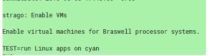

# 28 款旧款 Chromebooks 现在支持 Linux 应用

> 原文：<https://www.xda-developers.com/28-older-chromebooks-support-linux-apps/>

更多来自宏碁、华硕、戴尔、惠普、联想和三星的 Chromebooks 获得了 Linux 应用支持。周四登陆的[变化](https://chromium-review.googlesource.com/c/chromiumos/overlays/board-overlays/+/1168589)将适用于 2015-2017 年发布的部分 Chromebooks，运行英特尔 Braswell 架构和内核 3.18。

[正如预期的那样](https://www.xda-developers.com/linux-app-support-older-chrome-os-devices/)，Chrome 开发者已经尽职尽责地将 Linux 应用支持移植到【更多！]较旧的 Chromebooks。此次更新支持大约 28 种带有“基板”(又名参考板)Strago 的设备。有关设备列表，请参见页面底部的表格。本次更新不包括三星 Chromebook Pro 或其他最近在内核 3.18 上的 Skylake 设备。Braswell 架构可以在低端 Chromebooks 上找到，通常是教育或入门级消费设备。

 <picture></picture> 

All Braswell Chromebooks are now supported

开发者或金丝雀频道的 Braswell/Strago 设备用户应该很快就会收到一个更新，将终端图标添加到他们的启动器中。检查下表，查看您的设备是否在列表中。

然而，接收 Linux 应用程序的是 Broadwell 设备，如 Chromebook Pixel 2 和戴尔 Chromebook 13，以及 Skylake 设备，如三星 Chromebook Pro 和惠普 Chromebook 13 G1。我们预计未来几周将会支持这些平台，因为我们可以从此次更新中推断出，大部分需要的到 3.18 的反向移植已经完成。

相关但并不令人意外的消息是，两个即将上市的高端 Chromebooks，代号为夜曲和 Atlas——下一部 Pixelbook 的潜在候选产品——将在 Linux 应用程序支持下推出现成的。

遗憾的是，其他平台上的产品，如较旧的华硕 C100pa 或采用 BayTrail CPUs 的 Chromebooks，将不会得到支持。查看我们的[支持 Linux 应用程序的 Chromebooks 主列表](https://www.xda-developers.com/chromebooks-linux-app-support/)了解不支持的列表，或者参考[官方文档](https://chromium.googlesource.com/chromiumos/docs/+/master/containers_and_vms.md#Hardware-Requirements)。

### 获得 Linux 应用程序支持的 bras well/board Strago chrome book

| 

模型

 | 

代号

 | 

发布年份

 | 

踢脚板

 |
| --- | --- | --- | --- |
| 宏碁 Chromebook R11 (CB5-132T，C738T) | 蓝绿色 | 2015 | 踢脚板街 |
| 宏碁 Chromebook 14 (CB3-431) | 埃德加 | 2016 | 踢脚板街 |
| 宏碁 Chromebook 15 (CB3-532) | 普通法规 | 2016 | 踢脚板街 |
| 华硕 Chromebook C202SA | 土地 | 2016 | 踢脚板街 |
| 华硕 Chromebook C300SA | 土地 | 2016 | 踢脚板街 |
| 华硕 Chromebook C301SA | 土地 | 2016 | 踢脚板街 |
| CTL Chromebook J5 | 巫师猪 | 2016 | 踢脚板街 |
| CTL NL61 Chromebook | 真的吗 | 2016 | 踢脚板街 |
| 爱德华 CMT Chromebook | 巫师猪 | 2016 | 踢脚板街 |
| Edxis 教育 Chromebook | 真的吗 | 2016 | 踢脚板街 |
| 海尔可兑换 Chromebook 11 C | 巫师猪 | 2016 | 踢脚板街 |
| 惠普 Chromebook 11 G5 | 殖民者 | 2016 | 踢脚板街 |
| 惠普 Chromebook 11 G5 EE | 真的吗 | 2016 | 踢脚板街 |
| 联想 N22 Chromebook | reks | 2016 | 踢脚板街 |
| 联想 N42 镀铬本 | reks | 2016 | 踢脚板街 |
| 联想 ThinkPad 11e Chromebook G3 | 最终的 | 2016 | 踢脚板街 |
| 联想 ThinkPad Yoga G3 | 最终的 | 2016 | 踢脚板街 |
| 电脑合并 Chromebook (PCM-116T-432B) | 巫师猪 | 2016 | 踢脚板街 |
| 三星 Chromebook 3 (XE500C13) | 切莱斯 | 2016 | 踢脚板街 |
| Viglen Chromebook 360 | 巫师猪 | 2016 | 踢脚板街 |
| 宏碁 Chromebook 11 N7 (C731) | 真的吗 | 2017 | 踢脚板街 |
| Dell Chromebook 11 (3180) | -饼干 | 2017 | 踢脚板街 |
| 戴尔 Chromebook 11 (3189) | -饼干 | 2017 | 踢脚板街 |
| 梅克尔·V2 chrome book | 真的吗 | 2017 | 踢脚板街 |
| Prowise 脯氨酸铬书 | 巫师猪 | 2017 | 踢脚板街 |

*某些设备可能会丢失。Braswell 上的 Chromebooks 采用了 N3050/N3150/N3060/N3160/N3700 处理器。如果你的 Chromebook 有任何这些 CPU，它就有 Linux 应用程序支持。该表来自 Chromium [板信息页面](https://www.chromium.org/chromium-os/developer-information-for-chrome-os-devices)和更全面的[镓 OS 设备 wiki](https://wiki.galliumos.org/Hardware_Compatibility) 。