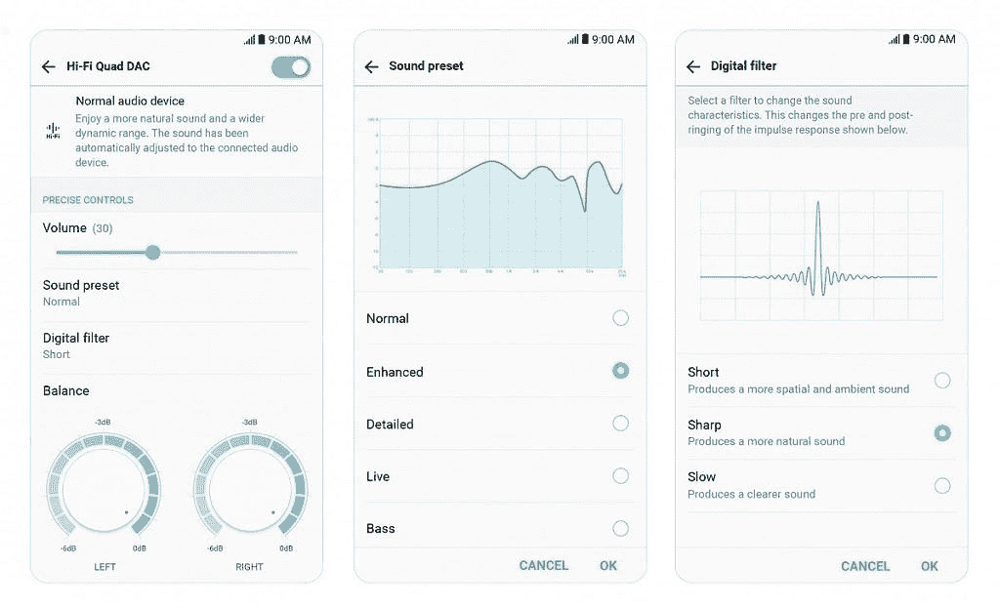

# LG 详细介绍了 LG V30 中使用的 32 位高级高保真四通道 DAC

> 原文：<https://www.xda-developers.com/32-bit-hi-fi-quad-dac-lg-v30/>

# LG 详细介绍了 LG V30 中使用的 32 位高级高保真四通道 DAC

延续注重 V 系列音频质量的趋势，LG 详细介绍了 LG V30 中使用的 DAC 的变化。

G 系列是 LG 之前和更老的旗舰系列，曾经是该公司能够向智能手机市场提供的最佳产品。几年前，他们推出了一个新的旗舰系列，V 系列，有了它，他们能够提供更多。LG 的 V 系列一直被宣传为专为媒体制造商(专注于摄像头和麦克风质量)和媒体消费者(使用增强的 DAC)设计的产品。今天早上，该公司发布了一篇博客文章，详细介绍了他们将在 LG V30 中使用的 HiFi quad DAC。

LG 已经透露 LG V30 的花絮有一段时间了。这始于他们确定了他们决定使用的 6 英寸全视野 OLED 面板。然后当他们透露了关于[相机和它的“LG 水晶般透明”镜头](https://www.xda-developers.com/galaxy-note-8-lg-v30-haptic-feedback/)的细节时继续。他们还发布了一份新闻稿，谈论他们为改善触觉反馈所做的工作。该公司还以分享他们的 LG UX 软件[的变化而闻名，该信息也于几周前发布](https://www.xda-developers.com/lg-v30-ux-6-0-floating-bar-graphy-cam/)。

今天，LG 决定透露他们决定为 LG V30 配备的数模转换器的一些细节。2 位高级 HiFi 四通道 DAC 由 ESS Technology 的 SABRE ES9218P 供电。虽然它的大部分功能与我们去年看到的 LG V20 相似，但他们证实了这个版本中将包含两个新功能。这些功能之一是它的数字滤波器，另一个是软件自带的声音预设。

 <picture></picture> 

The sound preset and digital filter pages for the LG V30.

LG 表示，数字滤波器通常只在昂贵的数字音频播放器中可用，他们的目标是改善脉冲响应的预振铃和后振铃。这些过滤器应该让你自定义，直到它适合你的个人口味。该公司随后表示，他们为他们提供的声音预设创建了 4 个最佳预编程设置。这包括增强，详细，现场和低音，应该给用户一个改进的音频体验，即使是普通的音频设备。

* * *

[**来源:LG 编辑部**](http://www.lgnewsroom.com/2017/08/from-delicate-chords-to-deafening-thunder-lg-v30-delivers-tailored-hi-fi/)