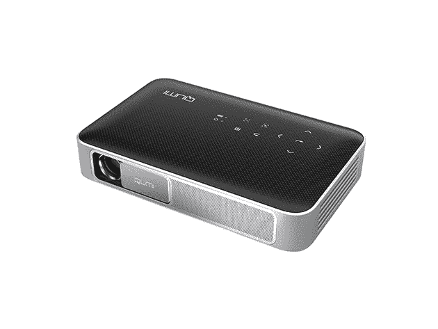

# 4 种家庭影院必需品，现在就可以买到

> 原文：<https://www.xda-developers.com/4-home-theater-essentials-you-can-get-on-sale-now/>

随着全国各地的电影院被隔离，过去几周对于真正的大银幕粉丝来说是痛苦的。虽然在普通电视上看网飞总比什么都没有好，但你可能想在家里重现完整的影院体验。这些投影仪和更多将帮助您享受令人眼花缭乱的视觉效果，现在 XDA 开发商仓库的 MSRP 高达 64%的折扣。

## **CINEMOOD 360:首款 360°互动投影仪**

****

有没有希望自己能参与其中？你可以用亚马逊上最畅销的迷你投影仪[cine mood 360](https://depot.xda-developers.com/sales/cinemood-360-first-360-interactive-projector?utm_source=xda-developers.com&utm_medium=referral&utm_campaign=cinemood-360-first-360-interactive-projector&utm_term=scsf-397963&utm_content=a0x1P000004sQM2QAM&scsonar=1)。这种口袋大小的设备可以将任何房间变成互动的数字体验，有 360 种游戏和电影。它还可以让你的孩子娱乐，有 40 本电子书和内置的迪士尼内容和其他流媒体平台。正常售价 499 美元的投影仪 [现在仅售 328.99 美元](https://depot.xda-developers.com/sales/cinemood-360-first-360-interactive-projector?utm_source=xda-developers.com&utm_medium=referral&utm_campaign=cinemood-360-first-360-interactive-projector&utm_term=scsf-397963&utm_content=a0x1P000004sQM2QAM&scsonar=1) 。

## **TaoTronics 120 英寸 16:9 投影仪屏幕**

****

虽然你可以投影到任何平面上， [这个来自 TaoTronics](https://depot.xda-developers.com/sales/taotronics-120-inch-16-9-projector-screen?utm_source=xda-developers.com&utm_medium=referral&utm_campaign=taotronics-120-inch-16-9-projector-screen&utm_term=scsf-398047&utm_content=a0x1P000004sQM2QAM&scsonar=1) 的大屏幕会给你一个比任何彩绘墙壁都好得多的画面。它由优质聚氯乙烯制成，背面有黑色涂层，确保光线不会透过。通过 160 度视角，投影图像看起来非常完美，并且屏幕易于使用钉子、挂钩甚至双面胶带进行安装。正常售价 29.99 美元，它的 [现在只要 24.99 美元](https://depot.xda-developers.com/sales/taotronics-120-inch-16-9-projector-screen?utm_source=xda-developers.com&utm_medium=referral&utm_campaign=taotronics-120-inch-16-9-projector-screen&utm_term=scsf-398047&utm_content=a0x1P000004sQM2QAM&scsonar=1) 。

## **Prima 1080p 高清袖珍投影仪**

****

完美适合密闭空间和小公寓的 [Prima 投影仪](https://depot.xda-developers.com/sales/prima-projector?utm_source=xda-developers.com&utm_medium=referral&utm_campaign=prima-projector&utm_term=scsf-398048&utm_content=a0x1P000004sQM2QAM&scsonar=1) 只有一个 iPhone 的 [大小。然而，这种设备有一个 200 流明的灯泡，可以传送 200 英寸宽的明亮清晰的图像。此外，Prima 在 64 位处理器上运行 Android 这意味着您可以在大屏幕上欣赏游戏和应用程序中的内容。它价值 799 美元，但你现在可以拿起投影仪](https://www.youtube.com/watch?v=jjhvBMLU4BA) [只需 279.99 美元](https://depot.xda-developers.com/sales/prima-projector?utm_source=xda-developers.com&utm_medium=referral&utm_campaign=prima-projector&utm_term=scsf-398048&utm_content=a0x1P000004sQM2QAM&scsonar=1) 。

## **Vivitek Q38-BK 超便携全高清智能投影仪**

600 流明的输出，10000:1 的对比度，[vivi tek Q38-BK](https://depot.xda-developers.com/sales/vivitek-q38-bk-ultra-portable-full-hd-smart-projector-certified-refurbished?utm_source=xda-developers.com&utm_medium=referral&utm_campaign=vivitek-q38-bk-ultra-portable-full-hd-smart-projector-certified-refurbished&utm_term=scsf-398049&utm_content=a0x1P000004sQM2QAM&scsonar=1)比这份名单上的其他投影仪强大得多。它在 130 英寸的显示屏上提供了 [全 1080p 高清播放](https://www.youtube.com/watch?v=PzJsAWlQENg) ，具有强大的四核 CPU，可运行 Android 应用程序。这款投影仪在亚马逊上的评级为 4.1 星，电池续航时间为两小时。原价 499.99 美元，认证退款为 [现在只需 279 美元](https://depot.xda-developers.com/sales/vivitek-q38-bk-ultra-portable-full-hd-smart-projector-certified-refurbished?utm_source=xda-developers.com&utm_medium=referral&utm_campaign=vivitek-q38-bk-ultra-portable-full-hd-smart-projector-certified-refurbished&utm_term=scsf-398049&utm_content=a0x1P000004sQM2QAM&scsonar=1) 。

*价格随时变化*

**来自 XDA 开发者仓库的更多信息**