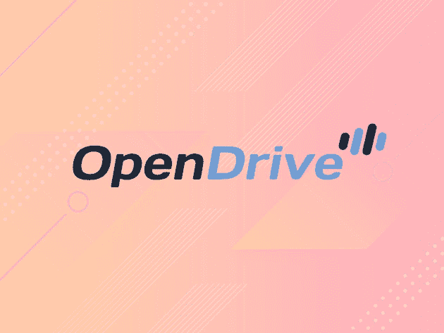
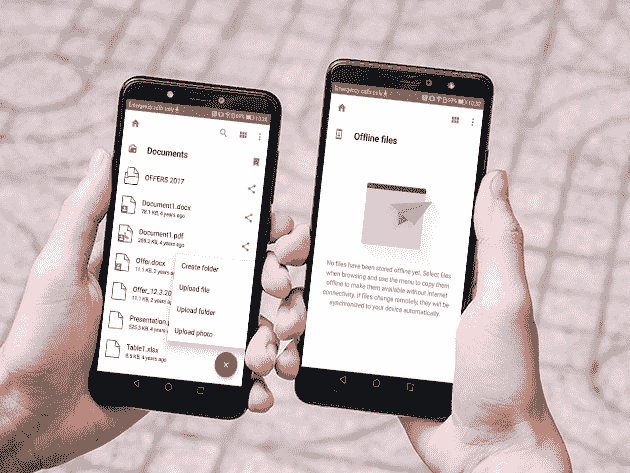
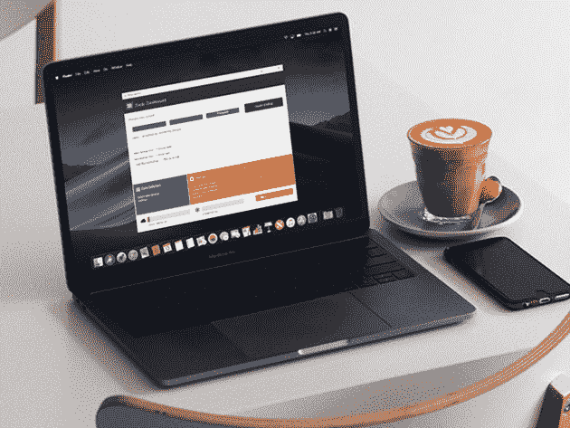

# 5 个云存储平台将保护您的文件安全

> 原文：<https://www.xda-developers.com/5-cloud-storage-platforms-that-will-keep-your-files-safe/>

想到硬件故障的前景并不有趣。但是，如果你重视你珍贵的旧家庭照片和重要的工作文件，制定某种备份计划是至关重要的。这些云平台提供了一种经济实惠的方式来备份您的数字世界。您目前可以在 XDA Developers Depot 节省 90%以上的保费计划。

## **OpenDrive Personal**

这款个人 cloud locker 非常适合复制您的整个硬盘和连接的硬盘。[open drive](https://depot.xda-developers.com/sales/opendrive-personal-custom-1-yr-subscription-1tb-storage-25gb?utm_source=xda-developers.com&utm_medium=referral&utm_campaign=opendrive-personal-custom-1-yr-subscription-1tb-storage-25gb&utm_term=scsf-341812&utm_content=a0x1P000004Mj1v&scsonar=1)可以在所有主要的桌面和移动平台上运行，具有自动同步功能，可以轻松地与朋友和家人共享文件。49 美元 (当时是 90 美元)或者 99 美元 (当时是 180 美元)就可以获得一年期 1TB、每日带宽 25GB 的套餐。您还可以升级到 5TB 和 500GB 的每日带宽，一年的 [价格为 198 美元](https://depot.xda-developers.com/sales/opendrive-personal-custom-1-yr-subscription-5tb-storage-500gb?utm_source=xda-developers.com&utm_medium=referral&utm_campaign=opendrive-personal-custom-1-yr-subscription-5tb-storage-500gb&utm_term=scsf-342955&utm_content=a0x1P000004Mj1v&scsonar=1) (当时为 490 美元)或两年的 [价格为 379 美元](https://depot.xda-developers.com/sales/opendrive-personal-custom-2-yr-subscription-5tb-storage-500gb?utm_source=xda-developers.com&utm_medium=referral&utm_campaign=opendrive-personal-custom-2-yr-subscription-5tb-storage-500gb&utm_term=scsf-342956&utm_content=a0x1P000004Mj1v&scsonar=1) (当时为 980 美元)。

## **Degoo Premium life 套餐**

https://www.youtube.com/watch?v=lvH0SSsrVcs

你有一个装满文件的大硬盘吗？Degoo Premium 的备份空间比 Dropbox、OneDrive 和 Google Drive 的总和还要多，足以满足您的需求。由于 AES-256 加密，该平台易于使用且超级安全。更好的是，它可以在你所有的设备上运行。现在您可以以 49.99 美元 (价值 900 美元)[2TB 59.99 美元](https://depot.xda-developers.com/sales/degoo-ultimate-2tb-backup-plan-lifetime-subscription?utm_source=xda-developers.com&utm_medium=referral&utm_campaign=degoo-ultimate-2tb-backup-plan-lifetime-subscription&utm_term=scsf-342946&utm_content=a0x1P000004Mj1v&scsonar=1) (价值 1，200 美元)[3TB 69.99 美元](https://depot.xda-developers.com/sales/degoo-premium-lifetime-3tb-backup-plan?utm_source=xda-developers.com&utm_medium=referral&utm_campaign=degoo-premium-lifetime-3tb-backup-plan&utm_term=scsf-342941&utm_content=a0x1P000004Mj1v&scsonar=1) (价值 1，500 美元) [10TB](https://depot.xda-developers.com/sales/degoo-premium-lifetime-backup-plans-10tb?utm_source=xda-developers.com&utm_medium=referral&utm_campaign=degoo-premium-lifetime-backup-plans-10tb&utm_term=scsf-342942&utm_content=a0x1P000004Mj1v&scsonar=1)

## **Koofr 云终身存储**

如果你使用 Google Drive、Dropbox、Amazon 或者 OneDrive，你可能要考虑一下 [Koofr](https://depot.xda-developers.com/sales/koofr-cloud-storage-plans-lifetime-subscription-25gb?utm_source=xda-developers.com&utm_medium=referral&utm_campaign=koofr-cloud-storage-plans-lifetime-subscription-25gb&utm_term=scsf-342952&utm_content=a0x1P000004Mj1v&scsonar=1) 。这个简单的应用程序让你上传文件，并通过一个简单的界面访问所有现有的在线存储。您可以很容易地找到副本，甚至设置自定义品牌。终身订阅从 [开始，25GB](https://depot.xda-developers.com/sales/koofr-cloud-storage-plans-lifetime-subscription-25gb?utm_source=xda-developers.com&utm_medium=referral&utm_campaign=koofr-cloud-storage-plans-lifetime-subscription-25gb&utm_term=scsf-342952&utm_content=a0x1P000004Mj1v&scsonar=1) (价值 270 美元)19.99 美元。还可以以 35.99 美元 (价值 540 美元)[250 GB 69.99 美元](https://depot.xda-developers.com/sales/koofr-cloud-storage-plans-lifetime-subscription-250gb?utm_source=xda-developers.com&utm_medium=referral&utm_campaign=koofr-cloud-storage-plans-lifetime-subscription-250gb&utm_term=scsf-342943&utm_content=a0x1P000004Mj1v&scsonar=1) (价值 1080 美元)，或者 179.99 美元 (价值 2700 美元) [1TB。](https://depot.xda-developers.com/sales/koofr-cloud-storage-plans-lifetime-subscription-1tb?utm_source=xda-developers.com&utm_medium=referral&utm_campaign=koofr-cloud-storage-plans-lifetime-subscription-1tb&utm_term=scsf-342949&utm_content=a0x1P000004Mj1v&scsonar=1)

## **Zoolz 云备份**

如果你需要一个长期的备用解决方案，[【Zoolz】](https://depot.xda-developers.com/sales/unlimited-users-unlimited-servers?utm_source=xda-developers.com&utm_medium=referral&utm_campaign=unlimited-users-unlimited-servers&utm_term=scsf-342944&utm_content=a0x1P000004Mj1v&scsonar=1)可能就是答案。这项服务将您的数据放在“冷存储”中，这非常适合存档。有两个版本可用:一个供个人使用，一个供多个用户使用。您可以通过个人计划获得一年 1TB 的存储空间， [只需 19.99 美元](https://depot.xda-developers.com/sales/zoolz-cloud-backup-for-home-1tb-of-cloud-backup-storage-1-user-1-year?utm_source=xda-developers.com&utm_medium=referral&utm_campaign=zoolz-cloud-backup-for-home-1tb-of-cloud-backup-storage-1-user-1-year&utm_term=scsf-342948&utm_content=a0x1P000004Mj1v&scsonar=1) (价值 199.99 美元)或 [三年 34.99 美元](https://depot.xda-developers.com/sales/zoolz-cloud-backup-for-home-1tb-of-cloud-backup-storage-1-user-3-years?utm_source=xda-developers.com&utm_medium=referral&utm_campaign=zoolz-cloud-backup-for-home-1tb-of-cloud-backup-storage-1-user-3-years&utm_term=scsf-342950&utm_content=a0x1P000004Mj1v&scsonar=1) (价值 597.99 美元)，可供最多五个用户使用，1TB 的存储空间 [现在是 89 美元](https://depot.xda-developers.com/sales/5-users-5-servers?utm_source=xda-developers.com&utm_medium=referral&utm_campaign=5-users-5-servers&utm_term=scsf-342945&utm_content=a0x1P000004Mj1v&scsonar=1)

## **ThunderDrive 云存储**

拥有比亚马逊快六倍的在线存储，[ThunderDrive](https://depot.xda-developers.com/sales/thunderdrive-pro-2tb-lifetime-subscription?utm_source=xda-developers.com&utm_medium=referral&utm_campaign=thunderdrive-pro-2tb-lifetime-subscription&utm_term=scsf-342954&utm_content=a0x1P000004Mj1v&scsonar=1)对生产力有很大帮助。这个平台也非常容易使用，并配备了 AES-256 加密。然而，也许最令人印象深刻的功能是价格:你可以花 29 美元 获得 [终身个人计划(500GB)，或者只花 59 美元](https://depot.xda-developers.com/sales/thunderdrive-personal-500gb-lifetime-subscription?utm_source=xda-developers.com&utm_medium=referral&utm_campaign=thunderdrive-personal-500gb-lifetime-subscription&utm_term=scsf-342953&utm_content=a0x1P000004Mj1v&scsonar=1) (价值 1200 美元)升级到 [2TB Pro 计划。](https://depot.xda-developers.com/sales/thunderdrive-pro-2tb-lifetime-subscription?utm_source=xda-developers.com&utm_medium=referral&utm_campaign=thunderdrive-pro-2tb-lifetime-subscription&utm_term=scsf-342954&utm_content=a0x1P000004Mj1v&scsonar=1)

*像这样的交易？查看 [金库](http://depot.xda-developers.com/sales/vault-the-online-security-cloud-14?utm_source=xda-developers.com&utm_medium=referral-subdeal&utm_campaign=vault)——你将获得四个高级工具，包括 NordVPN 和 Dashlane，以增强你的在线安全性。现在免费试用 14 天！*

*价格可能会有变化。*