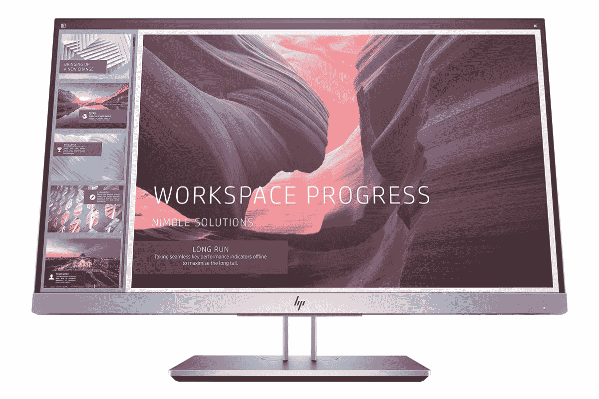
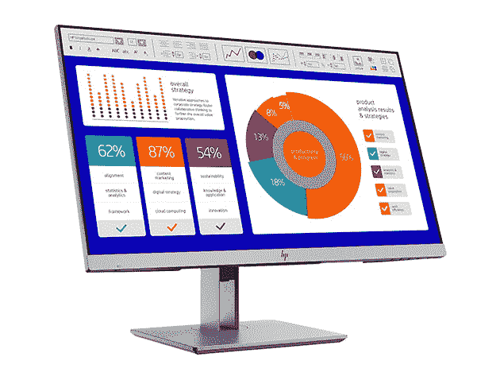
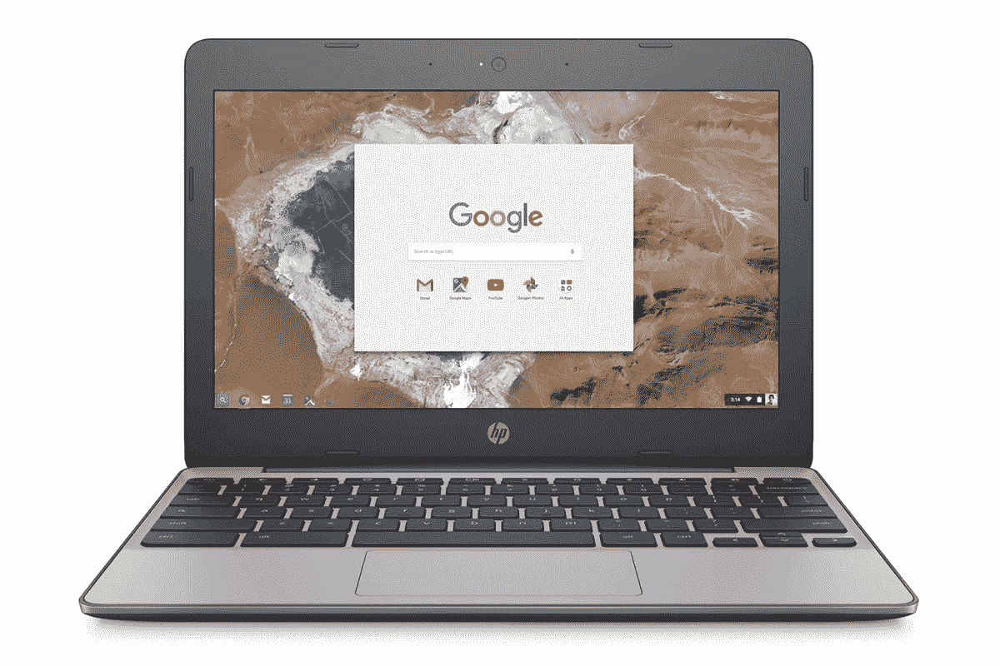
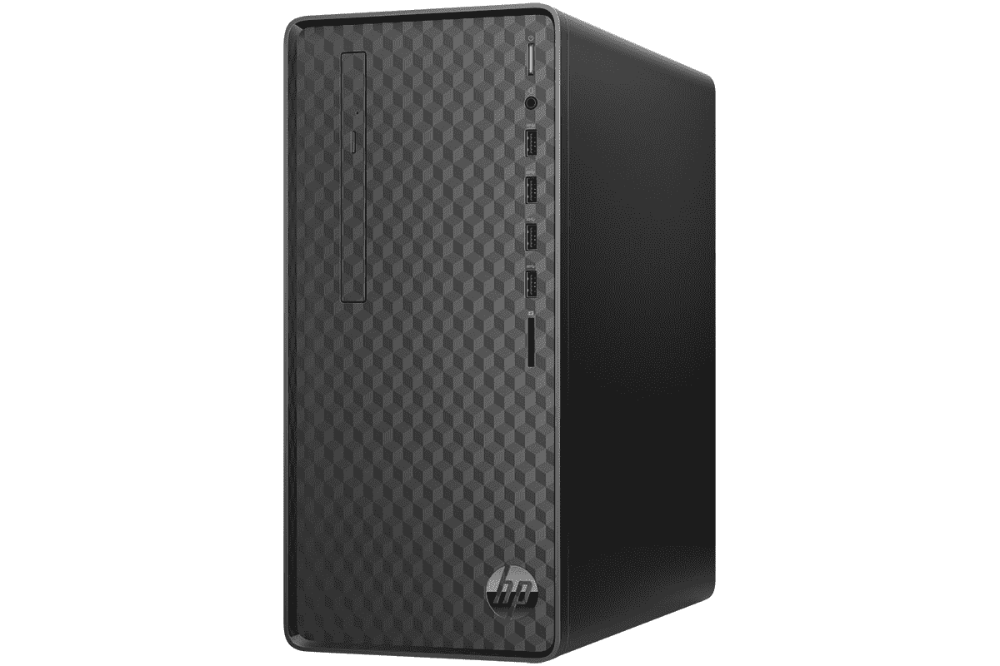
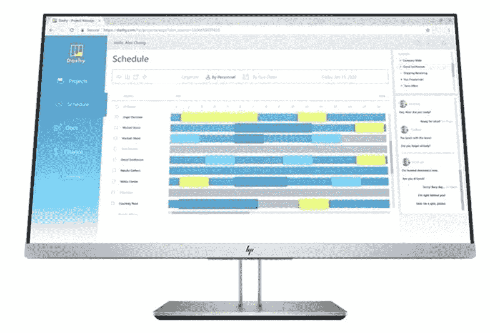

# 惠普显示器 5 项优惠及更多优惠，起价仅为 119 美元

> 原文：<https://www.xda-developers.com/5-deals-on-hp-monitors-and-more-starting-at-just-119/>

如果你在过去几周一直在家工作，你可能会意识到你的设置中存在一些漏洞。如果您想在不倾家荡产的情况下进行升级，请在 XDA Developers Depot 查看这些惠普硬件交易。现在，您可以节省高达 14%的建议零售价。

## **惠普 EliteDisplay E223d 21.5 英寸坞站显示器**

****

[这款 21.5 英寸 LED 显示器](https://depot.xda-developers.com/sales/hp-elitedisplay-e223d-21-5-docking-monitor?utm_source=xda-developers.com&utm_medium=referral&utm_campaign=hp-elitedisplay-e223d-21-5-docking-monitor&utm_term=scsf-411578&utm_content=a0x1P000004sexeQAA&scsonar=1) 拥有九个集成端口，可提供惊艳的视觉效果和令人印象深刻的连接性。随附的支架可让您将屏幕倾斜和旋转至最佳角度，而这款显示器的流线型边框则非常适合双显示器设置。它通常零售价为 269 美元，但你现在可以以 229.99 美元 买到 elite display[。](https://depot.xda-developers.com/sales/hp-elitedisplay-e223d-21-5-docking-monitor?utm_source=xda-developers.com&utm_medium=referral&utm_campaign=hp-elitedisplay-e223d-21-5-docking-monitor&utm_term=scsf-411578&utm_content=a0x1P000004sexeQAA&scsonar=1)

## **HP EliteDisplay E243p 23.8 英寸 16:9 IPS Sure View 显示器**

****

如果你有更多的钱可以花，那么这款[elite display E243p](https://depot.xda-developers.com/sales/hp-elitedisplay-e243p-23-8-16-9-ips-sure-view-monitor?utm_source=xda-developers.com&utm_medium=referral&utm_campaign=hp-elitedisplay-e243p-23-8-16-9-ips-sure-view-monitor&utm_term=scsf-413426&utm_content=a0x1P000004sexeQAA&scsonar=1)值得一试。这款 23.8 英寸全高清显示屏采用 IPS 技术，可提供令人难以置信的色彩和 260 cd/m2 的亮度。隐私模式使屏幕变暗，以保持您的视野不受遮挡，灵活的支架可以倾斜、升高和旋转。正常售价 364 美元， [现在只要 309.99 美元](https://depot.xda-developers.com/sales/hp-elitedisplay-e243p-23-8-16-9-ips-sure-view-monitor?utm_source=xda-developers.com&utm_medium=referral&utm_campaign=hp-elitedisplay-e243p-23-8-16-9-ips-sure-view-monitor&utm_term=scsf-413426&utm_content=a0x1P000004sexeQAA&scsonar=1) 。

## **惠普 Chromebook 11.6 英寸(经认证翻新)**

****

这款轻便的 Chromebook 提供 12 小时的电池续航时间，非常适合在移动中查看电子邮件、浏览网页和写作。据 CNET 称，它还具有“锐利的设计、舒适的键盘、明亮的 IPS 显示屏和扬声器”这款便携的老爷车原价为 229.99 美元，但你现在可以花 199.99 美元 [买到认证的 refurb。](https://depot.xda-developers.com/sales/hp-chromebook-11-v033nr-11-6-2gb-16gb-intel-celeron-n3060-x21-6ghz-gray-certified-refurbished?utm_source=xda-developers.com&utm_medium=referral&utm_campaign=hp-chromebook-11-v033nr-11-6-2gb-16gb-intel-celeron-n3060-x21-6ghz-gray-certified-refurbished&utm_term=scsf-413427&utm_content=a0x1P000004sexeQAA&scsonar=1)

## **惠普 M01-F0057C 台式机酷睿 i3 1.1TB SATA**

****

[这只美丽的野兽](https://depot.xda-developers.com/sales/hp-m01-f0057c-8gb-1-1tb-intel-core-i3-9100-x4-3-6ghz-win10-home?utm_source=xda-developers.com&utm_medium=referral&utm_campaign=hp-m01-f0057c-8gb-1-1tb-intel-core-i3-9100-x4-3-6ghz-win10-home&utm_term=scsf-413428&utm_content=a0x1P000004sexeQAA&scsonar=1) 在四核英特尔 i3 处理器和 8GB RAM 上运行 Windows 10 Home。它还集成了英特尔 UHD 630 显卡、一个用于存储媒体的 1.1TB 大硬盘，甚至还有一个 DVD 驱动器——还记得这些吗？零售价为 399.99 美元，但你现在只需 349.99 美元 就能买到 [。](https://depot.xda-developers.com/sales/hp-m01-f0057c-8gb-1-1tb-intel-core-i3-9100-x4-3-6ghz-win10-home?utm_source=xda-developers.com&utm_medium=referral&utm_campaign=hp-m01-f0057c-8gb-1-1tb-intel-core-i3-9100-x4-3-6ghz-win10-home&utm_term=scsf-413428&utm_content=a0x1P000004sexeQAA&scsonar=1)

## **惠普 EliteDisplay E273d 27 英寸坞站显示器**

****

经专家评审评定为 4 星，[elite display E273d](https://depot.xda-developers.com/sales/hp-elitedisplay-e273d-27-docking-monitor?utm_source=xda-developers.com&utm_medium=referral&utm_campaign=hp-elitedisplay-e273d-27-docking-monitor&utm_term=scsf-413429&utm_content=a0x1P000004sexeQAA&scsonar=1)以 250cd/m 的亮度提供完整的 1080p 清晰度。此外，它还有 10 个端口，包括 USB-C 和 USB-A，这意味着您可以轻松连接您的笔记本电脑、充电设备和菊花链显示器。这款环保显示器由海洋塑料制成，现在的零售价为 364.99 美元[打九折。](https://depot.xda-developers.com/sales/hp-elitedisplay-e273d-27-docking-monitor?utm_source=xda-developers.com&utm_medium=referral&utm_campaign=hp-elitedisplay-e273d-27-docking-monitor&utm_term=scsf-413429&utm_content=a0x1P000004sexeQAA&scsonar=1)

*价格随时变化*