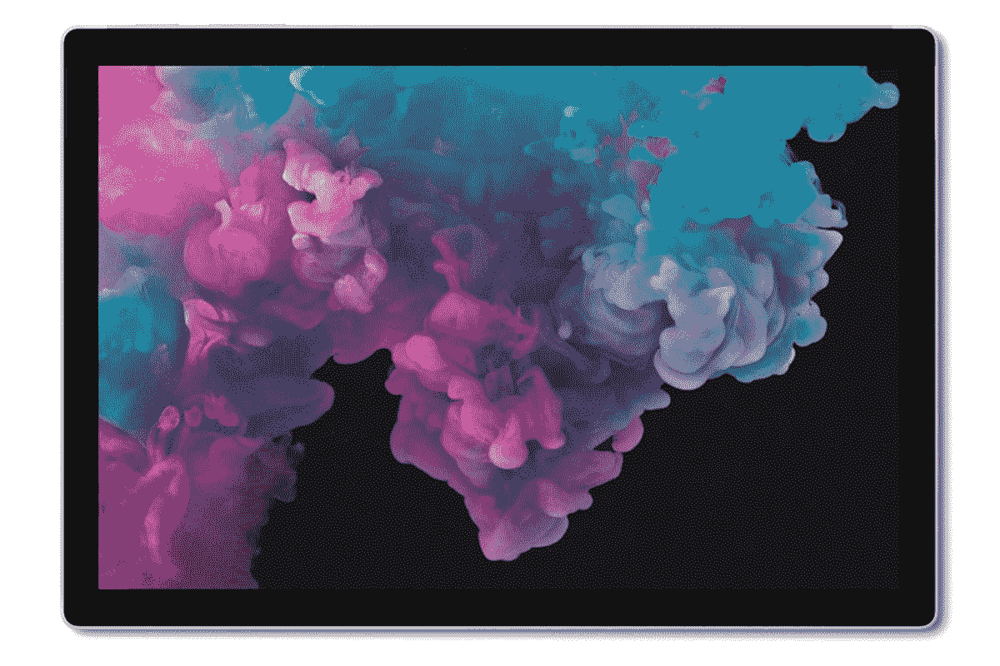
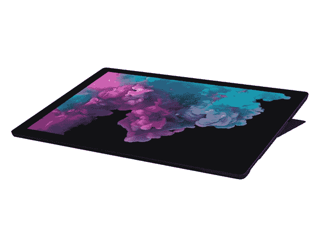

# 5 项微软 Surface 优惠，您现在就可以节省大笔费用

> 原文：<https://www.xda-developers.com/5-microsoft-surface-deals-you-can-save-big-with-right-now/>

目前世界上许多最好的电脑都是由微软制造的。特别是，Surface 系列以合理的价格提供了卓越的规格。如果你正在寻求升级，看看这五个关于 Surface 设备的交易——现在通过 XDA Developers Depot 可以获得高达 27%的 MSRP 折扣。

## **微软 Surface Laptop 2 13.5 英寸 Touch Core i5 8GB(钴蓝色)**

****

提供长达 15 小时的电池续航时间， [微软 Surface Laptop 2](https://depot.xda-developers.com/sales/microsoft-surface-laptop-2-13-5-touch-intel-core-i5-8250u-x4-1-6ghz-8gb-256gb-ssd-win10?utm_source=xda-developers.com&utm_medium=referral&utm_campaign=microsoft-surface-laptop-2-13-5-touch-intel-core-i5-8250u-x4-1-6ghz-8gb-256gb-ssd-win10&utm_term=scsf-407582&utm_content=a0x1P000004sXYLQA2&scsonar=1) 专为移动工作而生。它在清晰的 13.5 英寸 LED 显示屏上运行 Windows 10，凭借英特尔 i5 芯片和 8GB 内存提供了出色的性能。PCMag 称其为“具有顶级构造的时尚超便携产品。 [原价 1299 美元，现在只要 979.99 美元](https://depot.xda-developers.com/sales/microsoft-surface-laptop-2-13-5-touch-intel-core-i5-8250u-x4-1-6ghz-8gb-256gb-ssd-win10?utm_source=xda-developers.com&utm_medium=referral&utm_campaign=microsoft-surface-laptop-2-13-5-touch-intel-core-i5-8250u-x4-1-6ghz-8gb-256gb-ssd-win10&utm_term=scsf-407582&utm_content=a0x1P000004sXYLQA2&scsonar=1) 。

## **微软 Surface Pro 12.3 英寸平板电脑 4GB RAM - Silver (Wi-Fi + 4G LTE)**

****

这款轻型设备拥有比大多数平板电脑多 50%的功率和令人惊叹的 2736 x 1824 触摸显示屏。在引擎盖下，第七代英特尔酷睿 i5 处理器提供了流畅的多任务处理能力。电池续航时间为 13.5 小时，128GB 固态硬盘为媒体提供了充足的空间。这款 4G 机型价值 1299.99 美元，现在以 1099.99 美元 的价格 [打八五折。](https://depot.xda-developers.com/sales/microsoft-surface-pro-gwl-00001-128gb-4gb-ram-12-3-wifi-4g-lte-silver?utm_source=xda-developers.com&utm_medium=referral&utm_campaign=microsoft-surface-pro-gwl-00001-128gb-4gb-ram-12-3-wifi-4g-lte-silver&utm_term=scsf-407586&utm_content=a0x1P000004sXYLQA2&scsonar=1)

## **微软 Surface Pro 6 平板电脑 1.9GHz 英特尔酷睿 i7 配 512GB 固态硬盘**

****

[更新版 Surface Pro](https://depot.xda-developers.com/sales/microsoft-surface-pro-6-512gb-12-3-wifi-intel-core-i7-8650ux41-9ghz?utm_source=xda-developers.com&utm_medium=referral&utm_campaign=microsoft-surface-pro-6-512gb-12-3-wifi-intel-core-i7-8650ux41-9ghz&utm_term=scsf-407587&utm_content=a0x1P000004sXYLQA2&scsonar=1) 据《卫报》报道，这是“可以说是制造得最好的 Windows 10 平板电脑”。这个版本有一个非凡的 16GB 内存和一个快速的 i7 处理器封装在一个光滑的框架内。你还可以获得大量的固态存储、13.5 小时的电池和 12.3 英寸的 PixelSense 显示屏。通常是 1499.99 美元，但你现在可以用 1279.99 美元 买到你的。

## **微软 Surface Pro 6 256GB 12.3 英寸 WiFi 英特尔酷睿 i7**

如果你不需要疯狂的规格， [这个版本的 Surface Pro 6](https://depot.xda-developers.com/sales/microsoft-surface-pro-6-256gb-12-3-wifi-intel-core-i7-8650ux41-9ghz?utm_source=xda-developers.com&utm_medium=referral&utm_campaign=microsoft-surface-pro-6-256gb-12-3-wifi-intel-core-i7-8650ux41-9ghz&utm_term=scsf-407588&utm_content=a0x1P000004sXYLQA2&scsonar=1) 是一个很棒的选择。你仍然可以将 i7 芯片和清晰的显示屏固定在只有 0.33 英寸厚的机身上。该版本还拥有 256GB 的固态存储、超长电池续航时间和英特尔显卡。价值 1499.99 美元，现在 [降到 1089.99 美元](https://depot.xda-developers.com/sales/microsoft-surface-pro-6-256gb-12-3-wifi-intel-core-i7-8650ux41-9ghz?utm_source=xda-developers.com&utm_medium=referral&utm_campaign=microsoft-surface-pro-6-256gb-12-3-wifi-intel-core-i7-8650ux41-9ghz&utm_term=scsf-407588&utm_content=a0x1P000004sXYLQA2&scsonar=1) 。

## **微软 Surface Pro 6 平板电脑 1.9GHz 英特尔酷睿 i7 配 1TB 固态硬盘**

 需要更多存储空间来存储照片、电影和游戏？ [ 这款 Surface Pro 6  ](https://depot.xda-developers.com/sales/microsoft-surface-pro-6-1tb-12-3-wifi-intel-core-i7-8650ux41-9ghz?utm_source=xda-developers.com&utm_medium=referral&utm_campaign=microsoft-surface-pro-6-1tb-12-3-wifi-intel-core-i7-8650ux41-9ghz&utm_term=scsf-407589&utm_content=a0x1P000004sXYLQA2&scsonar=1) 有你罩着，多亏了一个巨大的 1TB SSD。它在 i7 处理器和 16GB 内存上运行 Windows 10 Pro，用 CNET 的话说，这是一个提供“巨大性能增益”的组合。原来 1499.99 美元，这个轻量级怪物 [ 现在只要 1429.99 美元 ](https://depot.xda-developers.com/sales/microsoft-surface-pro-6-1tb-12-3-wifi-intel-core-i7-8650ux41-9ghz?utm_source=xda-developers.com&utm_medium=referral&utm_campaign=microsoft-surface-pro-6-1tb-12-3-wifi-intel-core-i7-8650ux41-9ghz&utm_term=scsf-407589&utm_content=a0x1P000004sXYLQA2&scsonar=1) 。

*价格随时变化*