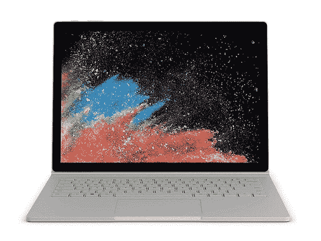
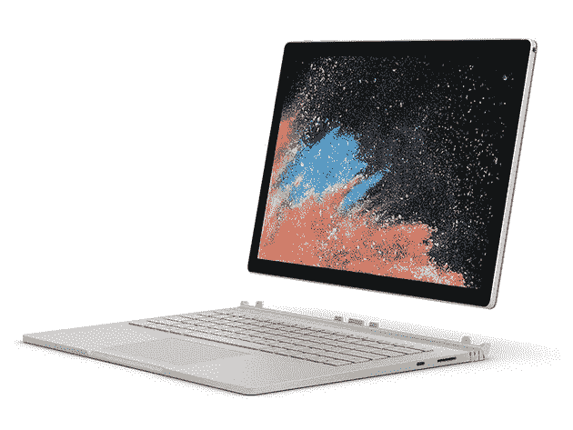
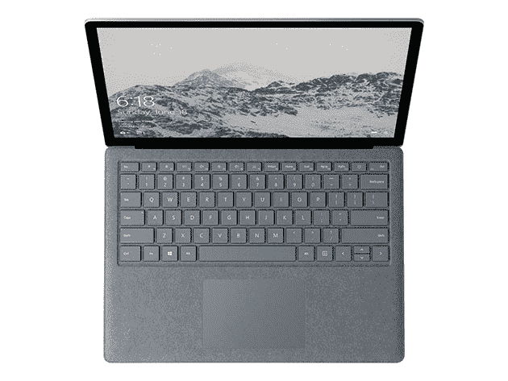
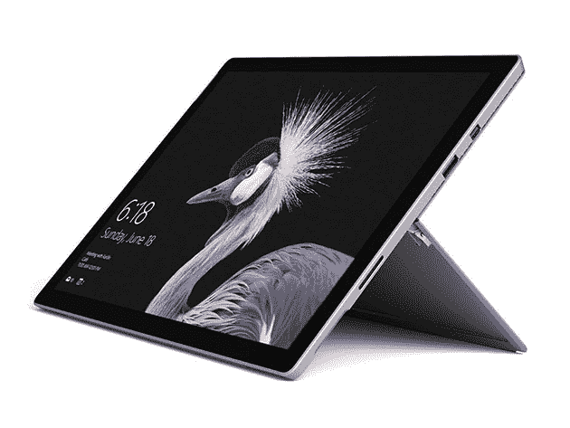
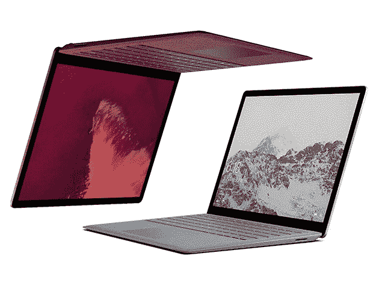

# 在这个总统日，你不应该睡觉

> 原文：<https://www.xda-developers.com/5-pre-owned-microsoft-surface-deals-you-shouldnt-sleep-on-this-presidents-day/>

在理想的世界里，大多数人只会买新的。但是，如果你想要更多的钱，重新认证的笔记本电脑提供令人难以置信的价值。这些机器像新的一样，被制造商修复过。它们还带有重置的原始保修。因此，如果您热衷于升级您当前的设置，但希望坚持预算，请在 XDA Developers Depot 查看这些产品，现在比您购买新产品的价格低 68%。

## **Surface Book 13.5 英寸酷睿 i5 256GB 银**

****

这款时尚的二合一设备采用英特尔第六代双核处理器，非常适合在旅途中工作。[Surface Book](https://depot.xda-developers.com/sales/microsoft-surface-book-8gb-ram-256gb-intel-core-i5-6300u-x2-2-4ghz-13-5-silver-certified-refurbished?utm_source=xda-developers.com&utm_medium=referral&utm_campaign=microsoft-surface-book-8gb-ram-256gb-intel-core-i5-6300u-x2-2-4ghz-13-5-silver-certified-refurbished&utm_term=scsf-372008&utm_content=a0x1P000004NIli&scsonar=1)在 13.5 英寸 IPS 触摸屏显示器上运行 Windows 10 Pro，分辨率为 3000x2000 像素。它还提供 256GB 的存储空间和无线连接。原价 1499 美元，工厂重新认证版本现 [仅售 529.99 美元](https://depot.xda-developers.com/sales/microsoft-surface-book-8gb-ram-256gb-intel-core-i5-6300u-x2-2-4ghz-13-5-silver-certified-refurbished?utm_source=xda-developers.com&utm_medium=referral&utm_campaign=microsoft-surface-book-8gb-ram-256gb-intel-core-i5-6300u-x2-2-4ghz-13-5-silver-certified-refurbished&utm_term=scsf-372008&utm_content=a0x1P000004NIli&scsonar=1) 。

## **Surface Book 13.5 英寸酷睿 i7 512GB 银**

****

这款 [高端 Surface Book](https://depot.xda-developers.com/sales/microsoft-surface-book-16gb-ram-512gb-intel-core-i7-6600u-x2-2-6ghz-13-5-silver-certified-refurbished?utm_source=xda-developers.com&utm_medium=referral&utm_campaign=microsoft-surface-book-16gb-ram-512gb-intel-core-i7-6600u-x2-2-6ghz-13-5-silver-certified-refurbished&utm_term=scsf-372014&utm_content=a0x1P000004NIli&scsonar=1) 拥有英特尔 i7 处理器和 16GB 内存，支持流畅的多任务处理。您将获得完全相同的 IPS 显示屏，以及双倍的存储空间和 NVIDIA GeForce GTX 显卡。这些机器的零售价为 2799 美元，但你可以花 879 美元 获得一个工厂重新认证的设备 [。](https://depot.xda-developers.com/sales/microsoft-surface-book-16gb-ram-512gb-intel-core-i7-6600u-x2-2-6ghz-13-5-silver-certified-refurbished?utm_source=xda-developers.com&utm_medium=referral&utm_campaign=microsoft-surface-book-16gb-ram-512gb-intel-core-i7-6600u-x2-2-6ghz-13-5-silver-certified-refurbished&utm_term=scsf-372014&utm_content=a0x1P000004NIli&scsonar=1)

## **微软 Surface 2 英特尔酷睿 i7 512GB**

****

号称拥有 15 小时电池续航时间和 2.9GHz 四核英特尔 i7 处理器的 [微软 Surface 2](https://depot.xda-developers.com/sales/microsoft-surface-2-intel-core-i7-7820hq-x4-2-9ghz-16gb-ram-512gb-platinum-certified-refurbished?utm_source=xda-developers.com&utm_medium=referral&utm_campaign=microsoft-surface-2-intel-core-i7-7820hq-x4-2-9ghz-16gb-ram-512gb-platinum-certified-refurbished&utm_term=scsf-372015&utm_content=a0x1P000004NIli&scsonar=1) 是一款令人难以置信的老爷车。这个版本有 16GB 的内存和 512GB 的固态硬盘，以及清晰的 LED 显示屏。它价值 2499.99 美元，但你可以用 1509 美元 抢到现在的出厂重新认证版本 [。](https://depot.xda-developers.com/sales/microsoft-surface-2-intel-core-i7-7820hq-x4-2-9ghz-16gb-ram-512gb-platinum-certified-refurbished?utm_source=xda-developers.com&utm_medium=referral&utm_campaign=microsoft-surface-2-intel-core-i7-7820hq-x4-2-9ghz-16gb-ram-512gb-platinum-certified-refurbished&utm_term=scsf-372015&utm_content=a0x1P000004NIli&scsonar=1)

## **微软 Surface Pro 4 12.3 英寸 8GB 内存 256GB**

****

[Surface Pro 4](https://depot.xda-developers.com/sales/microsoft-surface-pro-4-8gb-ram-256gb-intel-core-i5-6300u-x2-2-4ghz-12-3-silver-certified-refurbished?utm_source=xda-developers.com&utm_medium=referral&utm_campaign=microsoft-surface-pro-4-8gb-ram-256gb-intel-core-i5-6300u-x2-2-4ghz-12-3-silver-certified-refurbished&utm_term=scsf-372016&utm_content=a0x1P000004NIli&scsonar=1)对于一台平板电脑来说相当强大，配备了第六代英特尔酷睿 i5 处理器和 8GB 内存。12.3 英寸 PixelSense 显示屏非常适合观看电影和编辑照片，您还可以获得 256GB 的固态媒体存储空间。原价 1499.99 美元，这个工厂重新认证的版本是 [目前 499 美元](https://depot.xda-developers.com/sales/microsoft-surface-pro-4-8gb-ram-256gb-intel-core-i5-6300u-x2-2-4ghz-12-3-silver-certified-refurbished?utm_source=xda-developers.com&utm_medium=referral&utm_campaign=microsoft-surface-pro-4-8gb-ram-256gb-intel-core-i5-6300u-x2-2-4ghz-12-3-silver-certified-refurbished&utm_term=scsf-372016&utm_content=a0x1P000004NIli&scsonar=1) 。

## **Surface Book 13.5 英寸酷睿 i7 256GB -铂金**

配备第八代英特尔酷睿 i7 处理器的 [白金 Surface Book](https://depot.xda-developers.com/sales/surface-book-8gb-ram-256gb-intel-core-i7-8650u-x4-1-9ghz-13-5-touch-platinum?utm_source=xda-developers.com&utm_medium=referral&utm_campaign=surface-book-8gb-ram-256gb-intel-core-i7-8650u-x4-1-9ghz-13-5-touch-platinum&utm_term=scsf-372017&utm_content=a0x1P000004NIli&scsonar=1) 提供了尖端的性能。充满电后，您可以获得长达 12 小时的电池续航时间，并配有触觉键盘和触摸板，以提高工作效率。这款机型还配有夏普 IPS 触摸屏显示器。零售价为 2499.99 美元，但你可以 [花 1109 美元](https://depot.xda-developers.com/sales/surface-book-8gb-ram-256gb-intel-core-i7-8650u-x4-1-9ghz-13-5-touch-platinum?utm_source=xda-developers.com&utm_medium=referral&utm_campaign=surface-book-8gb-ram-256gb-intel-core-i7-8650u-x4-1-9ghz-13-5-touch-platinum&utm_term=scsf-372017&utm_content=a0x1P000004NIli&scsonar=1) 得到一个工厂重新认证的 refurb。

*价格随时变化*