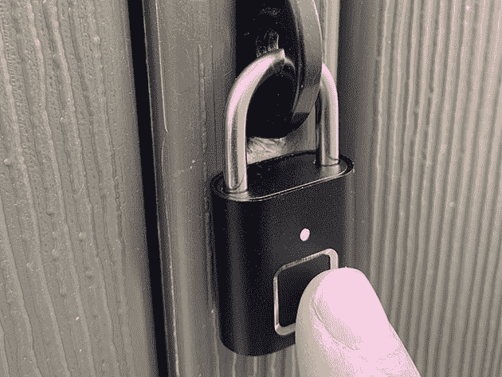
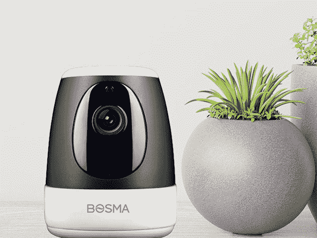
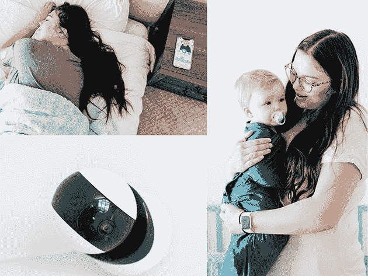
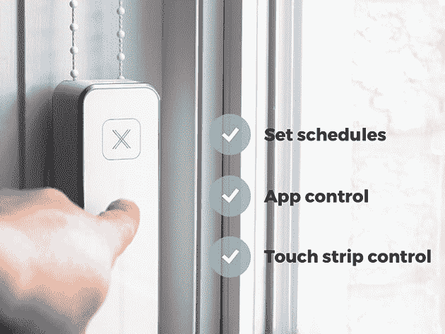
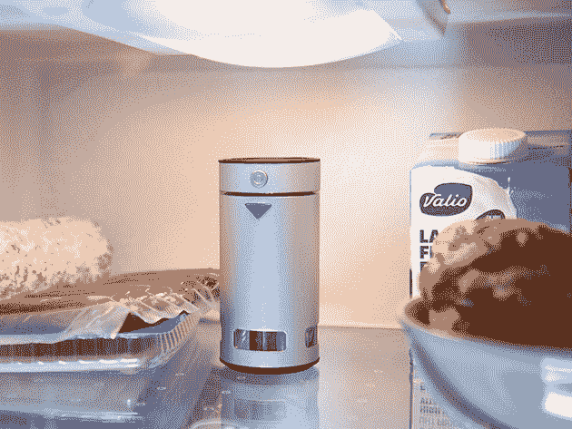
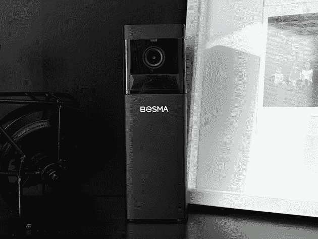

# 7 笔智能家居和安全设备交易，提升您的生活空间

> 原文：<https://www.xda-developers.com/7-deals-on-smart-home-and-security-devices-to-upgrade-your-living-space/>

在过去的几个月里，我们都比平时花更多的时间呆在家里。如果你想升级你的生活空间，让你的家更智能，这些交易绝对值得你关注。现在，你可以在 XDA 开发者仓库购买智能家居设备和安全设备。

## **Google Home Mini 的简易电池底座**

****

在亚马逊上被评为 4.5 星， [这个配件](https://depot.xda-developers.com/sales/jot-battery-base-for-google-home-mini-carbon?utm_source=xda-developers.com&utm_medium=referral&utm_campaign=jot-battery-base-for-google-home-mini-carbon&utm_term=scsf-410203&utm_content=a0x1P000004sdL5QAI&scsonar=1) 让你的 Google Home Mini 自由漫游。5000 毫安时的电池足够使用八个小时，底座只增加了智能扬声器 5.9 盎司的重量。通常售价 34.95 美元，现在的 [仅售 16.99 美元](https://depot.xda-developers.com/sales/jot-battery-base-for-google-home-mini-carbon?utm_source=xda-developers.com&utm_medium=referral&utm_campaign=jot-battery-base-for-google-home-mini-carbon&utm_term=scsf-410203&utm_content=a0x1P000004sdL5QAI&scsonar=1) 。

## **TOKK 指纹智能锁**

****

安全储物柜和外屋的理想选择， [这款智能锁](https://depot.xda-developers.com/sales/tokk-fingerprint-smart-lock?utm_source=xda-developers.com&utm_medium=referral&utm_campaign=tokk-fingerprint-smart-lock&utm_term=scsf-410268&utm_content=a0x1P000004sdL5QAI&scsonar=1) 无需钥匙 0.5 秒开启。你可以对它进行编程，接受 20 种不同的指纹，内置电池可以使用六个月。同样重要的是，它是由坚固的钢材制成的。您现在就可以以 24.99 美元 的价格 [抢购，享受全价五折优惠。](https://depot.xda-developers.com/sales/tokk-fingerprint-smart-lock?utm_source=xda-developers.com&utm_medium=referral&utm_campaign=tokk-fingerprint-smart-lock&utm_term=scsf-410268&utm_content=a0x1P000004sdL5QAI&scsonar=1)

## **XC 安全摄像头**

****

当你不能在家时， [这个红点获奖者](https://depot.xda-developers.com/sales/xc-security-camera?utm_source=xda-developers.com&utm_medium=referral&utm_campaign=xc-security-camera&utm_term=scsf-410269&utm_content=a0x1P000004sdL5QAI&scsonar=1) 让你用 1080p 高清视频直播签到。这架照相机有一个广角镜头，它可以 360 度飞行。它还具有双向音频、运动检测、夜视技术和 90dB 警报器。它的零售价为 59.99 美元，但你现在可以花 43.99 美元 [买到这款相机。](https://depot.xda-developers.com/sales/xc-security-camera?utm_source=xda-developers.com&utm_medium=referral&utm_campaign=xc-security-camera&utm_term=scsf-410269&utm_content=a0x1P000004sdL5QAI&scsonar=1)

## **智能节拍视频呼吸监测仪**

****

这款 [创新型婴儿监视器](https://depot.xda-developers.com/sales/smart-beat-video-breathing-monitor?utm_source=xda-developers.com&utm_medium=referral&utm_campaign=smart-beat-video-breathing-monitor&utm_term=scsf-410270&utm_content=a0x1P000004sdL5QAI&scsonar=1) 每秒钟分析 4000 万像素，随时监视您的小家伙。你可以通过智能手机随时查看高清直播，如果有什么不对劲，Smart Beat 会提醒你。平时 299 美元， [这个小玩意现在 284 美元](https://depot.xda-developers.com/sales/smart-beat-video-breathing-monitor?utm_source=xda-developers.com&utm_medium=referral&utm_campaign=smart-beat-video-breathing-monitor&utm_term=scsf-410270&utm_content=a0x1P000004sdL5QAI&scsonar=1) 。

## **轴齿轮:智能百叶窗控制器(5 件装)**

****

用串珠链兼容各种色调和百叶窗， [轴齿轮](https://depot.xda-developers.com/sales/five-pack?utm_source=xda-developers.com&utm_medium=referral&utm_campaign=five-pack&utm_term=scsf-410271&utm_content=a0x1P000004sdL5QAI&scsonar=1) 让你轻轻一点就能让光线进来。您可以使用附带的 Touch Strip 控件，也可以使用配套的 smartphone 应用程序来设置自定义日程。控制器很容易安装，在 Indiegogo 上筹集了超过 12.8 万美元。价值 999 美元，这包五个是 [现在只要 799.99 美元](https://depot.xda-developers.com/sales/five-pack?utm_source=xda-developers.com&utm_medium=referral&utm_campaign=five-pack&utm_term=scsf-410271&utm_content=a0x1P000004sdL5QAI&scsonar=1) 。

## **Gotek 智能冰箱除臭剂**

****

当你的冰箱里装满原料时，细菌和气味很容易滋生。 [这款智能除臭剂](https://depot.xda-developers.com/sales/smart-fridge-deodorizer?utm_source=xda-developers.com&utm_medium=referral&utm_campaign=smart-fridge-deodorizer&utm_term=scsf-410272&utm_content=a0x1P000004sdL5QAI&scsonar=1) 利用臭氧和负离子双模式杀死 96.2%的细菌，让事情得到控制。它依靠内置的可充电电池运行，可持续 90 天。Gotek 通常售价为 119.90 美元，目前仅售 99.99 美元。

## **X1 室内安全摄像头**

****

设计融入其中， [X1 安全摄像机](https://depot.xda-developers.com/sales/x1-indoor-security-camera?utm_source=xda-developers.com&utm_medium=referral&utm_campaign=x1-indoor-security-camera&utm_term=scsf-410273&utm_content=a0x1P000004sdL5QAI&scsonar=1) 提供 360 度覆盖和智能运动检测。当摄像头注意到任何意外的移动时，你会在手机上收到警报，并且你可以使用集成的警报器来警告你的邻居。建议零售价为 99.99 美元，但你现在可以用 73.99 美元 买到 [。](https://depot.xda-developers.com/sales/x1-indoor-security-camera?utm_source=xda-developers.com&utm_medium=referral&utm_campaign=x1-indoor-security-camera&utm_term=scsf-410273&utm_content=a0x1P000004sdL5QAI&scsonar=1)

*价格随时变化*