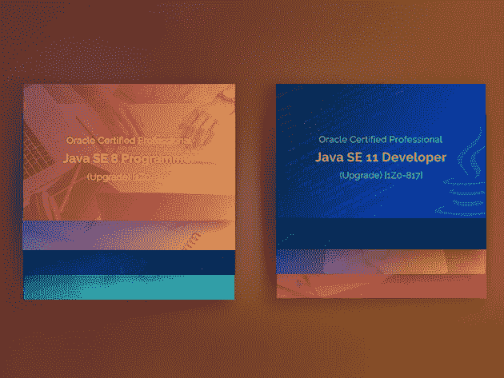
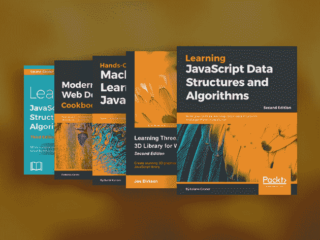

# 7 个本周出售的 JavaScript 和 Java 课程

> 原文：<https://www.xda-developers.com/7-javascript-and-java-courses-that-are-on-sale-this-week/>

虽然 Java 和 JavaScript 是非常不同的语言，但它们是一个很好的标签团队。掌握这两者，你将能够从头开始构建令人惊叹的 Android 应用和网站。为了帮助你开始，这里有 XDA 开发者仓库的七个关于优质课程的优惠。

## **2020 年 Java Bootcamp 捆绑包**

****

非常适合首次开发人员， [这个捆绑包](https://depot.xda-developers.com/sales/the-2020-java-bootcamp-bundle?utm_source=xda-developers.com&utm_medium=referral&utm_campaign=the-2020-java-bootcamp-bundle&utm_term=scsf-420820&utm_content=a0x1P000004srEdQAI&scsonar=1) 包括 10 个初学者友好的课程，平均评分为 4.6 星。通过 10 个小时的内容，您将学习如何使用对象、数组、集合等构建工作程序。该培训价值 990 美元，但您现在可以花 36 美元 购买 [。](https://depot.xda-developers.com/sales/the-2020-java-bootcamp-bundle?utm_source=xda-developers.com&utm_medium=referral&utm_campaign=the-2020-java-bootcamp-bundle&utm_term=scsf-420820&utm_content=a0x1P000004srEdQAI&scsonar=1)

## **2020 年完整的 Java 大师级捆绑包**

****

带你更上一层楼， [这七门课程的集合](https://depot.xda-developers.com/sales/the-2020-complete-java-master-class-certification-bundle?utm_source=xda-developers.com&utm_medium=referral&utm_campaign=the-2020-complete-java-master-class-certification-bundle&utm_term=scsf-420824&utm_content=a0x1P000004srEdQAI&scsonar=1) 帮助你成长为一名 Java 开发人员。在 62 小时的培训中，您将了解如何使用一系列流行工具为 Android 和丰富的网络应用编写本机应用。这些课程通常价值 1066 美元，现在只需 33.99 美元。

## **完整的全栈 JavaScript 课程**

****

涵盖前端和后端开发， [本课程](https://depot.xda-developers.com/sales/the-complete-full-stack-javascript-course?utm_source=xda-developers.com&utm_medium=referral&utm_campaign=the-complete-full-stack-javascript-course&utm_term=scsf-420825&utm_content=a0x1P000004srEdQAI&scsonar=1) 帮助你掌握网页 JavaScript。你总共要接受 21 个小时的培训，涵盖 ReactJS、NodeJS、LoopbackJS、Redux、Material-UI 等等。该课程还包括三个令人兴奋的项目。 [正常售价 200 美元，现在只要 28 美元](https://depot.xda-developers.com/sales/the-complete-full-stack-javascript-course?utm_source=xda-developers.com&utm_medium=referral&utm_campaign=the-complete-full-stack-javascript-course&utm_term=scsf-420825&utm_content=a0x1P000004srEdQAI&scsonar=1) 。

## **Oracle Java 认证考试准备课程+测试培训包**

****

根据 PayScale，Oracle Java 认证开发人员的年薪最高可达 12 万美元。 [这个捆绑](https://depot.xda-developers.com/sales/oracle-java-certification-exam-preparation-courses-tests-training-bundle?utm_source=xda-developers.com&utm_medium=referral&utm_campaign=oracle-java-certification-exam-preparation-courses-tests-training-bundle&utm_term=scsf-420826&utm_content=a0x1P000004srEdQAI&scsonar=1) 帮你通过考试，13 个小时的培训视频，40 次全程模拟考试，每道题的详尽讲解。总共价值 400 美元，这个套装是 [现在只需 29.99 美元](https://depot.xda-developers.com/sales/oracle-java-certification-exam-preparation-courses-tests-training-bundle?utm_source=xda-developers.com&utm_medium=referral&utm_campaign=oracle-java-certification-exam-preparation-courses-tests-training-bundle&utm_term=scsf-420826&utm_content=a0x1P000004srEdQAI&scsonar=1) 。

## **完整的 JavaScript 电子书包**

如果你想探索 JavaScript 的全部潜力， [这个电子书的迷你图书馆](https://depot.xda-developers.com/sales/the-complete-javascript-ebook-bundle?utm_source=xda-developers.com&utm_medium=referral&utm_campaign=the-complete-javascript-ebook-bundle&utm_term=scsf-420827&utm_content=a0x1P000004srEdQAI&scsonar=1) 是一个很好的起点。该包包括十个标题，涵盖了基本的 JS 以及一些有趣的主题，如企业开发、机器学习、3D 图形、物联网等等。这些电子书零售总额为 400 美元，但你现在可以花 19.99 美元 [买到。](https://depot.xda-developers.com/sales/the-complete-javascript-ebook-bundle?utm_source=xda-developers.com&utm_medium=referral&utm_campaign=the-complete-javascript-ebook-bundle&utm_term=scsf-420827&utm_content=a0x1P000004srEdQAI&scsonar=1)

## **终极 Java 专家认证包**

****

11 门课程，38 个小时的内容， [这个终极捆绑](https://depot.xda-developers.com/sales/the-ultimate-java-expert-certification-bundle?utm_source=xda-developers.com&utm_medium=referral&utm_campaign=the-ultimate-java-expert-certification-bundle&utm_term=scsf-420828&utm_content=a0x1P000004srEdQAI&scsonar=1) 名副其实。该培训涵盖了 Java 9 的最新特性，向您展示了如何构建 web 应用程序，甚至还介绍了 UI 设计。同样重要的是，你应该带着证书和一份不错的作品集离开。通常价值 2200 美元， [这些课程现在只有【31】](https://depot.xda-developers.com/sales/the-ultimate-java-expert-certification-bundle?utm_source=xda-developers.com&utm_medium=referral&utm_campaign=the-ultimate-java-expert-certification-bundle&utm_term=scsf-420828&utm_content=a0x1P000004srEdQAI&scsonar=1)。

## **全面的 JavaScript 捆绑包**

****

从开发游戏到制作动态网页， [这个捆绑](https://depot.xda-developers.com/sales/the-complete-javascript-bundle?utm_source=xda-developers.com&utm_medium=referral&utm_campaign=the-complete-javascript-bundle&utm_term=scsf-420829&utm_content=a0x1P000004srEdQAI&scsonar=1) 通过 142 小时的视频课帮助你掌握 JavaScript。除了基础知识，您还将学习 JavaScript DOM、HTML5 画布绘制、面向对象编程等等。这八道菜价值 1492 美元，但你现在可以花 31 美元 买到。

*价格随时变化*