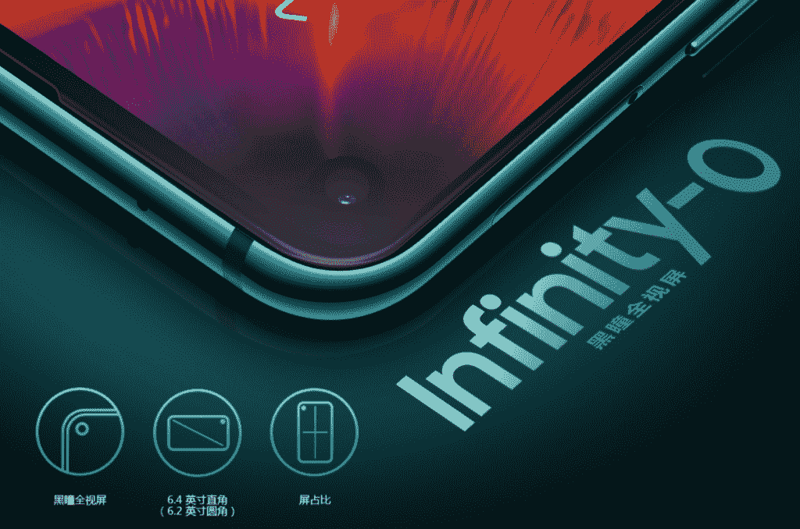

# 近距离观察 Honor 的打孔屏幕技术

> 原文：<https://www.xda-developers.com/a-closer-look-at-honors-hole-punch-screen-technology/>

最近，我们有一个关于显示孔、滑盖手机和凹槽的讨论。社区对这个话题有很大的发言权，因此在本文中，我们将更深入地研究即将推出的 Honor View20 和三星 Galaxy A8s 中“打孔”风格凹槽背后的技术。

## 带打孔显示屏的手机

打孔显示屏将成为 2019 年的趋势特征，我们已经看到这种情况在一些不同的手机中出现。华为 Nova 4、三星 Galaxy A8s、三星 Galaxy S10 和 Honor View20 都配备了打孔显示屏。虽然所有这些设计可能看起来都一样，但 Honor 能够使用几种不同的技术实现更好的结果。

 <picture></picture> 

The Galaxy A8s with hole-punch notch

上图是 Galaxy A8s 显示自拍相机穿过显示屏。你还会注意到打孔器周围有一个相当大的黑环。这个环是摄像机穿过显示器的每一层的结果，除了非常表面的水平。这留下了一个大洞，如果相机没有穿过屏幕的显示层，你会发现这个洞。

相机穿透显示器每一层的另一个缺点是，光将有更大的机会漏光。这种设计可能会导致低质量的自拍。还有一个问题是显示器的耐用性受到设计的影响。这可能会导致显示器容易损坏。

荣誉视图 20，带打孔槽口

Honor View20 能够实现一个不完全穿透显示器的小相机点，同时仍然保留不受阻碍的相机功能。在液晶层上，Honor View20 采用了一种叫做像素转换技术的特殊技术，这种技术可以控制液晶的流动，使光线能够穿过并到达相机。

这使得孔的直径变小。虽然 Galaxy A8s 的直径估计为 6.7 毫米，但 Honor View20 的直径只有 4.5 毫米。在有孔的显示器层中，Honor 放弃了机械钻孔，并采用了更困难的光刻钻孔，以确保孔径尽可能小。

你不太可能会有漏光的问题，应该会拍出质量更好的自拍。Honor 的打孔设计耐用性应该更好，因为它在摄像头孔上有更多层玻璃。

这些手机采用了我们在智能手机中看到的第一个打孔设计，因此，看看这项技术在明年如何演变将是一件有趣的事情。Honor View20 将于 12 月 26 日在中国推出，并于 1 月 22 日在全球发行。

## 为什么打孔展示比缺口展示更好

凹口是 2018 年最受批评的手机功能之一。虽然一些制造商能够通过水滴设计来最小化干扰，但它仍然是你手机设计中的眼中钉。容纳自拍相机的打孔设计与手机的设计自然契合。它要小得多，这意味着对手机显示屏的干扰要小得多。打孔设计允许手机具有更大的屏幕与机身比率，这对用户来说总是更好的观看体验。

## Honor 打孔机背后的技术

荣誉视图 20 有 18 层，构成了手机的显示屏。Honor 的设计可以防止屏幕内摄像头干扰显示，因为摄像头完美地嵌入了屏幕，实现了最佳显示效果。与钻透屏幕所有层的其他屏幕内相机设计相比，Honor View20 的设计保持了显示器的结构和强度，并确保了更好的可用性和照片质量。

在屏幕底部的连接处，Honor View20 的工程师们尝试了数十种材料，最终找到了一种特殊的胶水来完成粘合，以最大程度地将摄像头的光线“锁定”在屏幕下。

访问 Honor View20 论坛，了解其他人对这款即将推出的手机的看法。

[**荣誉观 20 论坛**](https://forum.xda-developers.com/honor-view-20)

###### 我们感谢 Honor 赞助了这篇文章。我们的赞助商帮助我们支付与运行 XDA 相关的许多费用，包括服务器成本、全职开发人员、新闻撰稿人等等。虽然您可能会在门户内容旁边看到赞助内容(这些内容将始终被标记为赞助内容),但门户团队对这些帖子不承担任何责任。赞助内容、广告和 XDA 仓库完全由一个独立的团队管理。XDA 绝不会通过接受金钱来赞扬一家公司，或以任何方式改变我们的观点或看法，从而损害其新闻诚信。我们的意见不能被收买。