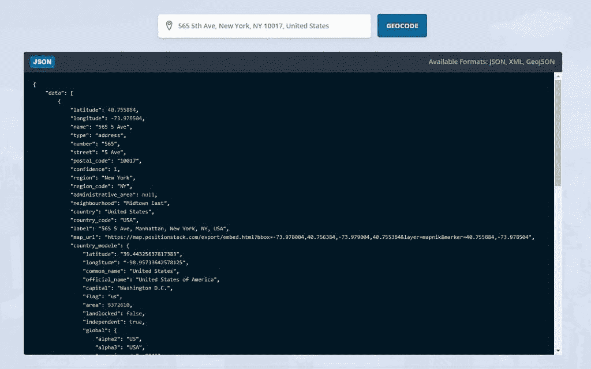

# 精确的正向和反向批量地理编码 REST API

> 原文：<https://www.xda-developers.com/accurate-forward-reverse-batch-geocoding-rest-api/>

如果您是一名寻找精确地理编码 API 的开发人员， [positionstack](https://positionstack.com/) 为您的项目提供了最佳解决方案。利用简单可靠的正向和反向地理编码解决方案，挖掘海量数据。Positionstack 覆盖全球超过 20 亿个地点和地址。

**可用功能:**

*   300 万次请求
*   高级支持
*   商业许可证
*   正向地理编码
*   反向地理编码
*   HTTPS 加密
*   扩展速率限制
*   JSON、XML 和 GeoJSON
*   可嵌入地图
*   多种语言
*   批量请求

[**参见**的计划和定价](https://positionstack.com/product)

 <picture></picture> 

Geocode any place or address worldwide, at scale.

Positionstack 拥有超过 20 亿个全球位置和地址，每天处理超过 10 亿个请求。可扩展的 API 支持全球成千上万的网络应用和移动应用，任何人都负担得起。查看他们的 [API 文档](https://positionstack.com/documentation)以了解更多细节。

免费试用位置堆栈。免费试用将为您提供 25，000 个请求、有限支持、个人许可、正向地理编码和反向地理编码。这个免费选项是确保这个 API 是您的开发项目的正确解决方案的好方法。一旦你认为这是一个好的解决方案，你可以从他们的四个不同的包中选择你需要的特性。有了基本、专业、商业和企业选项，就有一个适合任何预算的计划。

###### 我们感谢 positionstack 赞助了这篇文章。我们的赞助商帮助我们支付与运行 XDA 相关的许多费用，包括服务器成本、全职开发人员、新闻撰稿人等等。虽然您可能会在门户内容旁边看到赞助内容(这些内容将始终被标记为赞助内容),但门户团队对这些帖子不承担任何责任。赞助内容、广告和 XDA 仓库完全由一个独立的团队管理。XDA 绝不会通过接受金钱来赞扬一家公司，或以任何方式改变我们的观点或看法，从而损害其新闻诚信。我们的意见不能被收买。