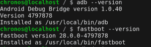

# 如何在运行 Chrome OS 的 x86_64 Chromebook 上设置 ADB & Fastboot

> 原文：<https://www.xda-developers.com/adb-fastboot-chromebook-chrome-os/>

# 如何在运行 Chrome OS 的 x86_64 Chromebook 上设置 ADB & Fastboot

如果你有一台运行 Chrome OS 的 x86_64 芯片的 Chromebook，并且想要设置 ADB 和 Fastboot，我们有一个专门为你准备的指南！

ADB 和 Fastboot 是每个 Android 开发者和高级用户都应该非常熟悉的工具。它们是强大的命令行程序，允许你使用你的电脑与你的智能手机接口，无论是应用程序调试还是修改软件。如果你有一台运行 Windows、macOS 或 GNU/Linux 发行版的 PC，设置 ADB/Fastboot 相当简单，但运行 Chrome OS 的 Chromebooks 在这样做时有点麻烦。谢天谢地， [Chrome OS 67](https://www.xda-developers.com/chrome-os-67-adb-material-design-tablets/) 在开发者模式[中为 ADB 带来了支持，正如我们所期待的](https://www.xda-developers.com/chrome-os-adb-access-android-apps/)，这意味着现在不需要面包丁就可以设置它了。如果你有一个 x86_64 芯片的 Chromebook，那么你可以利用一个为你处理一切的脚本。

没有太多的步骤，过程相当简单——你只需要将教程中的命令复制并粘贴到 Chrome OS Shell 中。XDA 认可开发者 [nathanchance](https://forum.xda-developers.com/member.php?u=6842057) 的指南涵盖了在 x86_64 架构的 Chromebooks 上安装 ADB 和 Fastboot 所需的步骤。安装 ADB 和 Fastboot 的过程包括对你的设备进行动力清洗(也就是彻底擦拭)。此外，你的 Chromebook 会不太安全，因为你需要启用开发者模式。如果你有一台 Chrome OS 平板电脑，比如[的惠普 Chromebook X2](https://www.xda-developers.com/hp-chromebook-x2-detachable-chrome-os-tablet/) ，那么[可以按照这里的指导进入开发者模式](https://www.xda-developers.com/enter-developer-mode-chrome-os-tablet/)。

存储库中的安装脚本为您完成了大部分繁重的工作，Nathan 还提供了利用该脚本所需的步骤。如果你在运行 ADB 和 Fastboot 时遇到问题，比如智能手机上没有验证提示，或者 Chrome OS 无法识别你的设备，重启 Chromebook 和智能手机应该可以解决这个问题。让我们知道你是否能够成功安装 ADB & fastboot！

[**x86 _ 64 chrome book**](https://forum.xda-developers.com/hardware-hacking/chromebooks/guide-setting-adb-fastboot-x8664-t3806428)上设置 ADB & Fastboot 的指南