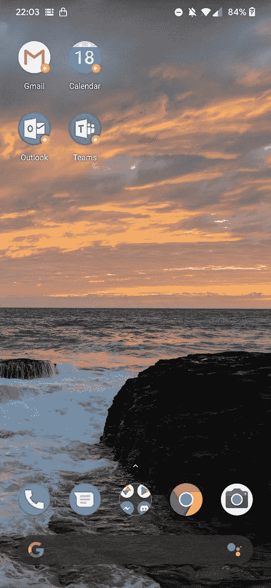

# 如何在一加手机上将任何应用添加到 OxygenOS 并行应用空间

> 原文：<https://www.xda-developers.com/add-any-app-oxygenos-parallel-apps-space-oneplus-phones/>

# 如何在一加手机上将任何应用添加到 OxygenOS 并行应用空间

你可以在运行 OxygenOS 的一加手机上的并行应用空间中添加任何应用。继续阅读，了解更多信息！

早在 2017 年，一加[在 OnePlus 3/3T 的 OxygenOS 公开测试版中推出了一项名为“并行应用”的新功能。此功能允许您克隆选定的应用程序，以便您可以在这些应用程序上运行单独的帐户，即使应用程序本身不支持快速帐户切换。支持的应用程序包括脸书、Facebook Messenger、Instagram、WhatsApp、Twitter、LinkedIn、Quora 等。然而，并不是每个应用程序都支持并行空间。幸运的是，有一个简单的解决方法。](https://www.xda-developers.com/oneplus-oxygen-4-5-8-open-beta-21-12/)

Parallel Apps 所做的是创建一个 ID 为“999”的新用户配置文件。OxygenOS 将安装在此用户个人资料上的应用程序集成到主用户个人资料中，并在锁屏中隐藏此个人资料，因此您无法登录。这个隐藏的用户配置文件安装了 Google Play 服务，但没有安装 T2 谷歌 Play 商店服务。幸运的是，可以将应用程序加载到用户档案中，以获得平行空间。为了让我们想要的任何应用程序作为*并行应用程序*运行，我们将安装“极光商店”应用程序，这是谷歌 Play 商店的一个完全开源的非官方客户端。如果你想知道为什么我们不喜欢将实际的谷歌 Play 商店安装在并行应用用户配置文件下，这是由于 Play Store 和并行应用的一个错误，它不允许你安装任何已经安装在主配置文件上的应用，因为 Play Store 认为那些应用已经安装在并行应用配置文件上。

要将 Aurora 商店应用程序安装到并行应用程序，从而能够安装任何其他应用程序，只需执行以下操作:

1.  从其 XDA 线程下载 Aurora 商店的 APK 文件。
2.  设置 ADB shell 访问。点击这里，你可以找到一份方便的指南。
3.  运行以下 ADB 命令:`adb install --user 999 <aurora_store_apk_name>.apk`
4.  这将把 Aurora 商店安装到用户配置文件 999，这是并行应用程序的配置文件。现在你只需打开 Aurora 商店，下载你想要的任何其他应用程序。
5.  或者，您可以为您想要克隆的任何应用程序下载 APK 文件，并运行步骤 3 中的命令。

 <picture></picture> 

Credits go to XDA Recognized Developer [Quinny899](https://forum.xda-developers.com/member.php?u=3563640) for this screenshot!

如果你不想走这条路，你也可以使用第三方应用程序，如 [Shelter](https://www.xda-developers.com/shelter-open-source-sandboxing-app/) 或 [Island](https://forum.xda-developers.com/android/apps-games/closed-beta-test-incoming-companion-app-t3366295) ，在你的设备上创建一个工作档案，然后安装任何你想要的应用程序。

你觉得这个功能有用吗？请在下面的评论中告诉我们！