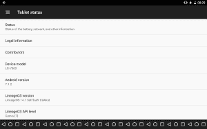

# 如何在三星 Galaxy S8/S8+上的导航栏中添加自定义按钮

> 原文：<https://www.xda-developers.com/add-custom-buttons-to-nav-bar-on-samsung-galaxy-s8-galaxy-s8/>

三星的 Galaxy S8 和 Galaxy S8+是市场上最热门的两款智能手机，这在很大程度上要归功于三星在显示技术方面取得的巨大进步。由于三星的目标是通过新的旗舰设备尽可能减少边框，该公司终于摆脱了曾经是三星硬件主食的电容键。取而代之的是软件导航键，可以在三星体验 UI 中进行一定程度的修改。

然而，像往常一样，导航栏调谐器的常规实现缺乏可定制性。大多数定制都围绕着 home 键——你可以改变灵敏度，以及它是否直接解锁手机。虽然有一个改变按钮布局的选项，但您唯一可以切换到的布局是反向布局，即后退和最近键被翻转。

我们 XDA 的开发者总是在寻找制造商提供的以外的东西，以便找到更多的方法来定制你的手机。这就是为什么今天我们要介绍一种方法来**在三星 Galaxy S8 和 S8+** 的导航栏上添加额外的按钮。

如果你一直在关注 XDA 门户网站(这是你应该做的)，你可能已经看到了我上个月关于如何在 Android 7 中实现[导航条定制的帖子。X](https://www.xda-developers.com/nav-bar-customization-was-hidden-in-stock-nougat-all-along-and-it-never-needed-root/) 设备，无需系统 UI 模块、定制 rom 或任何类型的 root 访问。该方法包括直接修改负责调整导航条的设置，即使用于修改导航条的 GUI 对用户是隐藏的。这是因为自 Android Nougat 以来，组成隐藏导航栏调谐器的代码就一直在 Android 开源项目(AOSP)的仓库中，但直到 Android O 谷歌才在系统 UI 调谐器下公开了这一活动。然而，只要运行 Android Nougat 的设备上的软件没有完全删除导航栏调谐器背后的代码，就有可能不用等待就可以使用该功能。

修改导航栏涉及通过 ADB 或已被授予 WRITE_SECURE_SETTINGS 权限的应用程序发送 shell 命令。由于与亚行打交道是很多人不熟悉的事情，XDA 资深成员 [paphonb](https://forum.xda-developers.com/member.php?u=6018897) 开发了一个名为[自定义导航栏](https://forum.xda-developers.com/android/apps-games/app-custom-navigation-bar-customize-t3590967)的应用程序，让一切都变得更容易。

随着成千上万的人开始测试他的应用程序，Galaxy S8 和 Galaxy S8+上的许多用户在尝试使用该应用程序时，开始遇到频繁的系统 UI 崩溃。因此，我们*认为*超越三星的实现来修改导航条是不可能的——但是这个假设后来被发现是错误的。以下是如何做到这一点。

## 在 Galaxy S8 或 S8+上的导航栏中添加自定义按钮

经过一些初步测试后，我们发现我们在我的原始教程中发送的相同 shell 命令也可以在 Galaxy S8 和 S8+上工作，但有一个主要的警告。无论你使用什么样的布局，原始的后退、主页、最近和 IME 切换键**都必须出现**。如果这些键中的任何一个缺失，系统 UI 将开始反复崩溃。此外，当三星导航条自动将颜色改为白色背景时，你添加到导航条的任何键看起来都有点奇怪，但我正在寻找解决这个小麻烦的方法。

不管怎样，让我们深入到你需要学习的命令中，以便修改你的三星 Galaxy 设备上的导航条。你需要做的第一件事是在你的机器上设置 ADB。

### 建立亚洲开发银行

首先，[直接从 Google](https://www.xda-developers.com/google-releases-separate-adb-and-fastboot-binary-downloads/) 为您的特定操作系统下载 ADB 二进制文件，并将其解压缩到您计算机上的一个单独目录中。接下来，[为你的三星手机安装合适的驱动](https://developer.android.com/studio/run/oem-usb.html)。然后，在设置- >开发者选项中启用“USB 调试”。如果你看不到开发者选项，那么你需要进入设置- >关于手机，然后点击 7 次内部版本号来启用它。最后，通过在与 ADB 二进制文件相同的目录中启动命令提示符(按住 shift +右键- >“在此打开命令提示符”)并运行以下命令，确保 ADB 正在工作:

```
 adb devices 
```

如果你看到你的设备的序列号(它没有说未经授权)，你是黄金。如果你在手机上看到一个弹出窗口，要求你授予你的计算机 ADB 访问权限，那么就说是。如果你看不到这两种情况，那么试着重启你的电脑/手机，并重新连接到你的电脑上。否则，请尝试重新安装驱动程序。

### 修改导航栏- ADB 方法

修改导航栏的语法如下:

```
 settings put secure sysui_nav_bar "key(KEYCODE_CONSTANT:file:///path/to/icon.png),back;home;recent,menu_ime" 
```

其中 KEYCODE_CONSTANT 是指一个 [KeyEvent](https://developer.android.com/reference/android/view/KeyEvent.html) 的常量，图标路径是文件 URI，允许你指定一个自定义图标添加到导航条。我发现 64x64 大小的图标非常适合我们的目的。你可以从 [IconsDB](http://www.iconsdb.com/) 网站下载许多免费图标。

举个例子，我发送的添加导航栏键来启动 Gmail 应用程序的命令是这样的:

```
 settings put secure sysui_nav_bar "key(65:file:///storage/emulated/0/NavIcons/gmail.png),back;home;recent,menu_ime" 
```

因为我们必须在命令中的某个地方有 back、home、recent 和 menu_ime，这意味着我们很遗憾不能替换这些常用键，所以我们可以使用我们自己的自定义导航条图标。但至少，我们可以调整间距，以适应更多的自定义键，或者只是得到我们喜欢的布局。例如:

```
 settings put secure sysui_nav_bar "space[#],back[#];home[#];recent[#],menu_ime[#]" 
```

括号中的值是相对大小乘数，允许您缩小或扩大按钮宽度。请注意，相对大小乘数的典型值应该保持在 0.85-1.15 之间，否则按钮将开始占用太少或太多的宽度而无法真正使用。不要试图把“0”作为相对大小来隐藏导航条键——你将会导致系统界面崩溃。

如果您弄乱了某些东西，并最终导致系统 UI 崩溃，您可以通过输入以下两个命令之一返回到导航栏的默认布局:

```
 settings put secure sysui_nav_bar "space,back;home;recent,menu_ime"
settings delete secure sysui_nav_bar 
```

作为对隐藏的 Android 牛轧糖导航条调谐器可以做的一些疯狂事情的提醒，这里有一个我们的读者制作的咯咯笑的导航条布局的截图。

 <picture></picture> 

Has science gone too far? Credits: [AndyYan](https://disqus.com/by/xda-471951a0b745047ddb6d0e874c0ceaa9/)

### 修改导航条-应用程序方法

我相信这是你们大多数人真正感兴趣的部分。XDA 资深会员 [paphonb](https://forum.xda-developers.com/member.php?u=6018897) 的[定制导航条](https://forum.xda-developers.com/android/apps-games/app-custom-navigation-bar-customize-t3590967)应用会让这一切变得更容易。开发人员最近发现了如何拦截调用特定应用程序的特定按键事件——他总共发现了多达 5 个按键事件。这里不需要详细解释他是如何完成这项工作的，所以我们就不赘述了。考虑到这一点，开发者能够更新应用程序(从版本 0.5.0 开始)，这样你就可以**基本上执行任何你喜欢的动作**。

例如，开发者最近增加了添加动作的能力，即**下拉状态栏**，**直接启动你选择的应用**，最重要的是触发**任务事件**。特别是 Tasker 事件功能是最令人惊叹的部分，因为通过 Tasker，您可以执行的操作数量是无限的。如果你想让你的导航条按钮做一些事情，它可以做到。将这一点与现有的 Tasker Profile 集成在一起，您可以根据上下文修改设备上的导航条，只在您选择的条件下添加某些键。

为了使用该应用程序的这些特殊功能，你必须支付 1.99 美元升级到该应用程序的专业版。此时，要在您的三星 Galaxy S8/S8+上使用该应用程序，您需要安装最新的测试版(0.7.0)。该应用程序将自动检测您是否正在使用 Galaxy S8/S8+,并禁用一些会导致您的设备开始崩溃的功能。

开发者告诉我，他仍在努力让这款应用为三星手机用户的稳定发布做好准备。现在，我会**等几天，让开发者更新他的应用**，这样你就有一个简单的方法来修改导航栏，而不必使用 ADB 命令。开发人员很快更新了他的应用程序——自从不到一个月前发布以来，它已经增加了许多功能。

* * *

## 结论

如果你有足够的冒险精神，你可以通过使用我之前展示的语法来使用隐藏的导航条调谐器。大多数人可能会等待自定义导航栏应用程序更新-我只是想让这个消息在那里，所以我们所有的 Galaxy S8/S8+朋友都知道会发生什么。我将继续发布与导航条调谐器相关的教程，下一篇将关注如何在导航条按钮上添加双击/特技点击。

请尽你所能支持 XDA 开发者！我们最近发现，有几个博客剪切、复制、粘贴了我们的原始教程和我们的用户在论坛上分享的其他内容。这些博客一直试图将我们在编写这些教程中所做的大量努力归功于自己，而不是自己提供高质量的内容。你不会在我们的[教程类别](https://www.xda-developers.com/category/tutorials/)中找到这样的教程，也不会在其他地方找到来自我们论坛的教程。

在推特、[谷歌+](https://plus.google.com/+xda) 、[脸书](https://www.facebook.com/xda.developers/)或 [YouTube](https://www.youtube.com/user/xdadevelopers) 上关注我们。查看我们的 [XDA 实验室](https://www.xda-developers.com/xda-labs/)应用程序，快速浏览我们的论坛(并考虑获得 [XDA 无广告](https://forum.xda-developers.com/ad-free/)！)在您的移动设备上！谢谢，请继续关注我们的下一个教程！