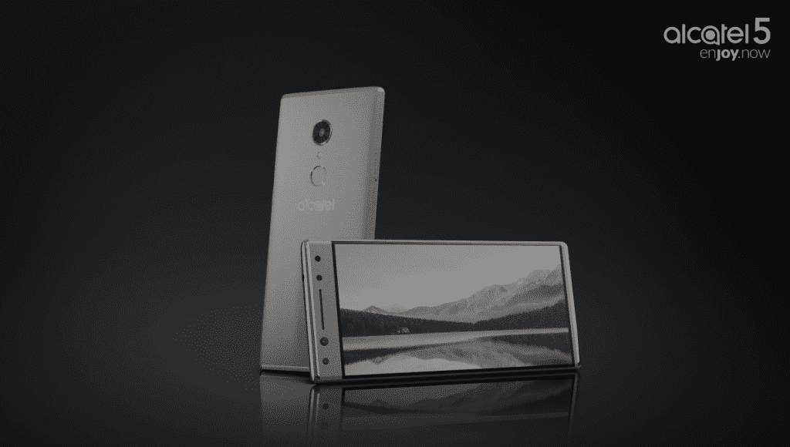
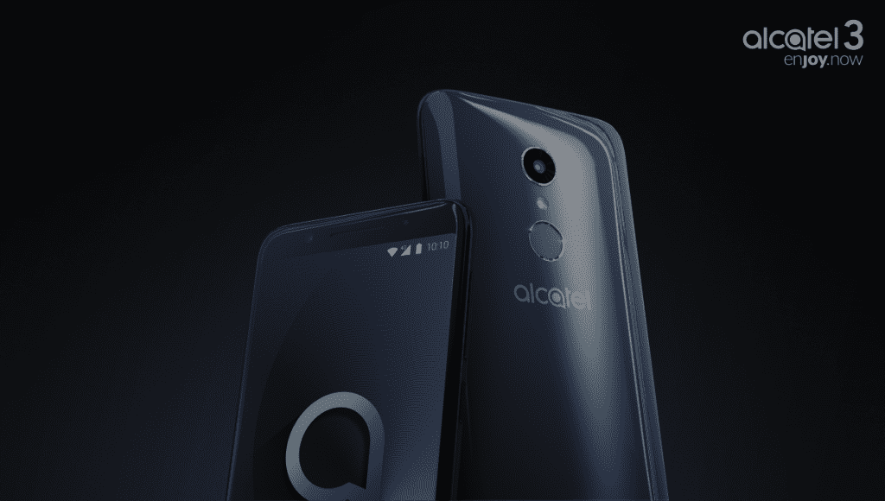
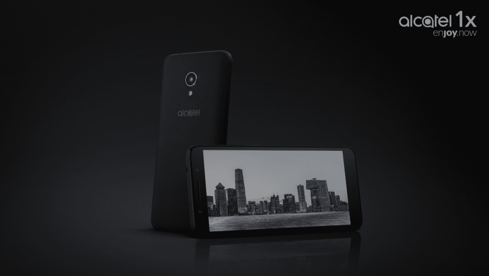
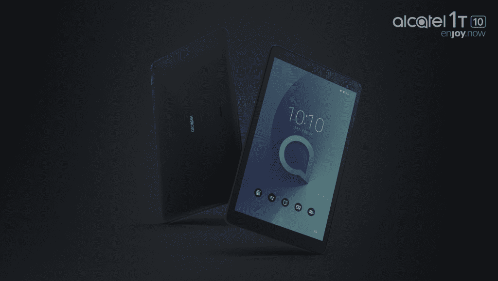
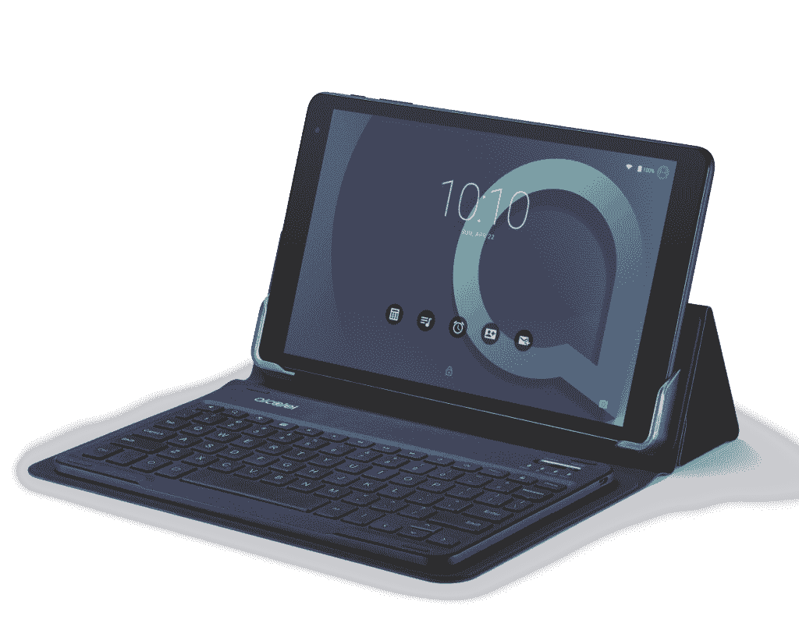

# TCL 宣布推出 Alcatel 5 和 Alcatel 3 系列手机、1T 系列平板电脑和 Android Go 手机

> 原文：<https://www.xda-developers.com/alcatel-alcatel-5-3-1-series-smartphones-1t-10-7-tablets-1x-android-go-phone/>

在西班牙巴塞罗那举行的 2018 年世界移动通信大会前夕，中国智能手机制造商 TCL 周六发布了一系列新设备。除了该公司在 1 月份的 2018 年消费电子展上推出的 Alcatel 5、Alcatel 3 和 Alcatel 1 系列智能手机外，它还推出了两款 Android 桌子 1T 10 和 1T7，以及一款 Android Oreo (Go edition)智能手机 Alcatel 1X。

* * *

## 阿尔卡特 5、阿尔卡特 3 和阿尔卡特 1 系列

阿尔卡特品牌的智能手机 Alcatel 1、Alcatel 3 和 Alcatel 1 系列成为 TCL 产品组合的亮点。这些产品系列的价位不同，功能各异，但每款 2018 款阿尔卡特手机都有三个共同点:FullView 18:9 显示屏，TCL 声称这使它们比以前的阿尔卡特设备“更小”和“更容易握持”；以及面部识别技术 Face Key，在不到半秒的时间内记录数百个生物特征数据点；和指纹传感器。

此外，TCL 表示，其 2018 年的所有智能手机都将定期收到 Android 安全更新，至少每季度一次。

* * *

**阿尔卡特 5 系列**

 <picture></picture> 

Source: TCL

| **阿尔卡特 5** |
| 5.7 英寸高清+ IPS 18:9 显示屏 |
| 联发科 MT6750 |
| 2GB/3GB 内存 |
| 16GB/32GB 存储空间+ microSD 插槽 |
| 1200 万像素后置摄像头，f/2.2 光圈 |
| 300 万像素+500 万像素前置摄像头 |
| 3000 毫安时电池 |
| 安卓牛轧糖 |

阿尔卡特 5 是这一系列中无可争议的旗舰产品。它拥有优质的拉丝金属一体式机身设计和 5.7 英寸 HD+ (1440 x 720) IPS 屏幕，联发科 MT6750 八核处理器(四个 1.5GHz 内核和四个 1GHz 内核)，以及 3,000mAh 电池(TCL 估计通话时间为 18 小时)。这款手机有两种配置，一种是 2GB 内存和 16GB 存储，另一种是 3GB 内存和 32GB 存储(都可以通过 microSD 卡扩展到 32GB)，两者都配备了后置指纹传感器。

这款手机的指纹传感器不仅仅是锁定它，防止被窥探。预编程的快捷键可以让你在自拍时将其用作快门键，在启用手机的隐私模式时隐藏信息，并启动与特定手指对应的应用程序。

在相机方面，阿尔卡特 5 有一个 12MP 的后置传感器，具有 f/2.2 的光圈和 1.25μm 的传感器尺寸，双音闪光灯，电子图像稳定(EIS)，高动态范围(HDR)，以及慢动作切换。前置摄像头将两个传感器封装在一个模块中:一个 1300 万像素的传感器，具有 f/2.0 的光圈，一个 500 万像素的传感器，具有 120 度广角镜头，1.4μm 像素大小和 LED 闪光灯。如果你愿意，手机的相机应用程序会为你在两种模式之间切换，当它在一张照片中检测到两个以上的人脸时，会自动选择广角模式。

阿尔卡特 5 以照片为中心的功能不止于此。它配备了社交模式(Social Mode)和即时拼贴(Instant Collage)，社交模式是一套照片编辑工具，如 Social Square，可以让你预览最近拍摄的照片，而无需离开相机取景器，即时拼贴可以为你最喜欢的照片提供丰富多彩的模板。还有 Photo Booth，它以每秒一张的速度连续拍摄四张照片，以便捕捉最佳镜头。

阿尔卡特 5 的其他装备包括蓝牙 4.2、NFC、FM 收音机、USB 2.0 Type-C 连接器、LTE Cat。4 连接(下行 150 Mbps，上行 50 Mbps)、调频收音机和 Wi-Fi 802.11/b/g/n。

它在€的特定市场上有金属黑和金属金两种颜色，售价 229.99 英镑(281.54 美元)，并配有安卓牛轧糖。

* * *

**阿尔卡特 3 系列**

 <picture></picture> 

Source: TCL

| **阿尔卡特 3V** | **阿尔卡特 3X** | **阿尔卡特 3** |
| 6 英寸 2K 18:9 显示屏 | 5.7 英寸高清+ 18:9 显示屏 | 5.5 英寸高清+ 18:9 显示屏 |
| 联发科 MT8735A | 联发科 MT6739 | 联发科 MT6739 |
| 2GB 内存 | 2GB/3GB | 2GB 内存 |
| 16GB/32GB 存储空间+ microSD 插槽 | 16GB/32GB 存储空间+ microSD 插槽 | 16GB 存储空间+ microSD 插槽 |
| 12MP + 2MP 双后置摄像头 | 1300 万像素+500 万像素双后置摄像头 | 1300 万像素后置摄像头，f/2.0 光圈 |
| 500 万像素前置摄像头 | 500 万像素前置摄像头 | 500 万像素前置摄像头 |
| 3000 毫安时电池 | 3000 毫安时电池 | 3000 毫安时电池 |
| 安卓奥利奥 | 安卓牛轧糖 | 安卓奥利奥 |

Alcatel 3 系列比 Alcatel 5 系列略有下降，抛弃了金属机身，采用了弯曲的 2.5D 轮廓玻璃设计。三款手机完善了中端系列:阿尔卡特 3V、阿尔卡特 3X 和阿尔卡特 3。

Alcatel 3V 是三款中最大的一款，拥有 6 英寸 2K (2160 x 1080)屏幕，2GB 内存和 16GB/32GB 存储空间(使用 microSD 卡可扩展至 128GB)。它配备了 3,000mAh 电池，可提供长达 14 小时的通话时间，以及主频为 1.45GHz 的联发科 MT8735A 四核处理器。

阿尔卡特 3V 并没有完全被阿尔卡特 5 超越，它拥有令人印象深刻的射手。500 万像素的自拍相机有一个 LED 闪光灯，EIS 和 HDR，加上前面提到的即时拼贴功能。其双后置摄像头模块，一个 12MP (1/2.8 英寸传感器尺寸和 f/2.2 光圈)和一个 2MP 传感器(1/5 英寸传感器尺寸和 f/2.4 光圈)，带 LED 闪光灯，相位检测自动对焦，1.25μm 像素尺寸，可以实时为图片添加散景效果，并改变任何拍摄的聚焦区域。

阿尔卡特 3V 没有 USB Type-C 连接器。但是凑合着用 MicroUSB 和蓝牙 4.2，NFC，Cat。4 LTE，802.11/b/g/n，双 SIM 卡槽。

Alcatel 3X 是 3V 的略小兄弟，它有 5.7 英寸的 HD+ (1440 x 720) IPS 屏幕，联发科 MT6739 四核 1.28HGz 处理器，以及 3,000mAh 电池(6 小时通话时间)。它有两种配置，2GB/3GB 的内存和 16/32GB 的内部存储(通过 microSD 卡可扩展到 128GB)，并装有同样功能的相机。

后置摄像头由一个 1300 万像素传感器(1/3.06 英寸传感器尺寸，f/2.0 光圈，78.4 度镜头)和一个 5MP 传感器(1/5 英寸传感器尺寸，f/2.2 光圈，120 度镜头)组成。双色调闪光灯在昏暗的环境中提供照明，HDR 和 EIS 提高清晰度。

Alcatel 3X 具有双麦克风噪音消除功能，与 Alcatel 3V 一样，还有一个 MicroUSB 端口。它支持蓝牙 4.2、NFC 和 802.11 b/g/n Wi-Fi。

阿尔卡特 3 系列的另一款产品是阿尔卡特 3，这是一款 5.5 英寸的手机，配有 HD+ (1440 x 720)显示屏，2GB 内存和 16GB 内部存储(通过 microSD 卡可扩展到 128GB)，联发科 6739 1,28GHz 四核处理器，以及 3,000mAh 电池(通话时间长达 17 小时)。

阿尔卡特 3 是阿尔卡特 3 系列中最便宜的手机，它显示:它配备了一个 1300 万像素的摄像头(带 LED 闪光灯，PDAF，1.12μm 像素大小，1/3”传感器大小，f/2.0 光圈)，而不是阿尔卡特 3V 和阿尔卡特 3X 上的双摄像头模块，以及一个带 LED 闪光灯的 500 万像素前置摄像头。它还配备了联发科 MT6739 四核 1.28GHz 处理器，一个 microUSB 端口，蓝牙 4.2，NFC，Cat。4 LTE，双 SIM 卡插槽，3,000mAh 电池，3G 续航时间长达 17 小时。

Alcatel 3V 和 Alcatel 3 有光谱黑色、光谱蓝色和光谱金色(每种颜色的可用性因国家而异)，Alcatel 3X 有金属黑色、金属蓝色和金属金色。3V 在€的售价为 189.99 美元(233.58 美元)，阿尔卡特 3X 和阿尔卡特 3 将于下月在€和€的部分市场上市，分别为 179.99 美元(220.07 美元)和 149.99 美元(184.41 美元)。

除了运行 Android 牛轧糖的阿尔卡特 3X 之外，阿尔卡特 3 系列的所有手机都搭载了 Android Oreo。

* * *

**阿尔卡特 1 系列**

 <picture></picture> 

Source: TCL

| **阿尔卡特 1X** |
| 5.3 英寸 FWVGA 18:9 显示屏 |
| 联发科 MT6739 |
| 1GB/2GB 内存 |
| 16GB 存储空间+ microSD 插槽 |
| 800 万像素后置摄像头，f/2.0 光圈(或 1300 万像素，视型号而定) |
| 500 万像素前置摄像头 |
| 2460 毫安时电池 |
| 安卓奥利奥(Go 版) |

Alcatel 1 系列是 TCL 对 Alcatel 3 系列和 Alcatel 5 系列的经济型入门级替代产品，它并没有像你想象的那样走捷径。

Alcatel 1X 采用麂皮和柔软的触感，配备 5.3 英寸 FWVGA (960 x 480)显示屏，主频为 1.28GHz 的联发科 MT6739 四核处理器，1GB/2GB 内存，16GB 内部存储空间(可通过 microSD 卡扩展至 3GB)，以及 2,460mAh 电池。它有一个双后置摄像头，一个 8MP 传感器和一个 13MP 传感器，后者的像素尺寸为 1.12μm，传感器尺寸为 1/4 英寸，光圈为 f/2.0，闪光灯模块；和一个固定焦距的 5MP 前置摄像头。

其他亮点包括 Cat。4 LTE 连接、指纹传感器、FM 收音机、NFC、Wi-Fi 802.11b/g/n、microUSB 连接器和双 SIM 卡插槽。

你不会在 Alcatel 1X 上找到像 HDR 和电子图像稳定这样的功能。但 2GB 型号配备了 Face Key，值得注意的是，这是第一款搭载 Android Oreo (Go edition)的阿尔卡特手机，Android Oreo 是 Android 的优化版本，专为 1GB 或更少 RAM 的设备设计。1X 配备了一套精简的数据采集应用程序，包括 YouTube Go、Google Go、Files Go、Google Maps Go 和 Gmail Go，以及定制版本的 Chrome、Google Play 和 Gboard。它还配备了谷歌安卓助手(Go edition)，这是谷歌安卓助手的一个精简版，功能更少。(唯一支持的语言是英语，不能设置提醒，也不能控制智能家居设备。)

Alcatel 1X 将于 4 月份推出四种颜色——黑色、蓝色、金色和玫瑰金，在€和€分别有单卡和双卡两种选择，售价分别为 99.99 英镑(122.93 美元)和 109.99 英镑(135.23 美元)。

* * *

## **阿尔卡特 1T 10 和阿尔卡特 1T 7**

 <picture></picture> 

Source: TCL

| 阿尔卡特 1T 10 | 阿尔卡特 1T 7 |
| 10.1 英寸高清(1280 x 800) IPS 显示屏 | 7 英寸(1024x600) IPS 显示屏 |
| 联发科 MT8321 | 联发科 MT8321 |
| 1GB 内存 | 1GB 内存 |
| 16GB 存储空间+ microSD 插槽 | 16GB 存储空间+ microSD 插槽 |
| 2MP 后置摄像头 | 2MP 后置摄像头 |
| 200 万像素前置摄像头 | VGA 前置摄像头 |
| 4000 毫安时 | 2580 毫安时 |
| 安卓 8.1 奥利奥 | 安卓 8.1 奥利奥 |

除了四款新智能手机，TCL 还发布了 1T 系列，这是一个全新的 Android 平板电脑系列，设备紧凑，不会破产。1T 系列的两款平板电脑都配备了护眼模式和儿童模式，护眼模式旨在通过最大限度地减少蓝光照射来缓解视觉疲劳，儿童模式是一套适合家庭的儿童游戏，包括一个相机应用程序和一个绘图应用程序，以及一个父母控制面板，允许父母设置使用限制。它们配有 Android 8.1 奥利奥。

两款平板电脑中较大的 Alcatel 1T 10 仅重 415 克，TCL 声称这是其尺寸和价格范围内“你能得到的最轻的平板电脑”。它拥有 10.1 英寸 1280 x 800 IPS 显示屏，1GB 内存和 16GB 内部存储空间(通过 microSD 卡可扩展至 128GB)，以及 4,000mAh 电池，充电可持续八小时。

 <picture></picture> 

Source: TCL

联发科 MT8321 1.3GHz 四核处理器使平板电脑保持运转，一个 2MP 后置摄像头和一个前置 2MP 摄像头处理摄影任务。阿尔卡特 1T 10 还拥有蓝牙 4.2、Wi-Fi 802.11 b/g/n、FM 收音机、microUSB 连接器和对 Miracast 的支持。

阿尔卡特 1T 7 拥有 7 英寸(1024 x 600) IPS 显示屏、1GB 内存、8GB 内部存储(可扩展至 128GB)和 2580 毫安时电池，重量约为其大型兄弟的一半(245 克)。它有两个摄像头，一个 200 万像素的传感器在后面，一个 200 万像素的传感器在前面，并不支持 Miracast，但在其他方面符合其规格。

Alcatel 1T 10 和 Alcatel 1T 将于晚些时候在欧洲、拉丁美洲和亚洲的 Q2 上市，起价分别为€99.99 美元(122.93 美元)和€69.99 美元(86.05 美元)。两者都将推出高级黑色和蓝黑色。1T 10 可选配蓝牙键盘和纹理外壳。

* * *