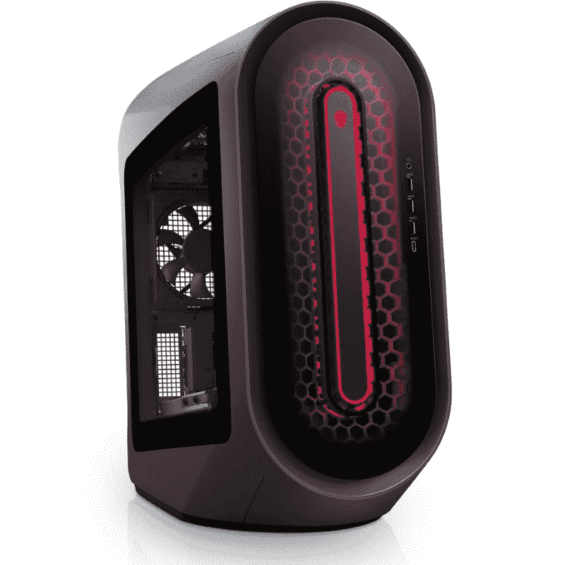
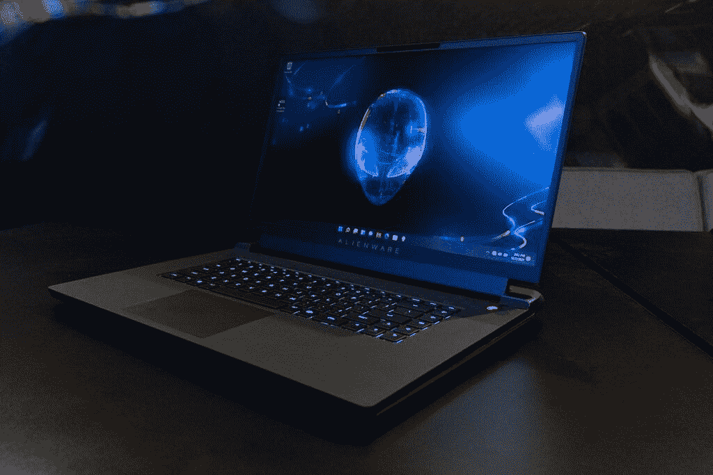
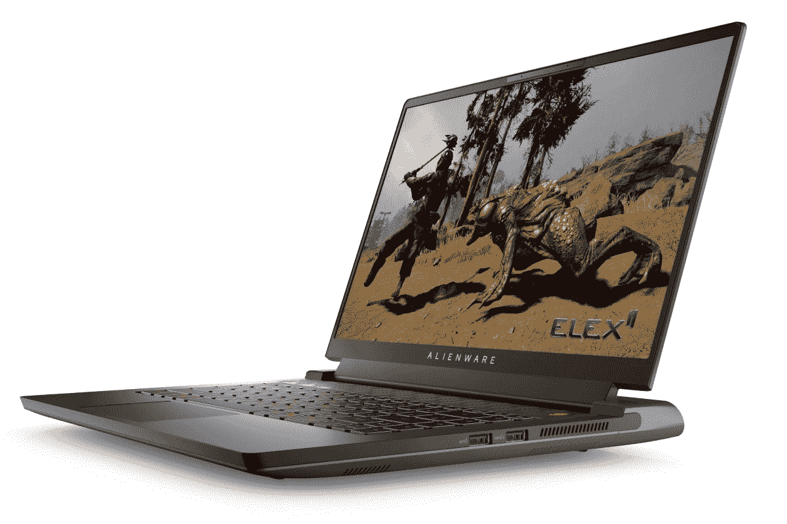
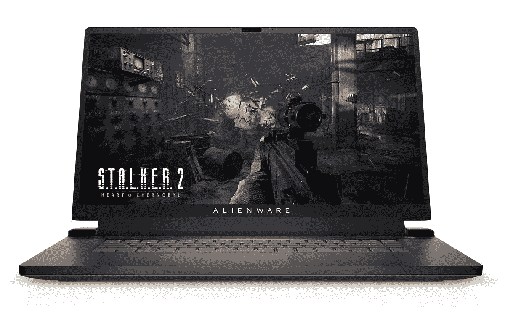
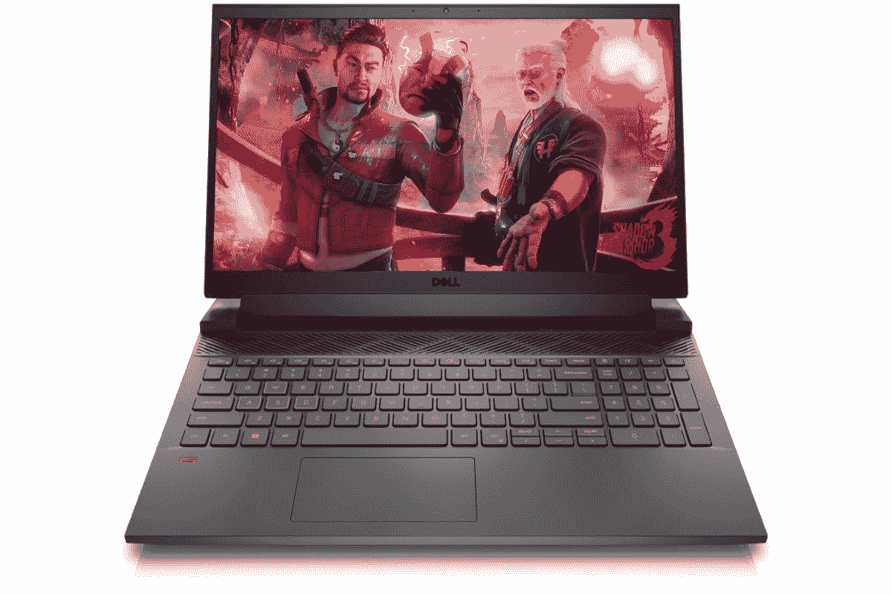

# 采用 AMD 锐龙处理器的新外星人笔记本电脑和 Aurora R14 发布

> 原文：<https://www.xda-developers.com/alienware-m15-r7-m17-r5-aurora-r14-available-amd-ryzen/>

戴尔的外星人品牌已经推出了几款新产品，包括外星人极光锐龙版 R14 台式机——现在配备了新的锐龙 7 5800X3D 处理器——以及外星人 m15 R7 和 m17 R5 笔记本电脑，这两款电脑都采用了 AMD 的锐龙 6000 系列处理器。此外，所有设备都配备了 NVIDIA 的最新 GPU。所有这些设备最初都是在 [CES 2022](https://www.xda-developers.com/new-dell-xps-desktop-alienware-aurora-gaming-pcs-have-intels-12th-gen-alder-lake-processors/) 上宣布的。

## Alienware Aurora Ryzen Edition R14

从外星人极光锐龙版 R14 开始，它不是一个全新的设备，因为它已经与锐龙 9 5900X 处理器一起提供。然而，现在有了新的锐龙 7 5800X3D CPU 的配置，戴尔表示这是第一款具有该功能的消费 PC。这款新处理器于今年早些时候发布，是第一款采用 3D V-cache 的主流产品，AMD 称这使其成为世界上最快的游戏 CPU。此外，新的 Aurora R14 型号可以配置高达 NVIDIA GeForce RTX 3090 Ti，高达 128GB 的 DDR4 RAM，时钟频率为 3200MHz，以及高达 4TB 的存储。

外星人极光锐龙版 R14 起价 1350 美元，但如果你想要锐龙 7 5800X3D 的最新型号，它至少会让你花费 2950 美元，因为它还配备了 RTX 3080 GPU、32GB 内存和 1TB 固态硬盘。

 <picture></picture> 

Alienware Aurora Ryzen Edition R14

##### Dell Alienware Aurora R14

外星人极光 R14 现在可以选择锐龙 7 5800X3D，以及安替英伟达 GeForce RTX 3090 Ti。

## 外星人 m15 R7 和 m17 R5

如果你对(某种程度上)便携式游戏更感兴趣，你可能会想把注意力转向新的外星人 m15 R7 和 m17 R5，它们今天也可以买到。这是你可以买到的两款[最好的游戏笔记本电脑](https://www.xda-developers.com/best-gaming-laptops/)，新版本最高配备 AMD 锐龙 9 6900HX 处理器，该处理器具有 8 个内核，16 个线程，加速速度高达 4.9GHz。你还可以为它们配置高达 NVIDIA GeForce RTX 30080 Ti 笔记本电脑 GPU，64GB 内存和 4TB 固态硬盘存储。

这两款笔记本电脑的区别就在显示器上。正如你所料，外星人 m15 R7 拥有 15.6 英寸的显示屏，可以是全高清(1920 x 1080) 165Hz 或 360Hz 的面板，也可以是 240Hz 刷新率的四高清(2560 x 1440)面板。外星人 m17 R5 有一个 17.3 英寸的显示屏，它只有全高清分辨率，尽管你可以选择 165 赫兹或 360 赫兹的刷新率选项。

 <picture></picture> 

Alienware m15 R7

这两款笔记本电脑还配有 RGB 背光键盘，可选择单区域照明或逐键 RGB。此外，您可以使用外星人的特殊 CherryMX 机械钥匙开关对其进行配置。

外星人 m15 R7 起价 1499 美元，而 m17 R5 起价 1599 美元。

 <picture></picture> 

Alienware m15 R7

##### Dell Alienware m15 R7

外星人 m15 R7 是一款 15 英寸笔记本电脑，采用 AMD 锐龙 6000 系列处理器，最高配有 GeForce RTX 3080 Ti 显卡。

 <picture></picture> 

Alienware m17 R5

##### Dell Alienware m17 R5

外星人 m17 R5 有一个高刷新率的 17 英寸显示屏，由最新的 AMD 锐龙 CPU 和 NVIDIA 显卡驱动。

## 戴尔 G15

最后，针对预算较少的游戏玩家，戴尔推出了新的 G15 游戏笔记本电脑。这一款还采用了 AMD 最新的锐龙 6000 系列 CPU，但最高只能达到锐龙 7 6800H，具有 8 个核心，16 个线程，加速速度高达 4.7GHz。你也可以配置高达 NVIDIA GeForce RTX 3070 Ti，所以你不能获得同样多的功率，但它仍然足以处理几乎任何现代游戏。您还可以获得高达 16GB 的内存和 1TB 的固态硬盘存储。

显示器也相当简单，但肯定是耐用的。这是一个 15.6 英寸的全高清分辨率面板，有 120 赫兹刷新率和 250 尼特亮度的选项，或 165 赫兹刷新率和 300 尼特的选项。该笔记本电脑在基本配置中也有一个橙色背光键盘，尽管它可以配置四区 RGB 照明。

戴尔 G15 起价 899.99 美元，它也是[最佳预算游戏笔记本电脑](https://www.xda-developers.com/best-cheap-gaming-laptops/)的有力竞争者。

 <picture></picture> 

Dell G15

##### 戴尔 G15

戴尔 G15 配备 AMD 锐龙 6000 系列 CPU 和高达 NVIDIA GeForce RTX 3070 Ti。