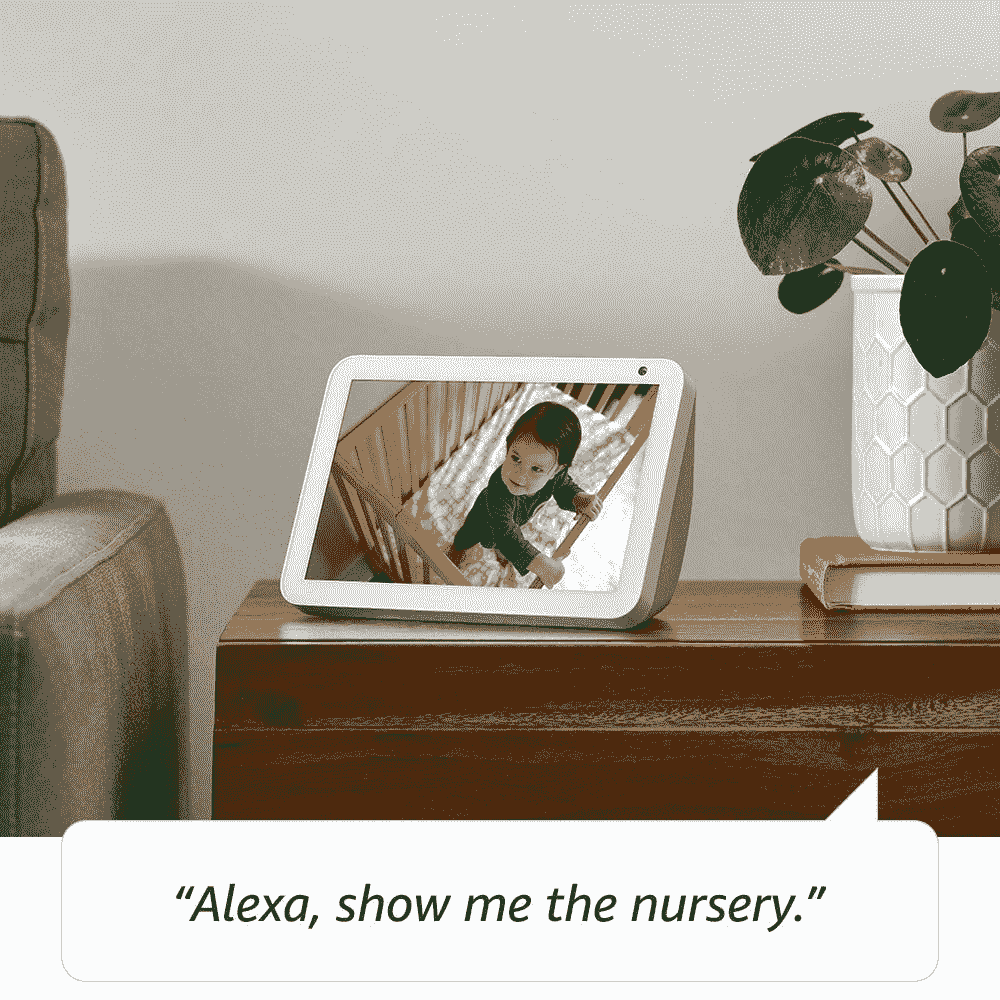

# 亚马逊 Echo Show 8 现已在印度接受预购

> 原文：<https://www.xda-developers.com/amazon-echo-show-8-available-pre-ordering-india/>

亚马逊的 Echo 和谷歌的 Nest(前 Home)是智能音箱市场的主导者。智能音箱 Echo 阵容由 [Alexa](https://www.xda-developers.com/tag/amazon-alexa/) 驱动，而谷歌 Nest 音箱由谷歌助手驱动。亚马逊和谷歌正在智能音箱市场争夺优势。2018 年，两家公司分别以亚马逊 Echo Show 和[谷歌 Nest Hub](https://www.xda-developers.com/google-home-hub-smart-display-google-chromecast-v3/) (原 Home Hub)的形式推出了内置显示器的智能扬声器新产品类别。最初的 10.1 英寸 Echo Show [于两年半前推出](https://www.xda-developers.com/amazons-touchscreen-echo-show-announced-alexa-updated-with-voice-calls/)，从那时起，该家族又增加了一款 5 英寸 [Echo Show 5](https://www.xda-developers.com/amazon-echo-show-5-90/) 。最近，亚马逊在 9 月份推出了 8 英寸 Echo Show 8 [，作为各种产品发布的一部分。现在，该设备可在印度预订。它的官方价格标签是₹12,999(183 美元)，但预购价格打折到₹8,999(126 美元)，直到该产品的发货日期 2 月 26 日。](https://www.xda-developers.com/amazon-echo-2019-announcements/)

 <picture></picture> 

Echo Show 8

Echo Show 8 配备了一个 8 英寸的高清显示屏，两英寸钕扬声器和一个无源低音辐射器的立体声音响，通过 Wi-Fi 连接互联网，以及一个内置物理快门的摄像头，以缓解隐私问题。就屏幕尺寸和价格而言，它在亚马逊设备组合中位于 Echo Show 5 之上，10.1 英寸 Echo Show 之下。Echo Show 8 比 Echo Show 5 贵，后者在印度的售价为₹6,999(98 美元)(尽管它最初是为₹8,999 推出的)，但比 10.1 英寸的 Echo Show 便宜(₹12,999 对₹22,999).所有三种产品的功能都是相同的，因为它们只是在硬件上有所不同。

Echo Show 8 可以做所有与 Alexa 相关的事情，包括搜索查询、观看内容、免提语音通话、内置显示器的视频通话等等。产品本身的存在可以用一句话来解释:亚马逊希望为大多数受欢迎的消费者需求打造各种尺寸的 Alexa 设备。该公司旨在让其语音助手在消费者的生活中无处不在，在某种程度上，它正在取得成功。

* * *

**[在亚马逊印度](https://www.amazon.in/dp/B07SMNPCGK/?tag=xdaportalin-21)预购 Echo Show 8**