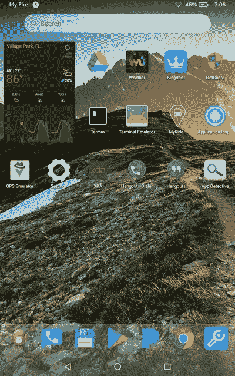

# 如何在 Amazon Fire OS 上使用带有小部件的自定义启动器

> 原文：<https://www.xda-developers.com/amazon-fire-os-custom-launcher-widgets/>

亚马逊的 Fire OS 除了拥有 Android 的主干之外，还可以被认为是与普通 Android 甚至 MIUI 或 Samsung Experience 等厚重的皮肤截然不同的野兽。他们的目标是基于开源 Android 平台开发自己的操作系统，同时保持完全独立于所有 Google Play 服务和认证，而不是青睐自己的亚马逊服务。但它仍然基于 Android，因此精通技术的用户可以使用 Fire OS 平台并根据自己的意愿进行定制。今天，我们将教你如何在**亚马逊 Fire OS** 设备上**轻松设置任何你想要的启动器(带小工具支持)**，无需**root**！就像我们做的大多数教程一样，你只需要访问 Android 调试桥。

* * *

### 第 1 部分-设置自定义启动器

在我们开始之前，正如我们刚才所说，你需要建立亚洲开发银行。如果您还没有这样做，请参考[本教程](https://www.xda-developers.com/install-adb-windows-macos-linux/)以便在您的设备中进行设置。我们现在并不真的需要它，但提前拥有它还是很好的。一旦完成，你需要在我们的论坛上找到 **[发射器劫持](https://forum.xda-developers.com/amazon-fire/general/launcher-root-launcher-hijack-v2-t3561026)工具**。这个工具是由 XDA 成员 [BaronKiko](https://forum.xda-developers.com/member.php?u=8089882) 基于 [parrotgeek1](https://forum.xda-developers.com/member.php?u=5723969) 的原始代码制作的，所以所有的荣誉都属于这两位开发者！

该工具利用您的亚马逊手机或平板电脑的辅助功能设置来正常工作，因此请确保它在“设置”>“辅助功能”>“检测主屏幕按钮按压”中进行了正确设置。此外，确保您的启动器不需要将其设置为默认。这意味着你可以使用像 Nova Launcher 和 Evie Launcher 这样的启动器，但你不能使用 Google Now 启动器或任何其他需要默认的启动器。

这样一来，您现在应该有了一个可以在 home 按钮上运行的自定义启动器。但是，如何在那个启动器上使用小部件呢？这样做通常需要 root，但幸运的是，您可以使用 ADB 的魔力来正确设置它们。这就是我们为什么提前设置它的原因。这个方法是 XDA 资深会员[龙火 1024](https://forum.xda-developers.com/member.php?u=8165603) 在我们[亚马逊火论坛](https://forum.xda-developers.com/amazon-fire/general/root-required-widgets-preferred-launcher-t3637814)上发现的。

首先，启动一个支持 root/分区的文件浏览器(我们不需要 root 来使用它，因为我们正在查看只读系统分区)。我们推荐来自我们论坛的免费 MiXplorer。

[appbox xda com.mixplorer]

导航到电话的根目录，然后转到/system/bin。找到“appwidget”文件，并将其复制到剪贴板。粘贴在你的手机或直接在你的电脑的某个地方。您需要将文件扩展名更改为。sh(你可以在你的电脑上用 Notepad 或 Notepad++来改变它，或者你可以在你的手机上用你的文件浏览器的重命名功能来改变它)。完成后，将文件放在内部存储的根目录(/sdcard/)。

之后，启动亚行。钻进壳里:

```
 adb shell 
```

然后，启动新添加的脚本:

```
 sh /sdcard/appwidget.sh 
```

现在是时候授予你的启动器部件权限了。使用以下命令:

```
 appwidget grantbind --package <launcher_package_name> --user <user_ID> 
```

为了找到包名，更简单的方法是使用 Play Store 中的包名查看器。

例如，Nova Launcher 的命令是:

```
 appwidget grantbind --package com.teslacoilsw.launcher --user 0 
```

如果以上命令不起作用，请使用以下命令:

```
 appwidget grantbind --package <launcher_package_name> --user current 
```

 <picture></picture> 

Widget support on third-party launchers in Fire OS. Credits: XDA Senior Member [DragonFire1024](https://forum.xda-developers.com/member.php?u=8165603)

搞定了。现在你可以在你选择的启动器上添加你喜欢的部件。

* * *

## 说明

这很简单。不同于普通的 Android(或者几乎所有的 Android 皮肤)，你可以根据自己的喜好替换启动器，甚至可以设置一个自定义的启动器作为默认启动器，亚马逊主屏幕是亚马逊 Fire OS 中唯一的系统级应用启动器，与 iOS 非常相似。你不能取代它，至少不能用常规的方法。

然而，你可以利用可访问性设置(允许应用程序拦截 home 键的按压)并设置一个中间应用程序(劫持启动器)，它将在 Amazon Fire OS 中拦截 home 键的按压，并在每次 home 键被按下时打开你自己的第三方启动器。虽然这不会使你选择的启动器成为默认的，但是这个解决方案将会非常完美。然后，我们运行的脚本允许我们访问 appwidget 二进制文件，在那里我们可以授予我们的第三方应用程序绑定小部件所需的权限。通常，如果启动器被设置为默认启动器，这很容易做到。但是由于没有 root 用户，我们实际上无法更改 Fire OS 上的默认启动器，这些命令解决了这个问题。

亚马逊 Fire OS 设备并不以其定制而闻名，但这并没有阻止我们论坛上有进取心的用户充分利用现有资源。查看我们的[亚马逊 Fire 论坛](https://forum.xda-developers.com/amazon-fire)以了解关于该设备的最新发展。