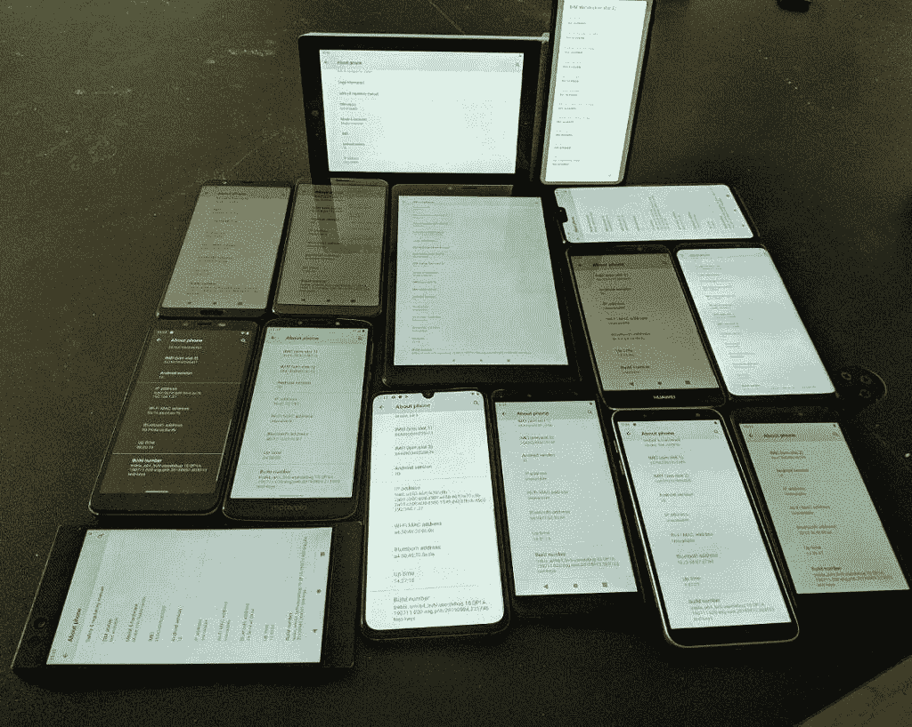

# 下载 Android 10 自定义 GSI 为任何项目高音支持的设备

> 原文：<https://www.xda-developers.com/android-10-custom-gsi-project-treble/>

多亏了 Project Treble——Android 操作系统的一个重大重组——可以引导一个通用的、基于 AOSP 的系统映像，而无需修改引导或供应商映像。寻求谷歌认证的原始设备制造商需要通过启动这个“通用系统映像”或 GSI 来测试他们的设备的三重合规性，并验证基本的硬件功能，但他们不需要确保*一切*都正常工作。不幸的是，这意味着 GSI 在一些设备上功能相当正常，而在另一些设备上却失灵了。这就是社区，尤其是 XDA 公认的开发商 [phhusson](https://forum.xda-developers.com/member.php?u=1915408) 介入的地方。由独立开发者在我们的论坛上构建的定制 GSI 被设计为在尽可能多的设备上运行，并且几乎没有错误。例如，phhusson 的最新 GSI 将 Android 10 带到了任何支持 Project Treble 的设备上，而且它不会破坏许多设备上的基本功能，如 Wi-Fi、RIL 或亮度控制。

谷歌确实在其网站上提供了自己的 Android 10 GSIs，但他们的 GSI 是 T2 的，所以开发者可以根据最新的 API 水平测试他们的应用。谷歌的 GSIs 并不是为用户在手机上运行日常驱动软件而设计的，这是一个遗憾，因为 AOSP 比许多手机上的股票软件干净得多。如果你有一部受欢迎的手机，拥有一个蓬勃发展的开发者社区，那么你可以从我们的论坛上发布一个基于 [Android 10 的定制 ROM](https://www.xda-developers.com/tag/android10) 。如果你在我们的论坛上找不到任何特定设备的 Android 10 ROMs，那么给 phhusson 的 GSI 一个机会。

他的定制 GSI 应该可以在任何支持 Project Treble 的 Android 设备上启动，这意味着大多数设备都使用 Android 8.0+。请注意，只有获得谷歌认证的设备才需要 Project Treble 支持，所以如果你试图在从中国进口的设备上启动这款 GSI，可能会遇到一些问题。无论如何，你会惊讶于 GSI 的功能性，尤其是在不太知名的联发科芯片组设备上。

 <picture></picture> 

Unofficial Android 10 GSI running on 15 different Android devices, including the Razer Phone, Xiaomi Mi 9, Chuwi Hi9 Air, Archos Hello 7, Redmi Go, Cubot X18 Plus, Infinix Smart 2, Samsung Galaxy J6, Motorola Moto e5, Allview V3 Viper, Honor View 10, Samsung Galaxy S9+, ASUS ZenFone 6, Huawei Mate 9, and OnePlus 6\. Credits: phhusson.

有兴趣试试这个吗？你首先需要的是一个解锁的引导程序。接下来，你可以从 phhusson 的 GitHub 页面[这里](https://github.com/phhusson/treble_experimentations/releases)下载他的 GSI 的最新版本，并在这里学习如何刷新 GSI [。在你这样做之前，你应该阅读 phhusson 的 XDA 论坛线程](https://www.xda-developers.com/flash-generic-system-image-project-treble-device/)[这里](https://forum.xda-developers.com/project-treble/trebleenabled-device-development/aosp-10-0-quack-phh-treble-t3992559)，并检查你应该使用下面链接的 Treble Info 应用程序下载哪个变种。由于用一个系统映像支持这么多设备的困难，某些设备上肯定会有一些 bug。如果您有任何问题，您可以在这里[或者在](https://github.com/phhusson/treble_experimentations/issues)[这里](https://github.com/phhusson/treble_experimentations)链接的聊天中报告。我还建议你看看我们的[项目 Treble forums](https://forum.xda-developers.com/project-treble) ，因为其他定制 ROM 开发者最终会基于 phhusson 的最新版本重新设计他们的工作，如果你不是 AOSP 股票的粉丝，会给你更多的选择。