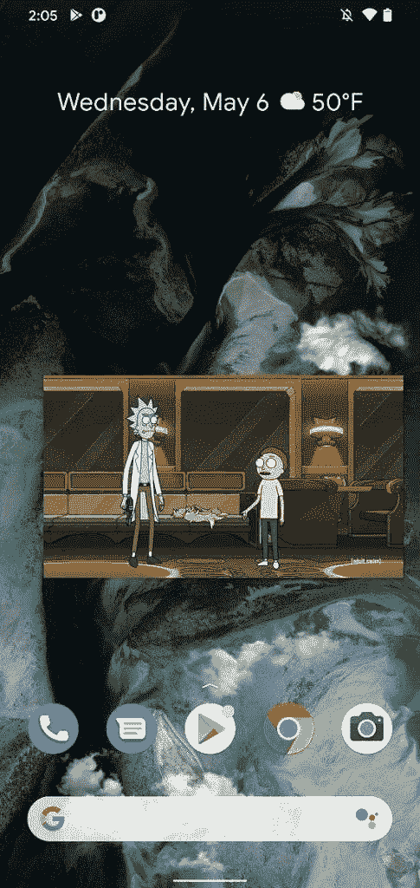

# 这是 Android 11 开发者预览版 4 中所有新的和隐藏的东西

> 原文：<https://www.xda-developers.com/android-11-developer-preview-4-google-everything-new-hidden-development-feature/>

早在二月份，谷歌就已经宣布了第一个 Android 11 开发者预览版，随后是[预览版 2](https://www.xda-developers.com/android-11-developer-preview-2-changes/) 、[预览版 3](https://www.xda-developers.com/android-11-developer-preview-3-changes/) ，以及最近的[预览版 4](https://www.xda-developers.com/google-android-11-beta-june-3-2020-developer-preview-4-live-release/) 。按照最初的计划，谷歌应该在谷歌 I/O 上发布第一个 Android 11 测试版，但由于新冠肺炎疫情，时间表[发生了很大变化。首个测试版将于 2020 年 6 月 3 日在网上发布。在那之前，我们有 Android 11 开发者预览版 4 让我们忙个不停。虽然在这个版本中没有突出开发者特性，但这并不意味着在 Preview 4 中没有任何值得注意的变化。以下是我们在谷歌 Pixel 3a XL 和谷歌 Pixel 4 上挖掘最新开发者预览版 4 时发现的变化和新功能。](https://www.xda-developers.com/google-io-2020-canceled/)

**[所有安卓 11 新闻](https://www.xda-developers.com/tag/android-11/)**

## Android 11 开发者预览版 4 中的新功能

### 1.最近使用的应用程序概览中的选择按钮

Android 11 开发者预览版 3 修改了最近的应用概述，增加了“截图”和“分享”按钮，取代了建议应用的行。现在在开发者预览版 4 中，这两个按钮被一个“选择”按钮连接起来。点击此按钮可高亮显示所有可选的文本和图像。

自 Android 9 Pie 以来，你已经可以在 Pixel 设备上的最新应用概述中手动选择文本和图像，但许多用户只是没有意识到这可以做到，或者这是一个功能。这个新的“选择”按钮只是让用户更清楚地看到，你可以在这里进行选择。不过，我们不知道这个“选择”按钮是否会在 Android 11 中用于非像素设备。Android 11 之前的非像素设备在最近的应用概述中已经无法访问可选的文本/图像。

### 2.画中画窗口现在可以调整大小了！

在 Android 11 开发者预览版 2 中，[我们发现代码](https://www.xda-developers.com/android-11-resize-picture-in-picture-pip-windows/)暗示谷歌将很快允许你调整画中画窗口的大小。在 Android 11 开发者预览版 3 中，我们发现这个功能离发布更近了，因为我们能够使用功能标志手动[启用它。现在在 Android 11 开发者预览版 4 中，这个功能已经默认为所有人开启。](https://www.xda-developers.com/android-11-dp3-tests-letting-you-resize-picture-in-picture-windows/)

 <picture></picture> 

Resized PiP window

要调整画中画窗口的大小，只需轻按四个角之一的外侧，然后向内或向外拖动。

### 3.像素主题中新的六边形和花朵图标形状

随着 Pixel 4 的发布，谷歌推出了 [Pixel Themes](https://www.xda-developers.com/december-2019-android-security-patches/) 应用。Pixel Themes 允许您从大量预安装的选项中自定义 UI 的某些部分，如字体、强调色、图标形状和图标填充。现在在开发者预览版 4 中，谷歌增加了两个新的图标形状选项:六边形和花朵。

### 4.无线调试现在有一个快速设置磁贴

Android 11 增加了通过 WiFi 快速设置 ADB 的支持。您可以通过扫描 QR 码或输入 6 位 PIN 码来快速设置无线 ADB。在开发者预览版 4 中，谷歌增加了一个快速设置磁贴，允许你快速打开/关闭无线调试。这将有助于保护您的设备安全，因为您可以在不使用无线调试时将其关闭，并在需要时快速打开。

若要启用无线调试快速设置互动程序，您必须转到“设置”>“开发人员选项”>“快速设置开发人员互动程序”。

### 5.连接的首选项现在链接到 Android Auto

在设置>连接设备>连接偏好设置中，现在有一个链接可以打开 Android Auto 的设置页面。这很可能是为了准备主 Android Auto 应用程序的弃用，以支持[谷歌助手期待已久的驾驶模式](https://www.xda-developers.com/google-assistant-driving-mode-waze/)。

### 6.通知计数显示在预览中

如果您在同一个对话中有多个通知，您现在会在展开箭头旁边看到一个数字，告诉您在该对话中错过了多少封邮件。例如，在此屏幕截图中，有两条消息来自同一个 Hangouts 对话，因此通知中的数字为“2”。

* * *

## 开发中的功能

这些功能在 Android 11 开发者预览版 4 中已经存在，但它们处于不同的完成阶段，还没有准备好。我们可以期待在未来的版本中看到这些特性。

### 1.从应用程序抽屉的建议行中移除应用程序

Pixel Launcher 在顶部包含一个应用程序建议行，根据您对这些应用程序的使用情况，建议您接下来可能要启动的应用程序。虽然你可以完全关闭这一行，以防你发现它没有用，但没有办法单独删除一个被推荐的应用。因此，如果你有一个应用程序，你不喜欢出现在这一行，你没有选择这样做。在开发者预览版 4 中，我们启用了一个开发选项，允许您通过将应用拖离应用抽屉并放到“不建议应用”选项上来从建议行中删除应用。通常情况下，这个“不建议应用程序”选项会显示“卸载”

### 2.混合热点:为应用 dock 中缺失的位置建议替换应用

应用程序 Dock 位于主屏幕的底部，它作为一个固定的应用程序栏，可以在多个主屏幕上看到。默认情况下，应用程序 Dock 由五个图标填充。如果你从 dock 中移除一个应用程序，在那个地方会有一个空白的空间。

然而，在启用混合 Hotseat 功能的情况下，当你从应用程序 Dock 中移除图标时，Pixel Launcher 将从建议行中建议一个应用程序来占据空白位置。我们已经[在一次 APK 拆解](https://www.xda-developers.com/pixel-launcher-android-11-hints-showing-suggested-apps-home-screen-dock/)中发现了这个特性，在开发者预览版 4 中，我们设法激活了这个特性。

Android 11 的关键特性之一是控件 API，它将允许开发者在电源菜单中设置家庭自动化快捷方式。在 Android 11 的早期预览版中，顶部电源菜单项下方有一个“快速控制”部分，而电源菜单的其余部分是透明的。

现在在 Android 11 开发者预览版 4 中，电源菜单背景是深色的，包括顶部的电源菜单项。此外，“快速控制”现在说“设备控制”，并有一个描述文本时，它是空的，说“为您连接的设备添加控制”。当您从支持的应用程序添加控件时，此文本会消失，以便为您喜爱的控件腾出空间。总的来说，这个功能看起来更加完善，我们可以在 6 月 3 日 Android 11 beta 1 发布会上看到谷歌公开谈论它。

### 4.准备“时间表”设置

在 Android 11 开发者预览版 3 中，我们发现了谷歌正在准备一个新的“日程”设置页面的证据，在那里你将能够控制所有可安排的设置，如勿扰模式、夜间照明、黑暗模式等。现在在 Android 11 开发者预览版 4 中，我们设法让这个“日程”设置页面的条目浮出水面。

它可以在设置>系统中找到。然而，目前谷歌应用程序的设置中不存在“时间表”的片段，因此当我们试图启动它时，它崩溃了。

### 5.电池共享现在是反向充电

在 Android 11 开发者预览版 1 中，我们发现了一项名为“电池共享”的活动，这表明谷歌正在努力为某些设备支持反向无线充电。代码分析表明，这个功能将是“redfin”独有的，我们推测它是由骁龙 765 处理器驱动的[Pixel 5 设备之一。](https://www.xda-developers.com/google-pixel-2020-code-names-snapdragon-765-snapdragon-730/)

在 Android 11 开发者预览版 4 中，电池份额被重命名为反向充电。然而，谷歌已经删除了该功能的许多描述性字符串。他们还让你无法启动设置页面，除非你的设备型号名称是“redfin”，以确认反向无线充电功能确实是为该设备设计的。

我们设法在设置>电池中显示设置，但是所有应该显示的文本现在都不见了。

### 6.Pixel Launcher 正在准备一个手势教程

谷歌在 Android 10 中增加了全屏手势导航，但他们还没有实施一个教程来教用户如何用这些手势导航。在最新的 Pixel Launcher 版本中，我们发现了一个教用户如何使用手势导航的新活动。

### 7.Pixel Themes 正在为 Pixel Launcher 准备网格大小定制

当我们在 Pixel 4 发布之前第一次了解 Pixel 主题应用程序时，我们能够在启动器中显示一个设置来改变网格大小。该功能从未在 Pixel Themes 应用程序中推出。

但在 Android 11 开发者预览版 4 中，我们设法在 Pixel Themes 应用程序中浮出了这个菜单。一旦此功能启用，您将能够选择 5x5(默认)、4x4、3x3 或 2x2 网格大小。

### 8.统一的热点和网络共享设置

最后，我们启用了一个特性标志来调整“热点和网络共享”设置的 UI。在新的 UI 中，Wi-Fi 热点设置与 USB 共享和蓝牙共享的切换在同一页面上。Android 11 开发者预览版 3 新加入的以太网共享，目前在新的 Hotspot & Tethering UI 中缺失。

* * *

## 移除了 Android 11 开发者预览版 4 中的功能

在 Android 11 开发者预览版 4 中，谷歌已经恢复了这些行为变化，因此不再可能使用这些功能。

### 撤消最近应用程序消除手势并消除持续通知

Android 11 开发者预览版 3 在两个关键领域改变了系统行为:最近应用和通知。对于最近的应用程序，他们可以在你解散卡后快速向下滑动屏幕上的任何地方来“撤销”解散最近的应用程序卡。对于通知，他们可以使用与消除标准通知相同的左/右滑动手势来隐藏持久通知——这将持久通知放在“历史记录”按钮下的新“后台活动的应用程序”区域中，使这些通知变得不那么明显。

这两个都已经不能实现了。

* * *

## 奖金:威瑞森谷歌像素 4a 确认

如果没有确认即将推出的硬件，这就不是谷歌的软件发布。这一次，它是谷歌像素 4A，被证实将在美国威瑞森。

* * *

这就是我们在这个版本中所能找到的全部内容。关注我们的 Android 11 新闻标签，了解到目前为止我们在下一个 Android OS 版本中报道的所有最新消息。

**[所有安卓 11 新闻](https://www.xda-developers.com/tag/android-11/)**