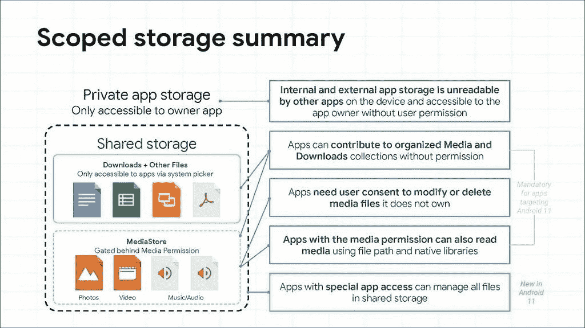
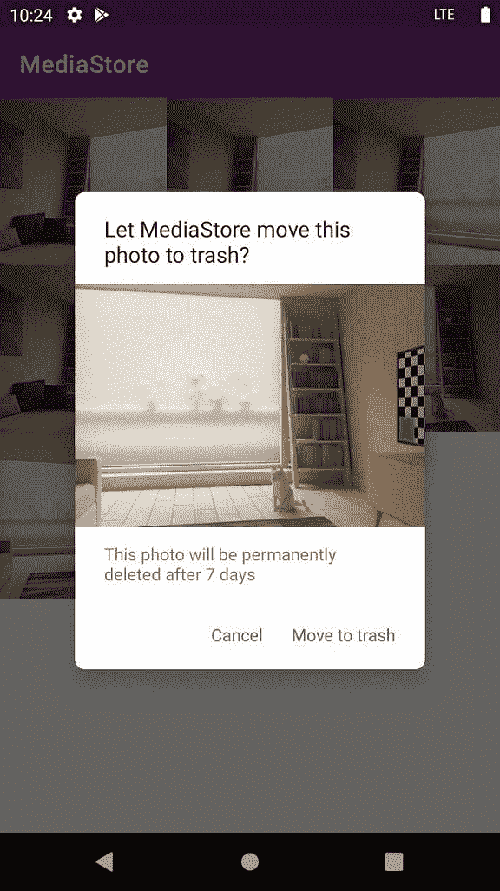

# Android 11 有一个隐藏的回收站，用于存放垃圾照片和视频

> 原文：<https://www.xda-developers.com/android-11-hidden-recycle-bin-trashed-photos-videos/>

谷歌正试图通过“范围存储”来控制失控的应用存储局面。作用域存储是在 Android 10 中引入的，但自从它首次出现以来已经改变了几次，因为它极大地影响了许多 Android 应用程序的存储访问。谷歌正在对面向 API 级别 30 的应用实施范围存储，这是与 Android 11 一致的最新 API 级别。

与其试图[再一次解释作用域存储](https://www.xda-developers.com/android-11-developer-preview-privacy-security-features-changes/)，这里有一张来自谷歌“[Android 11](https://www.youtube.com/watch?v=5w5h_UdIiqs)中所有隐私问题”演讲的图片，总结了作用域存储将如何影响 Android 11 中应用的存储访问。

 <picture></picture> 

Source: Google

到目前为止，对存储访问的一个更有趣的变化是引入了一个新的“垃圾”机制。这项功能在谷歌的“[Android 11](https://www.youtube.com/watch?v=RjyYCUW-9tY&feature=youtu.be)存储访问”视频中有详细介绍。本质上，使用 [MediaStore API](https://developer.android.com/reference/android/provider/MediaStore) 的应用程序可以丢弃文件，而不是删除它，以便给用户一个机会在以后恢复文件。谷歌将这一功能比作 PC 上的回收站，只不过 Android 的回收站默认是隐藏的。不过，谷歌表示，对垃圾文件拥有编辑权限或要求用户同意的应用程序可以显示回收站中的项目。被丢弃的物品会在 30 天后被 Android 自动删除。

Android 11 还要求应用程序在修改不属于应用程序的媒体文件之前，必须获得用户的同意。另一个增加的新功能是“收藏夹”，它允许媒体应用程序将“收藏夹”文件状态添加到指定的媒体项目，以便其他媒体应用程序知道用户认为这些项目很重要。例如，如果用户在 gallery 应用程序中标记了一个项目，那么其他媒体应用程序可以看到该项目已被收藏。

虽然谷歌的讲话没有展示 MediaStore 新垃圾桶概念的例子，但该 API 自第一个 Android 11 开发者预览版以来就已经可用。开发人员塞维多夫·米索琴科在二月份发表了一篇关于 Medium 的文章，介绍了这个新的 API，他在一个示例应用中演示了这个 API，如下所示:

 <picture></picture> 

New MediaStore Trash API in Android 11\. Credits: [Yuriy Mysochenko](https://medium.com/@sdex/new-mediastore-trash-api-in-android-r-9a7000c4037).

在这个演示中，该应用程序询问用户是否想将照片移到垃圾桶，这将暂时从图库中删除照片。7 天后，照片将从存储中永久删除。谷歌人 Roxanna Aliabadi 提到，操作系统将垃圾项目存储 30 天，因此自第一次开发者预览版以来，7 天的存储限制可能有所增加。

对实现这个 API 感兴趣的开发者现在可以在 Android 开发者网站上查看文档。媒体应用程序可以创建一个名为 [createTrashRequest](https://developer.android.com/reference/android/provider/MediaStore#createTrashRequest(android.content.ContentResolver,%20java.util.Collection%3Candroid.net.Uri%3E,%20boolean)) 的 PendingIntent 来提示用户丢弃一个项目，然后添加标志[IS _ trassed](https://developer.android.com/reference/android/provider/MediaStore.MediaColumns#IS_TRASHED)来指示媒体项目已经被丢弃。被丢弃的项目由操作系统保留，直到[日期到期](https://developer.android.com/reference/android/provider/MediaStore.MediaColumns#DATE_EXPIRES)，之后它们将从存储中永久删除。查询 MediaStore 的媒体应用程序必须使用 [QUERY_ARG_MATCH_TRASHED](https://developer.android.com/reference/android/provider/MediaStore#QUERY_ARG_MATCH_TRASHED) 显式查询已丢弃的项目，因为默认情况下，已丢弃的项目会从操作中过滤掉。

如果您的应用处理存储访问，您可以(也应该)听听这个关于作用域存储的完整演讲: