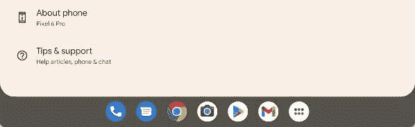

# Android 13 开发者预览版 2 将应用抽屉带到了任务栏

> 原文：<https://www.xda-developers.com/android-13-app-drawer-taskbar/>

[Android 13 开发者预览版 2 于周四](https://www.xda-developers.com/android-13-developer-preview-2/)刚刚发布，随着新一轮的新功能和变化，Android 13 将于今年晚些时候最终发布。谷歌强调了新版本的一些变化，但似乎还有另一个有益的改进:大屏幕设备的任务栏中有一个应用抽屉。

最近的 [Android 12L](https://www.xda-developers.com/android-12l/) 更新(又称 Android 12.1)在一些大屏设备的底部增加了一个任务栏，包括一些平板电脑和可折叠手机，这在 Android 13 中仍然存在。然而，正如斯珀的米莎尔·拉赫曼在一条推文中指出的，现在任务栏中有一个额外的图标可以打开应用程序抽屉。

 <picture></picture> 

Credit: Mishaal Rahman

从应用程序抽屉中打开的任务栏可能不如你选择的主屏幕启动器中的抽屉功能齐全——例如，现在似乎没有搜索栏。不过，它会让你选择打开另一个新的应用程序，而不用回到主屏幕或询问谷歌助手，类似于 Galaxy 手机上的 Edge 面板和其他类似的定制功能。这也使配备任务栏的 Android 在功能上更接近 Windows 或 Chrome OS，这两种操作系统都将所有应用程序组织在一个可从任务栏访问的按钮中。

Android 13 开发者预览版 2 还增加了应用程序通知的运行时权限，改进了日语文本换行，针对日语、COLR 字体、MIDI 2.0、蓝牙 LE 音频等语言的新文本转换 API，以及其他变化。查看我们的主要 [Android 13 开发者预览 2 报道](https://www.xda-developers.com/android-12l/)了解更多信息和 Pixel 设备的下载链接。

谷歌预计将在 4 月份发布第一个 Android 13 测试版，稳定版将在 7 月份之后发布。Android 12 于去年 10 月发布，Android 11 于 2020 年 9 月发布，因此 Android 13 的时间表可能会遵循相同的模式。