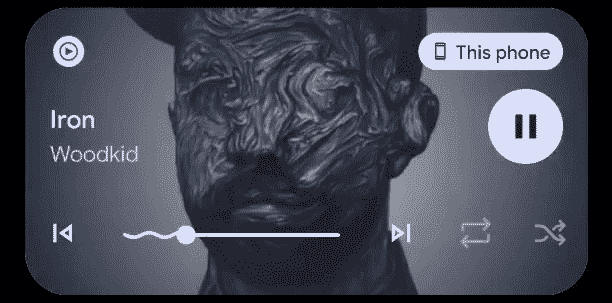

# Android 13 Beta 1 有一个有趣的媒体控制新动画

> 原文：<https://www.xda-developers.com/android-13-beta-1-media-controls-animation/>

Android 的每个新版本都会更新通知面板的外观和感觉，通常会对快速设置面板和通知组织进行更改。Android 13 的第一个开发者预览版已经更新了快速设置下媒体控件的设计，现在 [Android 13 Beta 1](https://www.xda-developers.com/android-13-beta-1-released/) 增加了一点额外的天赋:一条移动的曲线。

Android 13 Beta 1 于周二发布，尽管谷歌在公司公告中没有提到，但新的更新在系统媒体控件的进度条上添加了一条移动的曲线。斯珀的米莎尔·拉赫曼在推特上展示了这个动画，它在进度条的流逝区域上下移动。

 <picture></picture> 

Android 13 Beta 1 media animation (Credit: Mishaal Rahman)

这个动画绝对是一个有趣的补充，但尚不清楚三星等制造商是否会在他们定制的 Android 版本中采用它，或者它是否会继续局限于股票一样的 Android 手机和平板电脑。

[谷歌对媒体控件的最后一次更新](https://www.xda-developers.com/android-13-media-controls/)是在 Android 13 开发者预览版 2 中，它增加了小工具的大小，使其在 Android 12 上扩展时看起来更大(通常是通过向下滑动或刷走所有通知)。新的布局显示完整的标题和其他数据，无需任何额外的点击，并拉伸专辑封面以覆盖整个背景，但在已经拥挤的快速设置面板中留给通知的空间更少。

Android 13 Beta 1 于周二发布，包括媒体文件访问的新权限选项，音频路由的改进，应用程序开发人员的新日志选项，以及一些界面变化。它目前在 Pixel 6 Pro、Pixel 6、Pixel 5a 5G、Pixel 5、Pixel 4a (5G)、Pixel 4a、Pixel 4 XL 和 Pixel 4 上可用——如果你想在手机上试用，我们有[下载链接](https://www.xda-developers.com/how-to-download-android-13/#beta1)。

**来源:** [米沙·拉赫曼(推特)](https://twitter.com/MishaalRahman/status/1519002265914425357)