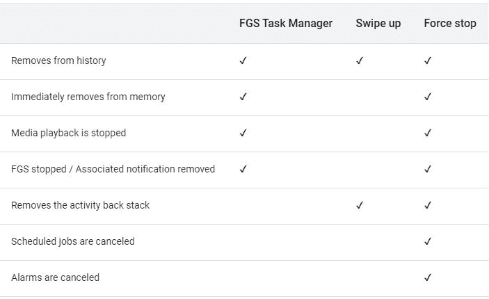

# Android 13 将允许你从通知抽屉中停止前台服务

> 原文：<https://www.xda-developers.com/android-13-foreground-services-task-manager/>

谷歌上周晚些时候开始播种第二个 [Android 13](https://www.xda-developers.com/android-13/) 开发者预览版。当时，[公司强调了这次发布中的一些新特性和变化。然而，它并没有揭示所有的变化。在过去的几天里，我们已经看到了一些这样的变化，包括](https://www.xda-developers.com/android-13-developer-preview-2/)[更新的媒体控件、重新设计的输出选择器](https://www.xda-developers.com/android-13-media-controls/)、[新的剪贴板弹出菜单](https://www.xda-developers.com/android-13-dp2-clipboard-popup/)和[PC 上 Android 的 UI 变化](https://www.xda-developers.com/android-13-pc-features/)。在这篇文章中，我们将看看第二个 Android 13 开发者预览版中发现的另一个有用的功能，它将让用户轻松地从通知抽屉中停止前台服务。

据*斯珀*报道，Android 13 DP2 包括一个新的前台服务(FGS)任务管理器。它显示了当前运行前台服务的应用程序列表，并允许用户停止前台服务，而不管目标 SDK 版本如何。你可以通过在通知抽屉上向下滑动并点击设置目录旁边的新图标来访问这个名为活动应用的列表。

 <picture></picture> 

Credit: Google

正如你在所附截图中看到的，新图标在前台显示了运行服务的应用程序的数量。点击它会打开一个卡片，上面有应用程序的名称，在前台活跃的时间，以及一个停止按钮。你可以点击停止按钮来停止前台服务。值得注意的是，通过 FGS 任务管理器停止应用程序与从最近屏幕关闭应用程序或使用设置中的“强制停止”选项没有相同的效果。下表强调了这三种操作之间的差异。

 <picture></picture> 

Credit: Google

斯珀进一步指出，当一个应用的前台服务在 24 小时内运行了至少 20 小时，FGS 任务管理器就会推送通知。通知将提示用户与 FGS 任务管理器进行交互。它将显示:*【应用】正在后台运行很长时间。点击以查看。*但是，如果前台服务的类型为 FOREGROUND _ SERVICE _ TYPE _ MEDIA _ PLAYBACK 或 FOREGROUND _ SERVICE _ TYPE _ LOCATION，则不会出现此通知。

值得一提的是，持有 ROLE_EMERGENCY 角色的系统级 app 和安全类 app 将免于出现在 FGS 任务管理器中。当设备处于演示模式时，这同样适用于所有应用程序。此外，用户将无法关闭一些应用程序，即使它们出现在 FGS 任务管理器中。这些应用程序包括设备所有者应用程序、描述文件所有者应用程序、持续应用程序和具有 ROLE_DIALER 角色的应用程序。

您可以通过下面的源代码链接了解更多关于新的前台服务任务管理器的信息。

* * *

**来源:** [谷歌](https://developer.android.com/about/versions/13/changes/fgs-manager)

**Via:** [斯珀](https://blog.esper.io/android-13-deep-dive/#foreground_service_manager)