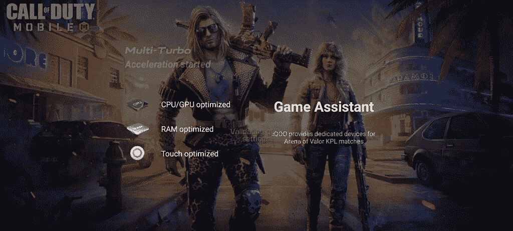

# Android 13 可以显著减少游戏加载时间

> 原文：<https://www.xda-developers.com/android-13-game-loading-mode-improvements/>

# Android 13 可以显著减少游戏加载时间

Android 13 在 GameManager API 中增加了一个名为 setGameState 的新方法，允许游戏向系统传达其当前状态。

随着 Android 12 的发布，谷歌为手机游戏玩家和开发者推出了几个新功能，将 Android 游戏体验提升到一个新的水平。选择智能手机，如 Pixel 6 系列，有一个新的[游戏仪表板](https://www.xda-developers.com/android-12-game-dashboard-gaming-mode-apis/)实用程序，可以在您玩游戏时访问有用的工具，如屏幕截图快捷方式、屏幕录制器、免打扰开关等。同时，新的游戏模式 API 允许开发人员根据用户选择的性能配置文件优化他们的游戏，以获得最佳性能或更长的电池寿命。Android 13 通过一些新功能继续推动移动游戏的发展。

据斯珀的 Mishaal Rahman 报道， [Android 13](https://www.xda-developers.com/tag/android13/) 在 *GameManager* API 中增加了一个名为 *setGameState* 的新方法，允许游戏向系统传达它们的当前状态。这使得游戏可以传递游戏的顶级状态，并指示是否可以中断。此外，游戏还可以使用 *setGameState* 告诉平台游戏是否正在加载资产/资源/编译/等。然后，平台可以向 power HAL 发送加载时间提示，以激活新的 GAME_LOADING 模式并提高 CPU 性能。但是，当 GAME_LOADING 模式处于活动状态时，将由 OEM 来指定他们想要实施的 CPU 性能调整。

从理论上来说，这意味着你将不得不少盯着最初的游戏加载屏幕。许多 Android OEMs 厂商已经实施了各种优化措施，例如分配更多的 CPU 和 GPU 资源，以提高游戏加载速度。

 <picture></picture> 

iQOO's Multi Turbo engine prioritizes CPU/GPU and other resources to speed up game loading.

*斯珀*报道称，谷歌正考虑在供应商测试套件(VTS)中增加一项测试，要求所有搭载 Android 13 及更高版本的设备都必须采用游戏加载模式。然而，目前还不清楚这个需求是否已经最终确定。也有可能升级到 Android 13 的设备可能不包含新的 power HAL 版本和 GAME_LOADING 模式。

* * *

**来源** : [斯珀](https://blog.esper.io/android-13-deep-dive/#loading_time_improvements)