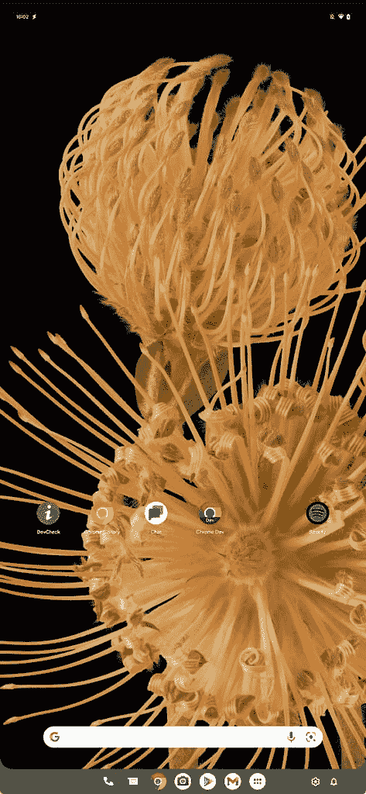

# Android 13 有新的任务栏和多窗口功能，只适用于个人电脑

> 原文：<https://www.xda-developers.com/android-13-pc-features/>

在被冷落多年后，谷歌终于开始关注大屏设备上的 Android。最近的 [Android 12L 更新](https://www.xda-developers.com/android-12l/)(也称为 Android 12.1)增加了一个任务栏，并更新了平板电脑和可折叠设备的布局，现在 Android 13 正在此基础上进行新的界面调整，专门针对台式机和笔记本电脑上运行的 Android。

除了 Chrome OS 和 Windows 上的嵌入式运行时之外，Android 在 PC 上并不常见，嵌入式运行时通常会隐藏大部分系统设计。不过，这并没有阻止谷歌在 Android 13 上对 PC 体验进行一些改进。在 Android 12L 中添加的应用任务栏现在在右侧有按钮用于打开通知面板和快速设置。

 <picture></picture> 

Android 13's PC layout (Source: Esper)

新的 PC 设计更接近 Android 3.0 Honeycomb 和一些 4.x 版本的设计，屏幕底部有快速设置和通知。然而，这些早期版本的 Android 并没有在任务栏上显示所有打开的应用程序。此外，PC 上的 Android 13 仍然在屏幕顶部有一个状态栏，在那里也可以访问快速设置和通知。

Android 13 开发者预览版 2 显然也默认以自由形式多窗口模式打开所有应用程序，而不是拉伸它们覆盖整个屏幕。自 7.0 Nougat 发布以来，多窗口支持就一直存在于 Android 中，但在多窗口模式下打开应用程序仍然需要进入开发者选项或将主屏幕启动器设置为第三方应用程序，如任务栏。

新的变化肯定会对在 PC 上运行 Android 的人有所帮助——比如通过非官方的 [Android x86 发行版](https://www.android-x86.org/)——但我希望这些设计元素最终也会出现在大型平板电脑上。三星刚刚发布了巨大的 14.6 英寸 [Galaxy Tab S8 Ultra](https://www.xda-developers.com/samsung-galaxy-tab-s8-ultra-review/) ，它肯定会受益于针对个人电脑的设计变化，尽管三星自己的 DeX 界面是一种功能替代。

**来源:** [斯珀](https://blog.esper.io/android-13-deep-dive/#pc_interface)