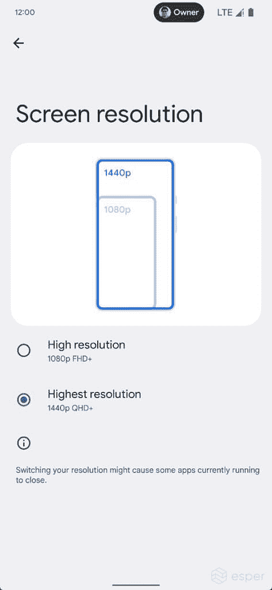

# 谷歌致力于 Android 13 的屏幕分辨率设置

> 原文：<https://www.xda-developers.com/android-13-screen-resolution-testing/>

本周早些时候，谷歌发布了第一个 Android 13 测试版，历经数月的开发者预览版。每个版本中都有一些谷歌在最初的公告中没有提到的新功能，其中之一似乎是系统设置应用程序中的新屏幕分辨率切换。

斯珀的米沙·拉赫曼发现 Android 13 Beta 1 支持在设置应用中切换分辨率。新选项可以从设置的显示部分的“屏幕分辨率”菜单中访问...不管怎样，当它真的上线的时候。目前，该功能仍在开发中，通常不可访问。

 <picture></picture> 

Credit: Esper

目前，分辨率选项由底层 Android 系统提供——在上面的例子中是 1080p 和 1440p。具有高刷新率显示器的 Android 设备已经有了改变当前刷新率的设置，所以这本质上是在此基础上的另一层定制。Android 的一些自定义皮肤已经有了改变当前屏幕分辨率的选项，比如三星的 One UI。

那么，你为什么想要改变你的屏幕分辨率呢？主要用例是提高游戏性能——渲染复杂图形需要更高分辨率的图形能力。如果你的中档手机有很高的显示分辨率，调低屏幕分辨率可以让一些游戏更流畅。然而，在打开游戏之前改变分辨率是很烦人的，除非你只是让手机或平板电脑一直保持较低的分辨率。

这项功能仍在开发中，所以确切的界面和可用选项可能会在它到来之前发生变化。谷歌也可以决定这不是一个好主意，并完全放弃它——这就是预发布软件的本质。

Android 13 Beta 1 于周二发布，包括媒体文件访问的新权限选项，音频路由的改进，应用程序开发人员的新日志选项，以及一些界面变化。它目前在 Pixel 6 Pro、Pixel 6、Pixel 5a 5G、Pixel 5、Pixel 4a (5G)、Pixel 4a、Pixel 4 XL 和 Pixel 4 上可用——如果你想在手机上试用，我们有[下载链接](https://www.xda-developers.com/how-to-download-android-13/#beta1)。

**来源:** [斯珀](https://blog.esper.io/android-13-deep-dive/#resolution_switching)