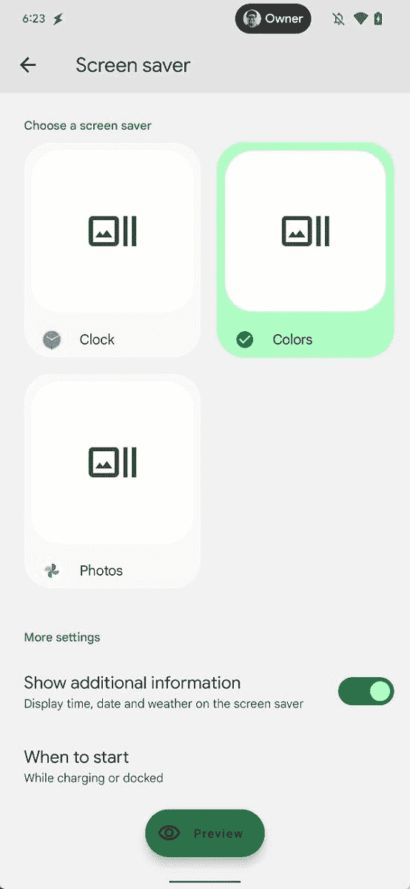

# Android 13 可能会用信息叠加来改造屏幕保护程序

> 原文：<https://www.xda-developers.com/android-13-screen-savers/>

上周，谷歌发布了 Android 13 的第二个开发者预览版，其中包含了大量的变化和新功能——其中一些还没有准备好发布。此次更新包括指向 Android 内置屏幕保护程序未来改进的代码，可能会在后期测试版或 Android 13 的最终版本中发布。

Android 支持屏幕保护程序已经很多年了，尽管它们在大多数移动设备上并不是必需的(或者根本没用)。然而，Android 13 有一些专门针对桌面电脑的变化，重新关注屏幕保护程序可能是这一努力的一部分。据报道，Android 13 在其代码库中包含了新的“复杂”类，这些类似乎是覆盖在屏幕保护程序顶部的数据。

 <picture></picture> 

Source: Mishaal Rahman

谷歌的智能手表软件平台 Wear OS 也有一个名为“复杂功能”的小信息面板。它们在这里可能会起到同样的作用，Android 13 目前包括与空气质量相关的复杂代码，“cast info”(大概是 Chromecast)，日期，时间和天气。

新的屏保代码可能与 Android 13 改进的桌面支持有关

新的屏幕保护程序代码可能与 Android 13 改进的桌面支持有关，但它也可能有助于统一 Android 的许多代码基础。例如，如果 Android 本身可以生成带有天气信息和其他可见数据的照片壁纸屏幕保护程序，谷歌就不必为 Android TV 和谷歌 TV 构建不同的版本。

Android 13 开发者预览版 2 还增加了应用程序通知的运行时权限，改进了日语文本换行，针对日语、COLR 字体、MIDI 2.0、蓝牙 LE 音频等语言的新文本转换 API，以及其他变化。查看我们的主要 [Android 13 开发者预览 2 报道](https://www.xda-developers.com/android-12l/)了解更多信息和 Pixel 设备的下载链接。

谷歌预计将在 4 月份发布第一个 Android 13 测试版，稳定版将在 7 月份之后发布。Android 12 于去年 10 月发布，Android 11 于 2020 年 9 月发布，因此 Android 13 的时间表可能会遵循相同的模式。

**来源:** [斯珀](https://blog.esper.io/android-13-deep-dive/#screen_saver_revamp)，[米沙·拉赫曼(推特)](https://twitter.com/MishaalRahman/status/1504964591905824768)