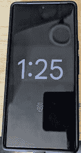

# 谷歌可能想用 Android 13 构建智能显示屏

> 原文：<https://www.xda-developers.com/android-13-smart-display-features-report/>

谷歌的智能显示器软件战略目前已无处不在。大多数 Nest Hub 设备使用 Chromecast 的软件的修改版本(在谷歌电视改造之前)，[最初的 Nest Hub 运行 Fuchsia OS](https://www.xda-developers.com/google-fuchsia-os-debut-nest-hub/) ，带有谷歌助手的第三方显示器由 Android Things OS 驱动。基于前两次开发者预览版中出现的新功能，谷歌可能会寻求将所有这些平台统一在 [Android 13](https://www.xda-developers.com/android-13) 的保护伞下。

谷歌周四报道称[谷歌正在开发一款新的 Nest Hub 智能显示器，它具有可拆卸的平板模式](https://www.xda-developers.com/google-nest-hub-detachable-tablet-report/)，而不是一款必须一直插在墙上的显示器。这不是一个遥不可及的概念，因为这个想法已经有了其他的尝试(比如联想的智能标签 M10)，而*斯珀的*米莎尔·拉赫曼已经指出，Android 13 的一些变化可以用于这样的设备。

我们已经看到在 Android 13 中弹出的许多功能可能对智能显示器有所帮助。

我们已经看到在 Android 13 中弹出的许多功能可能对智能显示器有所帮助。[屏幕保护程序的信息覆盖图](https://www.xda-developers.com/android-13-screen-savers/)将像现有 Nest Hub 上的环境模式一样工作，[新的用户资料功能](https://www.xda-developers.com/android-13-user-profiles/)可能对不止一个人的家庭有帮助，等等。还有一个正在开发中的[“枢纽模式”](https://www.xda-developers.com/android-13-might-include-a-new-hub-mode-for-tablets/)，它可以改善应用程序跨个人资料共享数据的方式。

也许 Nest-Hub-with-Android 理论的最佳证据是 SensorPrivacyManager API 的一个新功能，它是在 Android 12 中添加的，用于检查麦克风或相机访问是否被关闭。谷歌正在对 Android 13 中的 SensorPrivacyManager 进行改进，将检查摄像头和麦克风的硬件切换状态——大多数 Android 设备上都不存在，但每个 Nest Hub 设备上都有。

 <picture></picture> 

Low light clock on Android 13 (Source: Esper)

Android 13 的代码中还有一个新的“弱光时钟”，如上所示，当设备对接并且环境亮度较低时会显示。这或多或少与 Nest Hub 设备上的时钟相同。

在真正宣布之前，我们无法确定谷歌是否正在开发基于 Android 的智能显示器，但鉴于谷歌的报告和 Android 13 中添加的所有软件功能，一切都在排队。不过，谷歌可能只是在用谷歌助手为第三方智能显示器做这些改进，而不是一个“谷歌制造”的产品。

* * *

**来源:** [斯珀](https://blog.esper.io/android-dessert-bites-18-android-13-for-smart-displays-18496723/)