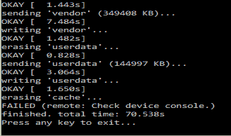

# 如果用户忘记了设备密码，Android 8.1 的错误将会阻塞设备

> 原文：<https://www.xda-developers.com/android-8-1-bug-brick-devices-lock/>

谷歌最近发布了 Nexus 5X 和 6P 以及第一代和第二代 Pixel 设备的第一批系统图像。该更新包括主要的修复和改进，以及一些小的变化。

Android 8.1 带来了许多新功能和变化，如自动明暗主题、神经网络 API、程序化安全浏览动作等。然而，一个 Reddit 用户最近无意中发现了一个不和谐的问题。

Reddit 用户 *tombolger* 发现，忘记运行谷歌最新 Android 8.1 版本的手机的解锁方法将会带来可怕的后果。忘记你的设备锁屏模式/pin/密码会导致你的设备得到**永久封杀**。在之前的 Android 版本(< 8.1)中，工厂重置保护(FRP)的实现方式是在完全擦除设备后需要谷歌帐户密码。

这是谷歌彻底改变方法的地方。与其前辈不同的是，Android 8.1 要求锁屏安全，这是以前在工厂重置手机后缓存在你的设备中的。这可能是一个精心设计的举动，而不是一个支持和增加另一层设备保护的失态。

这使得偷窃这些手机变得毫无价值(除了零件)，因为没有人能够使用和设置这些设备。

Reddit 用户进一步补充说，没有选项可以更改以前使用的锁屏安全性，即模式、pin 或密码。谷歌技术支持建议他 RMA 他的设备。他进一步描述说，通过 fastboot 闪存 Android 8.0 的股票映像或降级到以前的版本没有帮助。他报告的错误在下面的图片中分享。

 <picture></picture> 

Source: /u/Tombolger

与此相关的是，Android 8.0 将“回滚保护”引入了验证启动过程。有了回滚保护，验证启动将不再启动它检测到已降级到早期版本的操作系统。

与此同时，谷歌尚未就这种不确定性发表官方声明。这一次，谷歌对设备加密和保护的热情可能有些过头了。当事态有所发展时，我们会更新这个故事。

[button link = " https://www . Reddit . com/r/Android/comments/7a 0 l 7y/PSA _ on _ Android _ 81 _ as _ it _ is _ now _ forgetting _ your/" Icon = " Select a Icon " side = " left " target = " " color = " f 85050 " text color = " ffffff "]来源:

u/tombolger[/button]