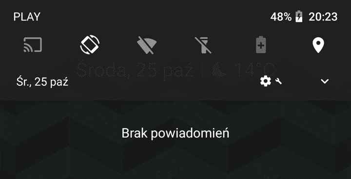
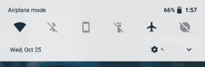
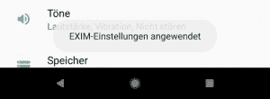

# 下面是 Android 8.1 Oreo 开发者预览版 1 的新特性:UI 变化&更多！

> 原文：<https://www.xda-developers.com/android-8-1-oreo-developer-preview-features/>

几天前，我们从谷歌[收到消息](https://www.xda-developers.com/developer-preview-android-8-1-oreo-mr1/)，Android 8.1，Android Oreo 的第一个维护版本，将在未来几周内作为开发者预览版发布到 Pixel 和 Nexus 设备上。事实上，就在最初确认的 8 天后，谷歌 Pixel、Pixel XL、Pixel 2、Pixel 2 XL、Nexus 5X 和 Nexus 6P 的第一批[系统图像现在已经消失了。虽然这次更新看起来像是对第一个 Android 8.0 版本的适度改进，但实际上比看起来要多得多，因为这次更新包含了一些主要的修复和改进，以及一些其他小细节和变化，总而言之，应该以各种方式改善整体用户体验。今天，我们将对 Android 8.1 开发者预览版 1 带来的一些内容做一个小小的总结。](https://www.xda-developers.com/android-8-1-oreo-developer-preview-1/)

* * *

## 新的 Android 8.1 奥利奥功能和变化

* * *

### 基于壁纸的暗/亮系统用户界面主题

Android 8.0 最受批评的一个方面是几乎系统 UI 的每个方面都采用了白色主题，包括快速设置面板和音量滑块，这妨碍了一些用户的夜间使用。虽然他们没有回到灰色牛轧糖快速设置，但我们得到了一个有趣的选择:自适应快速设置。

基本上，系统 UI 现在不只是将色调和菜单切换回灰色，而是利用新推出的(API 27)壁纸颜色 API，从手机壁纸中抓取颜色，将系统 UI 的许多方面切换到更暗的色调，如快速设置面板、迷你 QS/通知色调、音量滑块、电源菜单甚至像素启动器(应用程序抽屉和文件夹/快捷方式背景)，如果壁纸是暗/黑的，则保持更亮的色调。

 <picture></picture> 

Dark notification shade in Android 8.1\. Credits: [/u/adrianj93](https://www.reddit.com/user/adrianj93)

然而，这种变化似乎只有在墙纸显示在屏幕上时才会改变。这意味着自适应颜色将显示在启动器、复活节彩蛋、最近面板和任何其他将设备壁纸显示为背景的应用程序活动上，而其他活动或应用程序将获得常规的白色/浅色色调。

* * *

### 快速设置面板变成半透明

 <picture></picture> 

Credits: 9to5Google

快速设置面板接受了一些小的视觉变化，它现在有一个稍微透明的背景。就像 Pixel 2 的快速设置面板和 Pixel Launcher 应用程序抽屉一样，半透明的亮/暗快速设置面板允许用户继续查看面板后面的内容，而无需将其拉回来。这在系统范围内有效，不同于自适应着色功能。

此外，磁贴本身的填充增加得非常少，用户图标完全从 QS 面板中移除，只剩下设置作为在手机内部切换用户的唯一方式。

* * *

### 设置接受了彻底的检查

Android 8.1 再次改变了设置应用的用户界面。最新的 Android 版本对顶部工具栏进行了彻底的修改:工具栏右侧不再有用于搜索内部设置的图标，搜索选项现在扮演了主角的角色，搜索栏取代了顶部工具栏。由于有些人只是忽略了以前的搜索图标，这个工具栏应该更加醒目和突出，以帮助人们更快更容易地找到他们需要的东西。

*安卓 8.0(左)和安卓 8.1(右)设置菜单。演职员表:AndroidHeadlines.com*

也可以发现一些其他的小变化。整个设置界面应该感觉更接近我们在 Pixel 2 和 Pixel 2 XL 上可以找到的界面，有一些小的装饰/布局变化，以及一个新的白色导航栏和黑色图标，类似于我们已经在 Pixel Launcher 应用程序抽屉上看到的。

* * *

### 新的，适当的奥利奥复活节彩蛋

8.1 也为复活节彩蛋爱好者带来了一个小而明显的变化:Android Oreo 复活节彩蛋，通过在“关于手机”中点击 Android 版本 7 次来访问，现在显示带有 Android bugdroid 的 Oreo cookie，而不是我们自第一次 Android O 开发者预览以来一直看到的已知橙色“O”图标。虽然没有新的奥利奥主题游戏:但“章鱼”复活节彩蛋本身(我们在 DP4 上介绍过)保持不变，因为它仍然可以通过重复点击奥利奥饼干来访问。

系统界面图标，如 USB 调试通知图标，也已经更新，反映了新的奥利奥饼干复活节彩蛋。

*安卓 8.0(左)vs 安卓 8.1(右)复活节彩蛋。演职员表: [/u/adrianj93](https://www.reddit.com/user/adrianj93)*

* * *

### 导航栏接受改造，不活动时自动变暗

升级到 Android 8.1 后可以立即注意到的变化之一是导航栏的新行为。这是因为导航条本身已经接受了一些修饰。首先，它现在明显更紧凑了——与 7.1/8.0 navbar 相比，图标现在更小、居中并且靠得更近，使得单手使用大手机更容易。

但是此外，导航条也有一个重要的行为变化:当没有触摸输入时，后退、主页和最近按钮的不透明度会降低。这种“自动变暗”的导航条在系统范围内有效，这可能是一种预防措施，以尽可能避免有机发光二极管屏幕上的烧屏和图像残留问题。

*学分:Quinny899*

* * *

当谷歌 Pixel 2 和谷歌 Pixel 2 XL 公布时，我们立即注意到的变化之一是一个新的，完全改变的电源菜单:取代了位于屏幕正中央的弹出菜单，长按电源按钮现在会在屏幕一侧给你一个更小，更友好的菜单，与电源按钮对齐，以便大大方便单手操作(特别是更大的 Pixel 2 XL)。Android 8.1 为所有设备带来了相同的菜单，包括最初的 Pixel 手机以及 Nexus 5X 和 6P。另外，它还以壁纸颜色 API 为主题。

*新的 Android 8.1 电源菜单有深色和浅色两种版本。演职员表:[/u/杰迪布瑞尔](https://www.reddit.com/user/JediBurrell)*

* * *

### 其他变化

 <picture></picture> 

White toast message on Android 8.1\. Credits: AndroidHeadlines.com

Android 8.1 还为 Pixels 和 Nexus 设备带来了其他一些较小、不太明显的改进，除了保持与新一代 Pixels 的一致性，还略微增强了 Android 的整体 UX:

*   状态栏现在在左右两侧增加了系统范围内的填充，类似于 Galaxy S8、Galaxy Note 8 和 Pixel 2 XL，使状态栏对圆角屏幕和更高的显示器更加友好。
*   环境显示时钟下的日期在 8.0 更新中被删除，现在又回到了基于 Android 8.1 的手机上。
*   下载管理器降低了它的通知优先级:不再用最近完成的下载来扰乱你的通知阴影，它们现在被降级为最小优先级通知。
*   类似索尼的实现，关闭移动数据前会出现对话框警告。
*   就像 Pixel 2 一样，如果你跳过了设置，一个彩色通知会提醒你完成手机设置。
*   **蓝牙电池电量，在 EMUI 这样的 OEM 皮肤和 LineageOS 这样的定制 rom 中都支持，现在 Android 8.1 正式支持。电池条显示在快速设置中。**
*   新的 toast 消息 UI:带有白色字母的深灰色半透明背景被替换为带有深色字母的白色半透明背景。
*   长按通知现在会提示振动。
*   **“应用程序正在后台运行”和“在其他应用程序上绘图”通知现在可以像任何其他通知渠道一样被用户轻松禁用:长按通知，禁用切换，就大功告成了！**

* * *

如果你认为我们错过了什么，请在评论区告诉我们！