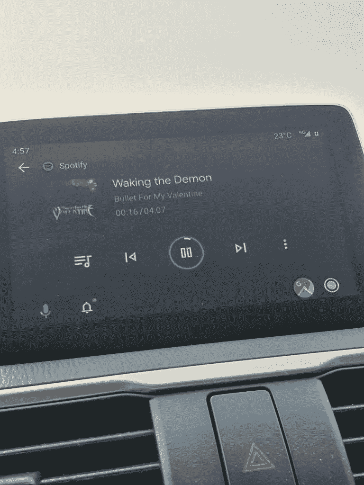

# [更新:推出] Android Auto 4.8 在汽车屏幕状态栏上提示带回天气信息

> 原文：<https://www.xda-developers.com/android-auto-4-8-weather-info-car-screen/>

**更新(美国东部时间 11/21/19 @下午 3:55):**Android Auto 在状态栏中为部分用户显示当前天气状况。

在今年早些时候的谷歌 I/O 大会上，谷歌推出了 Android Auto 汽车界面的[重新设计版本](https://www.xda-developers.com/android-auto-redesign-dark-theme/)，该版本具有深色主题和简化的控件。[然而，许多用户认为谷歌在简化用户界面方面走得有点远。例如，新界面不会一目了然地显示任何天气信息，需要你与谷歌助手对话或启动天气快捷方式来获取这些信息。当你开车并想查看天气状况时，这可能会很烦人。令人欣慰的是，谷歌似乎将再次在汽车屏幕上添加天气信息，因为我们在 Android Auto 应用程序中发现了一个在状态栏上显示天气信息的新开关。](https://www.reddit.com/r/AndroidAuto/comments/cpsqbn/what_did_we_gain_by_this_aa_refresh_and_what_did/)

APK 拆卸通常可以预测应用程序未来更新中可能出现的功能，但我们在这里提到的任何功能都可能不会出现在未来的版本中。这是因为这些特性目前还没有在实时构建中实现，并且可能会被开发人员在未来的构建中随时引入。

Android Auto 4.8 今天在谷歌 Play 商店发布，并且已经在 APKMirror 上发布。更新中的新字符串显示，该应用程序将添加一个设置，以在汽车屏幕的状态栏上显示天气信息。天气信息是从连接的电话的位置获得的。

```
 <string name="settings_weather_summary">Show weather information on the car screen status bar, obtained using your phone location</string>
<string name="settings_weather_title">Weather</string> 
```

一旦该功能对所有人开放，它将出现在 Android 应用程序的设置页面中，如下所示:

我没有 Android Auto 兼容的车辆或主机，但我们会在获得新功能的图片后更新本文。我们也会密切关注这项功能，并在它上线时通知您。

*感谢 PNF 软件为我们提供了使用许可 [JEB Decompiler](https://www.pnfsoftware.com/?aid=xdadev) ，这是一款针对 Android 应用的专业级逆向工程工具。*

* * *

## 更新:推出

 <picture></picture> 

via /u/PCsector

Reddit 上的人们开始看到温度出现在新的 Android 自动设计的状态栏中。用户开始在设置中看到天气选项，如上面的原始文章所示。根据评论，你使用哪个版本的 Android Auto 似乎并不重要，所以这看起来像是服务器端的更新。它也可能先于其他国家在美国上线。如果你运行的是新版 Android Auto，请留意一下。

**来源:[Reddit](https://www.reddit.com/r/AndroidAuto/comments/dzgb6h/new_update_has_the_temperature_at_the_top_now_can/)**