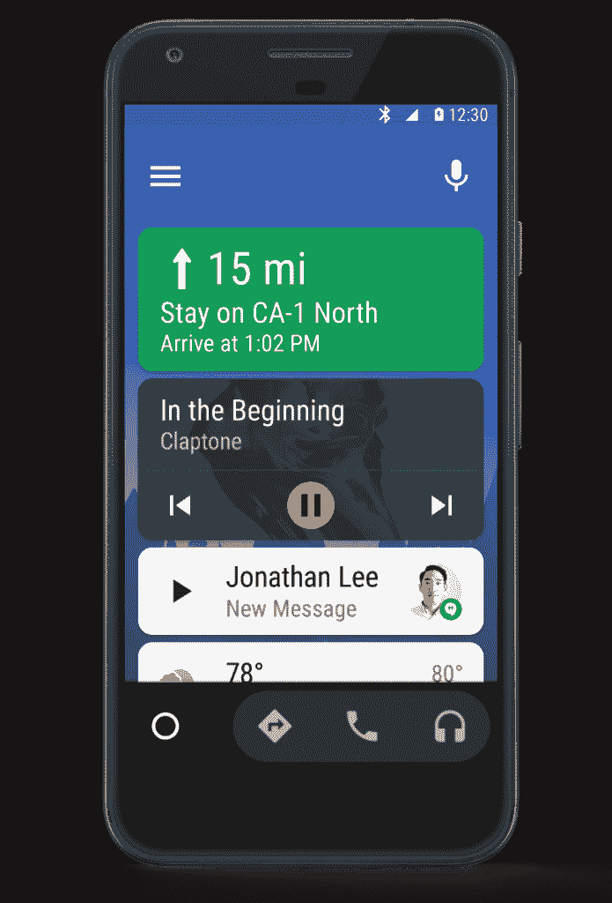

# 通过智能手机上更新的应用程序，现在每辆汽车都可以使用 Android Auto

> 原文：<https://www.xda-developers.com/android-auto-now-available-for-every-car-through-updated-app-on-smartphones/>

虽然有来自 50 多个品牌的 200 多种车型支持 Android Auto，但你可能还没有尝试过。每天都有更多的汽车上市，但对于普通中产阶级来说，汽车升级并不常见。

 这就是为什么谷歌现在宣布**智能手机的 Android Auto 功能**，允许你使用任何运行 Lollipop 或更高版本的智能手机作为迷你汽车仪表盘。这是对 Android Auto 应用程序的更新，为您的手机提供了一个司机友好的界面，可以轻松、简略地访问您在路上需要的一切。通过它，你可以查看方向，控制音乐或管理通信，尽可能减少安全驾驶的干扰。

你可以把你的手机放在一个支架上，或者把它连接到你汽车的显示屏上，把你不太智能的仪表盘变成一个司机友好的屏幕。使用 Spotify 或 Play Music 等应用程序控制您的音乐，拨打电话，并控制谷歌地图的即时路线导航，所有这些都只需最少的交互，甚至一些免提语音命令。当您的手机与支持蓝牙的车载支架或汽车本身配对时，您也可以自动启动该应用程序。最后，语音命令将在未来几周得到增强，使体验更容易获得，更流畅和更安全。

这无疑是 Android Auto 即服务的正确发展方向。不局限于具体汽车上昂贵的实现，会让大家获得更好的安卓汽车体验。我们迫不及待地想自己测试更新，但与此同时，你可以在 Playstore 上找到[原始 Android Auto 应用程序以等待更新，或者](https://play.google.com/store/apps/details?id=com.google.android.projection.gearhead&hl=en)[下载新的 APK](http://www.apkmirror.com/apk/google-inc/android-auto/android-auto-2-0-642304-release-release/) (ARM64)。

超过 30 个国家(Android Auto 目前在这些国家可用)将在未来几天收到更新。你可以在安卓汽车网站上[注册，以便在你的手机上收到电子邮件通知！](https://www.android.com/auto/#keepmeposted)