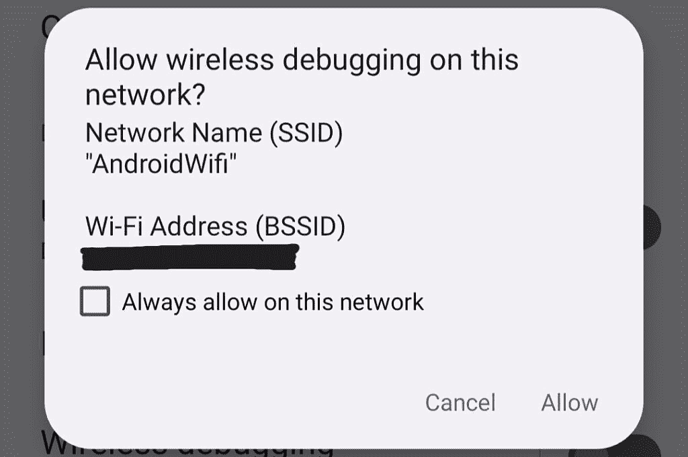

# Android 开发者选项解释:这里是你可以用这些设置做的一切

> 原文：<https://www.xda-developers.com/android-developer-options/>

大多数安卓智能手机和平板电脑已经有几十(甚至几百)种设置，可以改变从通知到系统颜色的一切。开发者选项中甚至隐藏了更多的设置，主要是为了帮助创建 Android 应用程序，但其中一些也可以在其他情况下派上用场。

尽管通过开发人员选项可访问的一些功能可能会有所帮助，但并不总是清楚哪个选项做什么。虽然开发者选项中的功能不会损坏你的手机或平板电脑，但启用其中一些功能可能会导致意想不到的问题。这就是为什么我们要在这个综述中讨论你可以用开发者选项做的所有事情，这样你就可以确切地知道哪个设置做什么。

## 如何在 Android 上访问开发者选项

默认情况下，开发人员选项是隐藏的，因此您需要在访问任何可用设置之前启用它们。这里的确切过程取决于你运行的 Android 版本，一些设备制造商(如三星)会移动一些菜单所在的位置。

第一步是在设备上的设置应用程序中找到内部版本号。通常，您可以通过打开设备上的设置应用程序，然后导航到**关于手机>内部版本号**来找到它。Android 8.0 和 Android 8.1 将其置于**系统>下关于手机>内部版本号**。如果你有平板电脑，这通常被称为“关于平板电脑”。Android 定制版本的位置可能会有所不同——例如，三星设备在**下有关于手机**(或平板电脑) **>软件信息>版本号**。

如果您找不到它，您可能正在使用一个带有自定义版本 Android 的设备，该设备会移动到一些设置所在的位置。如果您的设置应用程序有一个搜索按钮(它通常在屏幕顶部附近，带有一个放大镜图标)，请按下它并搜索“内部版本号”如果它出现，请按它，它应该会在“关于”页面上突出显示。

一旦你最终到达内部版本号条目，你必须一直点击内部版本号，直到你看到一个确认信息。旧设备只是立即启用开发者选项，而使用新版 Android 的手机和平板电脑通常需要你输入锁屏密码才能确认。完成后，您应该会看到一个弹出窗口，显示“您现在是一名开发人员”，如下面的截图所示。

 <picture></picture> 

This message should appear once you have enabled Developer options.

之后，你应该在你的设置应用中有一个新的开发者选项菜单。同样，开发者选项菜单的确切位置取决于您的 Android 版本和设备制造商。一些设备(如最近的三星手机和平板电脑)将开发者选项放在主设置屏幕的底部附近，而其他设备则将它们移动到系统菜单或其他位置。如果你的设置应用中有一个搜索按钮，你可以试着点击它，然后输入“开发者选项”来找到菜单。

* * *

## 解释开发人员选项中的每个设置

我们将讨论 Android 开发者选项菜单中的每个选项，以及它们的功能。这些选项的确切顺序和位置可能因设备而异，一些制造商添加了一些他们自己的选项，我们将在这里讨论。这个列表也是基于 Android 12L/12.1 的——Android 的未来版本可能会添加或删除其中的一些选项。

### 主要选项

**内存:**点击此按钮会打开一个屏幕，显示您的设备当前使用了多少 RAM(随机存取内存)，以及基于 3 小时、6 小时、12 小时或 1 天间隔的平均值。你还可以看到手机上的应用程序列表，按照它们使用的内存大小排序。如果您注意到您的设备在应用程序之间切换时经常重新加载应用程序，那么检查这个屏幕并查看某个应用程序是否行为不当可能是一个好主意。

**错误报告:**这允许您为 Android 系统生成错误报告。如果你对 Android 或其他核心系统组件的错误进行归档，谷歌可能会要求提供错误报告。

**错误报告处理程序:**这将改变您设备上哪个应用程序处理错误报告快捷方式。通常没有理由改变这一点。

**桌面备份密码:**创建备份密码，用于使用 adb 命令备份和恢复设备应用和数据。

**保持清醒:**启用此开关将防止手机在充电时进入睡眠状态(屏幕关闭)。这有助于测试应用程序或其他任务，如果您不想在一段时间内反复解锁设备。

**启用蓝牙 HCI 窥探日志:**这将所有蓝牙 HCI 数据包保存到一个文件中，该文件存储在/sdcard/btsnoop_hci.log，然后可以使用类似 [Wireshark](https://www.wireshark.org/) 的工具打开该文件，以分析和排除蓝牙数据故障。

**OEM 解锁:**解锁引导程序时需要启用此开关，但这不是解锁引导程序的唯一步骤。此选项不会出现在所有设备上。

**运行服务:**这将打开一个屏幕，显示您的设备上运行的所有应用程序和系统进程，以及每个程序使用的内存量。它类似于上面提到的内存屏幕，但这一个对检查您的设备的当前状态更有帮助。

**图片色彩模式:**这将您的设备切换到使用 sRGB 色彩空间，这在大多数设备默认使用 sRGB 之前很有用。现在这种开关一般不会有什么作用。

**WebView 实现:**这改变了 Android 应用中哪个应用负责呈现嵌入式 web 内容。除非你有充分的理由，否则你不应该碰它，否则你可能会丢失一些应用程序数据(例如，如果一个应用程序使用 WebView 的本地存储)。

**自动系统更新:**如果已经下载了更新，关闭此功能可防止您的设备在重启过程中应用系统更新。一些设备可能会忽略这种行为，或者在其他地方设置另一个开关来控制系统更新的处理方式。

**DSU 加载器:**[DSU 加载器](https://www.xda-developers.com/android-11-dsu-loader-gsi-locked-bootloader-developers-test-apps-stock-android/)功能是在 Android 11 中引入的，它允许你临时启动到一个通用的系统镜像。

**系统 UI 演示模式:**演示模式主要用于捕捉干净的截图，没有任何分散注意力的细节。它显示时钟在 12:00，电池电量在 100%，并隐藏所有通知图标。

**快速设置开发者互动程序:**此屏幕为您提供了将其他开发者选项的一些切换添加到您设备的快速设置中的选项(Wi-Fi 和蓝牙切换所在的位置)。

### 排除故障

**USB 调试:**启用此功能将允许电脑上的 [Android 调试桥](https://www.xda-developers.com/adb-tips-tricks/)实用程序通过 USB 与您的设备通信。ADB 可用于侧装应用程序，用命令更改系统设置，授予应用程序权限，等等。但是，如果启用了 USB 调试，一些应用程序和游戏会拒绝启动。

**撤销 USB 调试授权:**第一次使用 ADB 连接到您的设备需要您授权该计算机。此选项撤销所有 ADB 授权，如果您无法访问过去可能使用过的一些计算机，这可能会很有帮助。

**无线调试:**这允许您通过本地 Wi-Fi 网络使用 ADB，而不仅仅是 USB。无线调试在 Android 中已经存在多年，但谷歌只是在 Android 11 中添加了这一切换。

 <picture></picture> 

Wireless debugging dialog

**禁用 ADB 授权超时:**作为一种安全措施，大多数设备在七天未使用后会自动撤销 USB 调试授权。这个开关关闭了这个特性——除非你有一个*真正*好的理由，否则你不应该使用这个开关。

**错误报告快捷方式:**这在电源菜单中增加了一个新按钮，用于生成错误报告。

**启用详细的供应商日志记录:**这包括错误报告中的更多信息，可能还包括私人信息。

**启用视图属性检查:**这允许您使用 Android Studio 中的[布局检查器来检查应用程序中的视图，这在开发应用程序时可以派上用场。](https://developer.android.com/studio/debug/layout-inspector)

**选择调试应用程序/等待调试器:**正常的错误报告和调试并不总能提供开发应用程序时所需的所有信息，尤其是在找出应用程序启动时崩溃的原因时。此选项允许您选择可以在给定应用程序之前初始化的调试器应用程序，该应用程序配置有“等待调试器”选项。

**通过 USB 验证应用程序:**这将检查通过 ADB 加载的应用程序是否有有害代码，类似于使用 Google Play Protect 验证下载到您设备上的应用程序的方式。如果你在电脑上从网上下载应用程序并使用 ADB 安装它们，这可能会很方便。

**验证可调试应用的字节码:**这是另一种安全措施，默认情况下启用。

**记录器缓冲区大小:**这将改变记录器的最大文件大小(也称为“logcat”)。较长的缓冲区可以显示较早的活动，而较短的缓冲区只包含最近活动的日志。

**功能标志:**谷歌有时会在 Android 开发者预览版和测试版中包含实验性功能，而这就是它们所在的位置。大多数运行 Android 稳定版本的设备都有一个空的功能标志菜单。

**启用 GPU 调试层:**该选项允许从本地设备存储中加载 Vulkan 验证层。谷歌有[一些文档](https://developer.android.com/ndk/guides/graphics/validation-layer)提供更多信息。

**图形驱动程序首选项:**这允许您用不同的驱动程序覆盖特定应用程序的系统图形驱动程序。大多数设备没有另一个图形驱动选项，但是如果你对技术方面感兴趣的话，[斯珀有一篇博客文章解释了这是如何工作的](https://blog.esper.io/android-dessert-bites-14-gpu-driver-updates-3819534/)。

**应用兼容性变化:**此菜单允许您针对旧版本的应用测试当前版本 Android 中的每个单独的 API 变化，这有助于更新应用的开发过程。它只适用于可调试的应用程序，所以在软件开发之外没有太大用处。

 <picture></picture> 

Refresh rate counter from 'Show refresh rate' setting

**显示刷新率:**这在屏幕上方增加了一个类似 Fraps 的计数器，用于检查当前刷新率，对于动态切换刷新率的设备很有帮助。请记住，这是*而不是*帧速率计数器。

**允许在设置上覆盖屏幕:**现代版本的 Android 不允许在你使用设置应用时运行覆盖屏幕，以防止可能的安全风险。此设置会覆盖该设置，除非有充分的理由，否则不要翻转它。

**系统跟踪:**这是一个在应用开发过程中进行性能优化的有用工具。

### 建立工作关系网

**无线显示认证:**这一设置过去可以让你将设备的屏幕投射到任何支持 [Miracast](https://www.xda-developers.com/miracast/) 的电视或显示器上，但谷歌几年前就为支持自己的 [Chromecast](https://www.xda-developers.com/chromecast/) 标准而撕掉了它的代码，所以这一切换在大多数设备上实际上不起作用

**启用 Wi-Fi 详细日志:**显示 Wi-Fi 设置中每个网络的接收信号强度指标，简称 RSSI。RSSI 值可以告诉你给定 Wi-Fi 信号的强度，但像 [WiFi 分析器](https://play.google.com/store/apps/details?id=abdelrahman.wifianalyzerpro)这样的应用程序通常是更好的工具。

**Wi-Fi 安全模式:**此选项在某些设备上可用，它将网络稳定性置于性能之上。

**Wi-Fi 扫描限制:**这限制了您的设备扫描 Wi-Fi 网络的频率，这有时可以减少电池电量，但也意味着您的设备将需要更长时间才能连接到已知网络。

**Wi-Fi 非持久 MAC 随机化/增强型 Wi-Fi MAC 随机化:** Android 在连接 Wi-Fi 网络时，根据需要使用[持久 MAC 随机化](https://source.android.com/devices/tech/connect/wifi-mac-randomization-behavior#persistent)或[非持久 MAC 随机化](https://source.android.com/devices/tech/connect/wifi-mac-randomization-behavior#non-persistent)。这个选项迫使 Android 总是使用非持久的 MAC 随机化，这实质上欺骗了网络，使其认为每次连接时都有一个新设备。这可能有助于具有电容登录或其他配置问题的网络。

**移动数据始终处于活动状态:**只要你连接到 Wi-Fi，Android 就会关闭你的移动数据连接，因为保持两个连接都处于活动状态会增加电池电量。此选项会反转这种行为，如果您不想在断开 Wi-Fi 连接时等待 LTE 或 5G 重新连接，这可能会有所帮助。警告:这很可能会减少你的电池寿命。

**网络共享硬件加速:**默认情况下，此设置处于打开状态，通过特殊的硬件功能改善网络共享连接。你可能不需要去弄乱它。

**默认 USB 配置:**这将改变当您将设备插入计算机(或其他 USB 主机)时使用的模式⁠—大多数设备的默认选项为“无数据传输”。例如，如果您经常通过 USB 传输文件，您可以在此设定选择“文件传输”以避免每次都选择它。请记住，该设置仅在您的设备解锁时适用。

**显示没有名称的蓝牙设备:** Android 通常会忽略没有名称的蓝牙设备，但这个设置会将它们的 MAC 地址显示在所有其他蓝牙设备旁边。

**禁用绝对音量:**现代版本的 Android 支持蓝牙输出的绝对音量，这通常会给你最大可能的音量控制。然而，一些耳机和头戴式耳机可能会对启用此功能很挑剔。在扬声器或耳机过于安静的情况下，打开此选项(关闭绝对音量，而不是打开)可能会有所帮助。

启用 Gabeldorsche :这启用了谷歌在 Android 11 中开始工作的新蓝牙栈，它被称为 Gabeldorsche ( [指的是丹麦的历史](https://9to5google.com/2020/02/19/android-11-dp1-gabeldorsche-bluetooth/))。大多数人没有理由现在就使用它，而且它实际上隐藏在一些设备上。

**禁用蓝牙 A2DP 硬件卸载:**这改变了蓝牙音频的传输方式，[有时可以修复有问题的蓝牙耳机和扬声器](https://www.reddit.com/r/GooglePixel/comments/symvuj/fyi_had_to_disable_bluetooth_a2dp_hardware_offload/)。

**蓝牙 AVRCP 版本/蓝牙地图版本:**这些改变了 Android 通过蓝牙处理媒体控制的方式。你可能不需要弄乱这些设置。

**高清音频:**此开关默认打开，将蓝牙音频从较低质量的 SBC 编解码器切换到较高质量的编解码器。如果没有更好的编解码器可用，或者您根本没有连接蓝牙音频设备，此设置可能会灰显。

**蓝牙音频编解码器:**此菜单显示您的 Android 设备支持的每个音频编解码器，当您连接了蓝牙设备时，您的耳机或扬声器不支持的选项将呈灰色显示。这里通常没有理由改变音频编解码器(Android 会自动选择可用的最佳编解码器)，但此菜单是快速检查蓝牙音频设备所使用的编解码器的好方法。

**蓝牙音频采样率/每样本位数:**这将更改蓝牙音频的一些质量设置。你可能不需要弄乱这些。

**蓝牙音频通道模式:**如果您的蓝牙音频设备使用单声道或立体声音频，此模式会发生变化。遗憾的是，与编解码器选择器一样，您只能从音频设备支持的模式中进行选择。

**最多连接蓝牙音频设备:**一些手机和平板电脑可以同时连接多个蓝牙音频设备。默认已经是最高允许的选项，所以通常没有理由在这里做任何改变。

### 投入

**显示点击:**显示屏幕上任何手指当前触摸屏幕的点。此功能在屏幕录制期间很有用，可以显示您点击屏幕的位置，但一些内置的屏幕录制器可以选择在录制期间自动启用此功能。

**指针位置:**这类似于“显示点击”，但它在显示屏顶部显示你点击的实际坐标。

### 图画

**显示界面更新:**当当前应用程序的状态发生变化时，这将闪烁整个屏幕。这对调试应用程序很有用，但是如果你对运动很敏感，*绝对不要启用这个*。

**显示布局边界:**在所有元素上显示一个类似网格的布局，使某些元素上的空白区域更容易看到。同样，这只有在开发应用程序时才真正有用。

**强制 RTL 布局方向:**这将强制所有文本从右向左显示，即使当前语言书写为从左向右。该选项有助于测试应用程序在阿拉伯语等语言中的外观，而无需实际更改设备语言。

 <picture></picture> 

RTL layout direction

**窗口动画比例/转场动画比例/动画师时长比例:**这三个选项改变了 Android 中大部分动画的速度。将它们设置为 0.5x 这样的值有时会让您的设备感觉更快，但也会导致不连贯的体验。

**模拟辅助显示器:**模拟连接到您的 Android 设备的显示器，结果显示在屏幕顶部的半透明层上。这在测试响应外部显示器的应用程序时很有帮助。

**最小宽度/最小宽度:**这是另一种改变 Android 上应用程序缩放比例的方法——较小的值增加尺寸，较大的值使一切变小。正常设置应用程序中的“显示大小”设置通常是改变屏幕比例的最佳方式，但该设置可以变得更大或更小。如果你的设备安装了 Android 12L/12.1 或更高版本，在这里设置一个足够高的值会导致[平板电脑任务栏](https://www.xda-developers.com/android-12l/#:~:text=Android%2012L%20also%20introduces%20a%20Taskbar%20for%20large%2Dscreen%20devices)出现。

**显示剪切块:**您可以在这里自定义设备屏幕上的切口、摄像头孔或其他剪切块。如果你的设备已经有一个剪切块，隐藏选项将会把状态栏向下推，使其不可见。

### 硬件加速渲染

**显示视图更新/显示硬件层更新:**这些类似于上述的“显示表面更新”设置。除非你是测试应用程序的开发人员，否则没有理由使用它们。

**调试 GPU overdraw:** 这使用颜色编码来可视化同一像素在同一帧中被绘制了多少次。可视化显示了一个应用程序可能在哪些地方进行了不必要的渲染。

**调试非矩形裁剪操作:**关闭画布上的裁剪区域，创建不寻常的(非矩形)画布区域。

**Override force-dark:** 这个设置是在 Android 10 中添加的，[应该强制应用程序拥有黑暗主题](https://www.ghacks.net/2019/10/30/how-to-enforce-dark-mode-in-many-apps-on-android/)，即使它们没有。然而，当它是新的时候，它从来没有在所有的应用程序中工作过，现在它似乎更不可靠了。大多数 Android 应用程序在这一点上也有原生的黑暗模式，所以没有必要。

**强制 4x MSAA:** 这将在所有使用 OpenGL ES 2.0 的应用中强制执行多采样抗锯齿(MSAA)。

**禁用硬件覆盖:**硬件覆盖允许在屏幕上显示某些内容的应用程序使用更少的处理能力。如果没有覆盖，应用程序将共享视频内存，并且必须不断检查冲突和剪裁，以呈现正确的图像。除非你有充分的理由，否则不要乱用这个选项。

**模拟色彩空间:**这可以在几种不同的模式之间切换显示颜色，包括单色选项。

**禁用 USB 音频路由:**这可以防止 Android 自动使用新连接的 USB 音频设备，如耳机适配器或 USB 耳机。如果你想插入一个提供音频输出的设备，但实际上不想使用音频部分，例如，一个带有 3.5 毫米耳机插孔的 USB 底座或适配器以及其他端口，这可能会有所帮助。

**媒体转码设置:**此菜单包含用于更改设备加载媒体文件方式的选项。别碰这些。

### 监视

**启用严格模式:**这是一个开发人员用来监控应用程序主线程上意外存储或网络访问的工具。

**Profile HWUI rendering:** 这是一种监控设备上 GPU 活动的方法，尽管它在开发期间测试应用程序之外没有太大帮助。

### 应用程序

**不保留活动:**这将在应用程序移至后台后立即强制关闭它们——本质上与将它们从最近活动屏幕中划掉是一样的。除非你正在测试一个应用程序，并且需要不断地重新加载它进行测试，否则没有理由使用它。

**后台进程限制:**这将更改在清除之前保留在后台内存中的应用程序的最大数量。同样，没有理由改变这一点，改变它可能会使你的电池寿命更差——重新启动应用程序经常比让它们留在后台需要更多的处理能力。

总是显示崩溃对话框:非常简单明了，每当应用程序崩溃时，它会显示一个弹出消息，便于报告错误。

**显示后台 ANRs:** 启用此选项将显示在后台运行的应用程序的“应用程序没有响应”消息，此外还会显示在屏幕上打开的冻结应用程序的默认行为。

**暂停缓存应用程序的执行:** Android 应用程序被缓存在内存中时不应该运行，但这个选项完全阻止了它们这样做。这个选项可以提高电池寿命，但代价是性能(当再次打开时，缓存的应用程序可能需要更长时间才能恢复)，但[现实生活中的结果好坏参半](https://www.reddit.com/r/oneui/comments/r9rqyp/enable_suspend_execution_for_cached_apps_saves_so/)。

**显示通知频道警告:**大多数安卓应用[将其通知分类](https://developer.android.com/training/notify-user/channels)，可以从安卓设置中单独打开或关闭。启用此选项会在应用程序发送未分配给类别的通知时显示警告。这主要有助于开发人员确保他们的所有通知都在一个类别中——如果您试图找出通知来自哪个通道，只需在通知面板中按住它。

**重置通知重要性:** Android 试图按照重要性对你的通知进行排序，点击这个按钮可以重置这种行为。

**待机应用程序:**列出了您设备上当前待机的所有应用程序。

**强制允许外部设备上的应用:** Android 应用可以选择是否可以通过清单设置安装在外部存储设备(通常是 microSD 卡插槽)上，但该选项会覆盖该设置。更改这一点并将不支持的应用程序移动到外部存储可能会导致奇怪的行为，因此最好不要管它。

**强制活动可调整大小:**该选项强制所有应用程序可调整大小，对于不能在分屏模式下工作或不能在 Chromebooks 上调整大小的应用程序来说，这可能是一个(有问题的)修复。

**启用自由形式窗口:**该选项允许应用程序在浮动窗口中打开，即使该设备不是为自由形式模式设计的(像大多数手机一样)。启用后，按住“最近通话”屏幕中某个应用程序的图标，选择“自由格式”将它变成一个浮动窗口。一些定制版本的 Android 已经有了这种定制实现，比如三星 Galaxy 手机和平板电脑上的“弹出视图”。

**强制桌面模式:**如果您连接外部显示器(例如，通过 USB Type-C 连接的显示器)，这将强制它使用带有自由形式窗口和自定义启动器的简单桌面界面。这一点的具体实现因 Android 皮肤和版本而异，一些设备有自己的行为来覆盖该选项。

**为所有应用启用多窗口/多窗口不可调整大小:**这允许不为调整大小而构建的应用(像许多游戏)在多窗口模式下使用。

**重置快捷方式管理器限速:** Android 限制应用程序在主屏幕和其他系统位置更新快捷方式的次数[以防止性能下降](https://developer.android.com/guide/topics/ui/shortcuts/managing-shortcuts#rate-limiting)。这个选项重置限速计时器，主要只是对开发有用。

### 其他部分

**自动填充:**本部分中的所有选项都是为了测试 Android 的自动填充框架，没有理由在这里更改任何选项，除非你正在测试一个使用自动填充数据的应用程序(或自动填充提供程序)。

**存储:**这个只包含一个选项，可以显示 Android 系统中的任何共享数据 blobs。在大多数情况下，这将是空的，并显示类似“没有该用户的共享数据”的消息

**位置:**“选择模拟位置应用程序”选项可以与 GPS 操纵杆等应用程序结合使用，以欺骗您设备的物理位置。查看我们的[我们的位置欺骗指南](https://www.xda-developers.com/how-to-fake-location-android-gps-spoofing/)了解更多详情。

**游戏:**一些三星 Galaxy 设备在开发者选项中有一个名为“游戏”的部分，其中有一个针对 [GPUWatch](https://developer.samsung.com/GameDev/gpuwatch.html) 的设置，它为 FPS 和 CPU 负载添加了覆盖。与“显示”部分中的刷新率计数器相反，它显示当前应用程序或游戏的当前 FPS 值，该值通常低于实际的显示刷新率。

* * *

我们希望本指南能够解释这些设置，而不仅仅是您在设备屏幕上看到的内容。