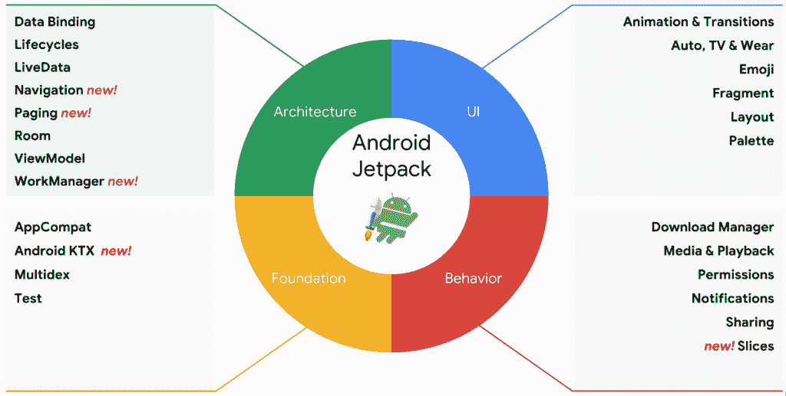
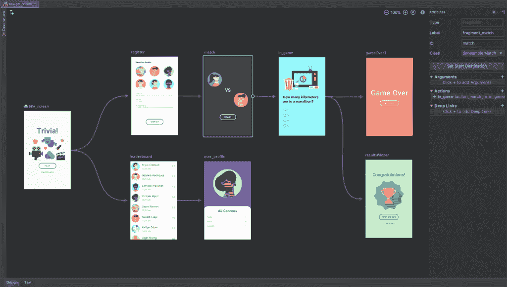

# Android Jetpack 是一组考虑到 Kotlin 而设计的 Android 组件，可用于 Android Studio 3.2

> 原文：<https://www.xda-developers.com/android-jetpack-components-kotlin-android-studio-3-2/>

谷歌一年一度的 I/O 开发者大会是该公司为 Android 开发者推出最新工具和功能的地方，今年也不例外。今天，该公司宣布了 Android Jetpack，这是一套加速应用开发的组件。Jetpack 的设计考虑到了 Kotlin，以帮助您简化代码。今天推出的最新 Android Studio 3.2 canary 也为 Jetpack 提供了新工具。

## 使用 Android Jetpack 加速应用程序开发

[Android Jetpack](https://developer.android.com/jetpack) 是一套 Android 组件、工具和指南，灵感来自支持库的向后兼容性和 [Android 架构组件](https://developer.android.com/topic/libraries/architecture/)的易用性。Jetpack 组件可以大致分为四类:架构、UI、基础和行为。

架构组件包括生命周期管理、视图模型、数据绑定等活动。UI 组件包括动画和过渡、片段、布局等等。基础组件包括 AppCompat、Multidex、testing 等等。行为组件包括媒体和播放、权限、通知、共享等。

 <picture></picture> 

Android Jetpack Components. Source: Google

Jetpack 中的组件是未捆绑的库，这意味着它们不是 Android 平台的一部分。这使您可以在新组件可用时按照自己的节奏添加它们。此外，这些组件是独立于平台的，允许您的应用程序在多个版本的 Android 平台上运行。

如上图所示，今天发布的新组件包括工作管理器、导航、分页、切片和 Android KTX。

### 工作管理器

该库为必须执行的基于约束的后台作业提供了一个 API，取代了对作业或 SyncAdapters 的需求。它可以在没有 Google Play 服务的设备上工作，可以创建工作图表，还可以查询你的工作状态。

### 航行

许多应用程序由多个活动组成，但是在活动之间共享数据和实现转换一直是应用内导航的一个痛点。导航组件将帮助您将应用内用户界面构建为单活动应用。它支持开箱即用的片段，因此当导航组件为您处理片段转换时，生命周期和视图模型等架构组件的所有好处都在那里。此外，您可以声明导航将自动处理的转换，您可以自动构建正确的向上和向后行为，您可以轻松地提供对深层链接的完全支持，并且您可以将导航连接到 UI 小部件，如导航抽屉和底部导航。最后，最新的 Android Studio 中的导航编辑器允许你可视化地管理导航属性。

 <picture></picture> 

Navigation Editor in Android Studio 3.2\. Source: Google

### 分页

分页组件，当与 RecyclerView 结合使用时，允许您为应用程序添加快速、无限的滚动。这个想法是，该组件简化了管理页面中的数据，即。尽可能快地连续提取大量数据，并返回结果供用户查看。

### 部分

最后，Slices 组件将简化 Android P 引入的 Slices API 的实现过程。这是一个 API，允许您将应用程序的 UI 作为搜索结果呈现在 Google 应用程序中。

 <picture></picture> 

Slices in the Google App. Source: Google

## 喷气背包——以 Kotlin 为设计理念

在去年的谷歌 I/O 大会上，该公司宣布他们将为 Android Studio 3.0 带来对 Kotlin 编程语言的一流支持。在过去的一年里，Kotlin 的采用量有了巨大的增长——谷歌表示，去年用 Kotlin 构建的 Play Store 中的应用数量增长了 500%。随着 Kotlin 越来越受欢迎，Android Jetpack 是在考虑编程语言的情况下构建的，这是有道理的。为此， [Android KTX](https://www.xda-developers.com/android-ktx-extensions-developers-kotlin-code/) 作为 Jetpack 的一部分推出，以帮助开发者进一步简化他们的代码。

由于官方文档中的新代码片段和一个 [API 参考文档页面](https://developer.android.com/reference/kotlin/android/classes)，Kotlin 开发者体验也将得到改善。谷歌在 Udacity 上的 [Kotlin Bootcamp 最近发布，作为对学习语言感兴趣的开发者的资源。最后，你现在可以在](https://www.udacity.com/course/kotlin-bootcamp-for-programmers--ud9011)[谷歌开发者专家项目](https://developers.google.com/experts/)中获得一个科特林专精。

## Android Studio 3.2 金丝雀

[Android Studio 3.1](https://www.xda-developers.com/android-studio-3-1-now-available/) 于三月底推出，带有 D8 dex 编译器、Kotlin Lint checks 等。最新的 [Android Studio 3.2](https://developer.android.com/studio/preview/) Canary 具有上面提到的可视化导航编辑器和 Jetpack 的新代码重构工具。要开始构建新的应用程序，请使用 te Activity & ViewData activity，您可以从 File - > New - > New Project 访问该 Activity。

其他改进包括:由于快照，Android 模拟器的启动时间缩短了两秒，针对较小应用程序代码的新 R8 Proguard 优化器，以及用于确定应用程序对设备电池寿命的影响的新能量分析器。

## 结论

Android Jetpack 将有助于加速许多已经接受 Kotlin 编程语言的人的应用程序开发。结合 Android KTX 和 Android Studio 3.2 Canary 中的新工具，您可以开始使用 Jetpack 组件来降低代码复杂性和大小。

谷歌在今年的 I/O 大会上向开发者宣布了更多内容。新的应用捆绑包、动态交付、应用操作和切片是你应该知道的一些其他新功能。请继续关注 XDA，我们将为您带来谷歌年度开发者大会的最新消息。