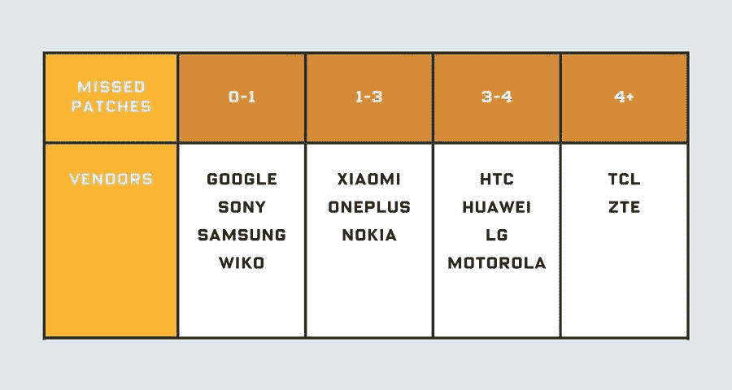
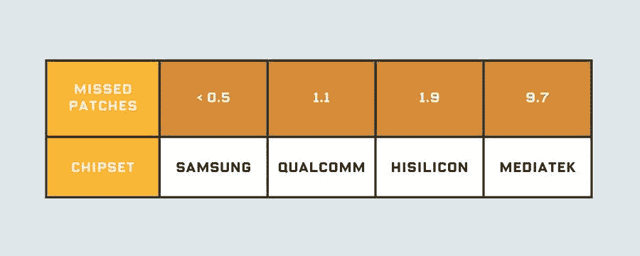

# 一些安卓原始设备制造商被发现谎报安全补丁

> 原文：<https://www.xda-developers.com/android-oem-lying-security-patches/>

似乎 Android 安全更新的情况不能再糟糕了，似乎一些 Android 设备制造商已经被发现在他们的手机到底有多安全的问题上撒谎。换句话说，一些设备制造商一直声称他们的手机达到了一定的安全补丁水平，而实际上他们的软件缺少所需的安全补丁。

这是根据 [*《连线》*](https://www.wired.com/story/android-phones-hide-missed-security-updates-from-you/) 报道的，该研究将于明天在黑客盒子安全会议上[发表。安全研究实验室的研究人员 Karsten Nohl 和 Jakob Lell 在过去两年中对数百台 Android 设备进行了逆向工程，以检查设备是否真的能够抵御他们声称安全的威胁。研究结果令人震惊——研究人员发现，许多手机报告的安全补丁级别与这些手机实际防范的漏洞之间存在显著的“补丁差距”。“补丁差距”因设备和制造商而异，但鉴于谷歌在每月安全公告中列出的要求，它根本不应该存在。](https://conference.hitb.org/hitbsecconf2018ams/sessions/mind-the-gap-uncovering-the-android-patch-gap-through-binary-only-patch-level-analysis/)

运行在第一个 [Android P 开发者预览版](https://www.xda-developers.com/android-p-developer-preview-1-google-pixel-xl-pixel-2-xl/)上的 [Google Pixel 2 XL](https://www.xda-developers.com/tag/google-pixel-2/) ，带有【2018 年 3 月安全补丁。

根据研究人员的说法，一些 Android 设备制造商甚至故意歪曲设备的安全补丁级别，只是简单地改变设置中显示的日期，而没有实际安装任何补丁。这很容易伪造——甚至你我都可以通过修改 build.prop 中的`ro.build.version.security_patch`在一个根设备上伪造。

在研究人员测试的来自十几家设备制造商的 1200 部手机中，该团队发现**即使是顶级设备制造商的设备也有“补丁缺口”，**尽管较小的设备制造商在这一领域的记录往往更差。**谷歌的手机似乎是安全的**，然而，Pixel 和 Pixel 2 系列并没有谎报他们有什么安全补丁。

在某些情况下，研究人员将其归因于人为错误:诺尔认为，有时像索尼或三星这样的公司会意外错过一两个补丁。在其他情况下，没有合理的解释为什么一些手机声称修补了某些漏洞，而事实上它们缺少多个关键补丁。

SRL 实验室的团队整理了一张图表，根据 2017 年 10 月以来他们错过的补丁数量对主要设备制造商进行了分类。对于自 10 月份以来收到至少一个安全补丁更新的任何设备，SRL 希望了解哪些设备制造商在根据当月的安全公告准确修补设备方面是最好的，哪些是最差的。

 <picture></picture> 

Source: Security Research Labs/Wired

显然，谷歌、索尼、三星和不太知名的 Wiko 位居榜首，而 TCL 和中兴通讯垫底。这意味着后两家公司在 2017 年 10 月之后对其一款设备进行安全更新时，已经错过了至少 4 个补丁。那就一定意味着 TCL 和中兴有错吗？是也不是。虽然这些公司谎报安全补丁级别是不光彩的，但 SRL 指出，芯片供应商往往是罪魁祸首:**采用联发科芯片销售的设备往往缺乏许多关键的安全补丁**，因为联发科未能向设备制造商提供必要的补丁。另一方面，三星、高通和海思很可能会为运行其芯片组的设备提供安全补丁。

 <picture></picture> 

Source: Security Research Labs/Wired

至于谷歌对这项研究的回应，该公司承认其重要性，并对每一款有明显“补丁漏洞”的设备展开了调查。目前还不知道谷歌计划如何在未来防止这种情况，因为谷歌没有任何强制性检查，以确保设备运行他们声称正在运行的安全补丁级别。如果你有兴趣了解你的设备缺少哪些补丁，SRL 实验室的团队已经创建了一个 Android 应用程序，可以分析你的手机固件是否安装了安全补丁。应用程序的所有必要权限以及访问这些权限所需的[可在此处查看](https://opensource.srlabs.de/projects/snoopsnitch/wiki/Android_application_permissions)。

我们最近报道说，谷歌可能准备[拆分 Android 框架和厂商安全补丁级别](https://www.xda-developers.com/google-separate-vendor-security-patch-android-security-patch-level/)。根据最近的新闻，这似乎更有道理，尤其是因为大部分责任都归咎于供应商未能及时为客户提供芯片组补丁。