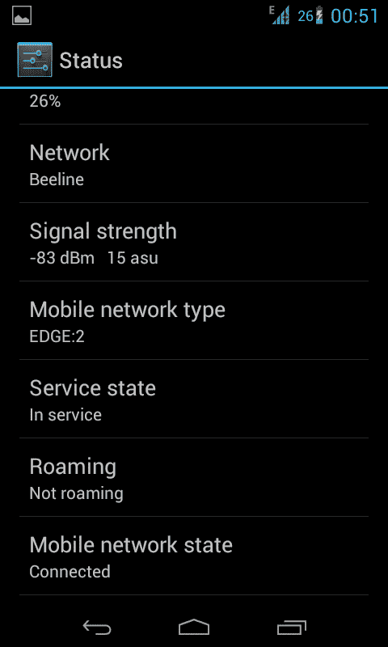
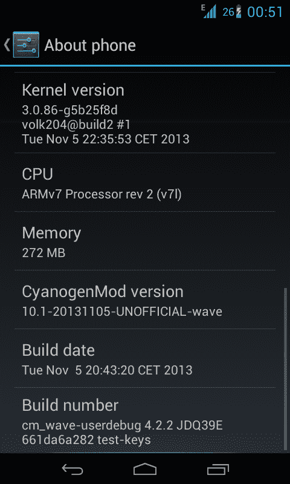

# Bada 上的 Android 现在比以往功能更强大

> 原文：<https://www.xda-developers.com/android-on-bada-now-more-functional-than-ever/>

Bada 是三星在 2009 年末随 Wave 系列发布的一款不太知名的操作系统。最终，这个操作系统在 2013 年从积极开发中退出，并由 [Tizen](http://en.wikipedia.org/wiki/Tizen) 取代。相对而言，开发人员很快意识到他们可以在 Wave 设备上安装另一个操作系统，但移植不同的操作系统是一项极其困难和耗时的任务，因为几乎所有的驱动程序都需要重写。但这里是 XDA，我们的字典里显然没有*不可能*这个词。

[几个月前](http://www.xda-developers.com/android/the-android-on-bada-project-takes-a-huge-step-forward/)，我们报道了将 Android 引入三星 Wave 设备的重大进展。现在，由于 XDA 资深成员 [volk204](http://forum.xda-developers.com/member.php?u=3807917) 和精英公认开发者 [Rebellos](http://forum.xda-developers.com/member.php?u=1767826) 所做的工作，这个名为 BadaDroid 的项目更加实用。最近的 2.1 版本的 ROM 修复了很多与 RIL 相关的问题。现在，只有 WCDMA 模式可用，设备可以直接从 SIM 卡读取联系人，消息，语音邮件号码。另一项新功能是接收彩信。这个版本仍然有一些 bug，但是列表越来越短，开发人员将其描述为测试版。也许 BadaDroid 很快就可以被视为日常司机的材料。

Volk204 很友好地提供了一些截图，以显示 RIL 几乎正在全力以赴地工作，并且项目正朝着正确的方向发展。

 

如果你对 Bada 的体验不是很好，不要犹豫，访问 [ROM 线程](http://forum.xda-developers.com/showthread.php?t=2400126)并在你的 Wave 上尝试 CyanogenMod 10.1。应该祝贺开发人员为突破以前的障碍所做的工作。