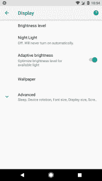

# Android Oreo 为主题引入命令行界面

> 原文：<https://www.xda-developers.com/android-oreo-command-line-themes/>

随着 Android Oreo 的推出，人们花了大量时间在源代码中寻找隐藏的好东西。过去，Android 工程团队曾讨论过在 Android O 中启用主题化。[我们在 5 月](https://www.xda-developers.com/google-preparing-enable-custom-themes-built-on-sony-rro-framework/)报道了 Android O 的第二个开发者预览版可能暗示了谷歌支持覆盖管理器服务(OMS)和运行时资源覆盖(RRO)，但现在我们可以肯定这是真的。Android Oreo now，*技术上的*，支持 OMS/RRO 主题，甚至提供了一个启用或禁用主题的界面，前提是你能忍受使用命令行。

更新:Substratum 已经在 dev 预览版中使用了这些命令，现在在 Oreo 中也使用了它们！

* * *

## RRO 和 OMS 是什么？

RRO 由索尼内部开发，用于索尼 Xperia 系列的主题功能。认识到它的重要性的开发者努力将它的支持扩展到其他 rom，随之而来的是在众多设备上的主题化——不仅仅是索尼设备。它巧妙地取代了应用程序运行时的资源，这种易用性在当时的其他主题化选项中是看不到的。这演变成了 OMS，也是由索尼内部开发的。著名的[图层管理器](https://play.google.com/store/apps/details?id=com.lovejoy777.rroandlayersmanager&hl=en)最初使用 RRO 主题，但是 OMS 后来被改编成现在所知的 Substratum，并且是现在我们论坛上用户最熟悉的主题框架。我们论坛上的 OMs 提交的 rom 意味着他们支持底层的标准主题引擎。底层中的“遗留模式”使用 RRO 主题化。

* * *

## 安卓奥利奥推出主题命令

看起来 Google 现在希望在 AOSP 完全支持这种主题类型，可能会转向一个完全的、系统支持的主题管理器。在 Android Gerrit 上，Google 在最近几个月(和 Android Oreo)做了一些改变，建议在系统范围内启用主题引擎。下面是这些更改，以及它们各自提交的链接。

所有这些变化都意味着 Google 朝着未来将包含的某种形式的系统主题化应用的方向发展。上面列出的权限需要系统特权，因此意味着只有系统应用程序(或具有 root 访问权限的应用程序)可以调用此权限。尽管如此，这还是很有趣，因为它表明谷歌终于朝着某个目标努力了。

那么为什么 Android Oreo 只在技术上支持主题化呢？嗯，简单的答案是，虽然你可以调用安装主题的系统方法，但这样做将被证明是毫无意义的。这是因为，尽管您可以使用新的命令行界面来管理已安装的主题，但是如果没有 root 访问权限，您实际上无法安装新的主题，因为主题需要进入一个受用户空间限制的目录。有了 root 权限，你就可以简单地启用底层主题，所以没有必要用新的方式。谷歌还没有包括一个系统应用程序来主题化设备，所以在那之前，尝试用新包括的方式来做没有任何好处。

## 命令行主题界面

我们在 XDA 测试了运行 Android Oreo 版本的谷歌 Pixel 上的命令。我们决定测试一些命令，并首先使用

```
 cmd overlays list 
```

查看所有预安装的覆盖图。我们注意到了一个“com.google.android.theme.pixel”的存在，通过运行以下命令禁用它并启用“android.auto_generated_rro__”。

从这里可以看出，标准叠加被禁用，自动生成叠加被启用。再次运行我们的命令来查看我们安装的覆盖图，我们看到了下面的输出。

这就在我们的 Google Pixel 上产生了一个新主题的 Android 系统设置应用程序。请注意，上面的覆盖列表也包括使用 Substratum 安装的主题，我们能够轻松地启用/禁用这些。

 <picture></picture> 

auto_generated_rro Theme

我们在挖掘源代码时还发现了另一个命令。该命令如下所示

```
 cmd overlay dump  
```

给出了以下输出。

### 输出

设置

Android . auto _ generated _ rro _ _:0 {

mPackageName.......:android.auto_generated_rro__

穆瑟里德............: 0

mTargetPackageName。:安卓

mBaseCodePath......:/vendor/overlay/framework-RES _ _ auto _ generated _ rro . apk

mState.............:状态 _ 已启用

误使能.........:正确

错误的..........:正确

}

com . Google . Android . theme . pixel:0 {

mPackageName.......:com.google.android.theme.pixel

穆瑟里德............: 0

mTargetPackageName。:安卓

mBaseCodePath......:/vendor/overlay/Pixel/pixelthemeoverlay . apk

mState.............:状态 _ 禁用

误使能.........:错误

错误的..........:错误

}

默认覆盖图:com.google.android.theme.pixel

PackageInfo 缓存

2 个包装

因此，可以看出，谷歌已经投入了大量的工作，开发主题引擎，并将其集成到 AOSP 源。看起来如果在系统范围内添加，[主题将在系统 UI 调谐器](https://android.googlesource.com/platform/frameworks/base/+/97a06a12ed29fb72eb40d49b83333a9a6327222c/packages/SystemUI/src/com/android/systemui/tuner/ThemePreference.java)中启用。谷歌[也为原始设备制造商](https://android.googlesource.com/platform/frameworks/base/+/ea2f3be7aae9435ce21743c959b62731c87a36b8)提供了信息，所以有可能更多的原始设备制造商将来会在 Android Oreo 上启用基于 AOSP 版本的主题支持。

总的来说，这是一个非常令人兴奋的发展。主题化是将 Android 定义为一个完全可定制的手机操作系统的众多部分之一，即使它目前需要 root 才能进行系统范围的主题化。将来，如果它能够在没有根用户访问的情况下工作，这将是朝着用户自由的方向迈出的重要一步。当然，它可能会在系统 UI tuner 中被锁定一段时间(因为破损的主题会破坏应用程序)，但允许用户甚至首先利用原生主题支持是对移动操作系统的巨大补充。