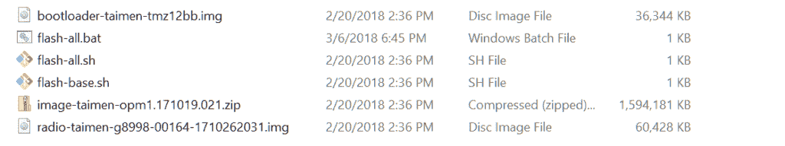
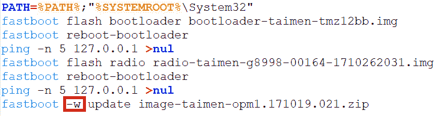
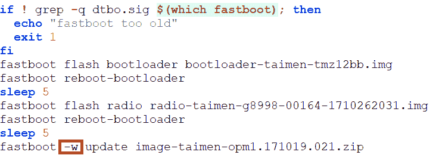

# Android P 开发者预览版 1 是为谷歌 Pixel/Pixel XL 和 Pixel 2/Pixel 2 XL 准备的

> 原文：<https://www.xda-developers.com/android-p-developer-preview-1-google-pixel-xl-pixel-2-xl/>

终于来了！Android 9.0，也称为 Android P，现在以首个 Android P 开发者预览版的形式从今天开始提供。这不会给你完整的 Android P 体验，因为它在很大程度上是一个正在进行中的工作(直到谷歌 I/O 才会完全公开)，但对于谷歌 Pixel、谷歌 Pixel XL、谷歌 Pixel 2 或谷歌 Pixel 2 XL 的幸运用户来说，你将是第一批看到 Android P 提供什么的用户。

该更新只能通过 OTA 文件和出厂映像安装。谷歌目前不会通过测试项目提供在线旅行社。关于如何安装 OTA 文件或工厂映像的说明可以在表格下方的源代码链接中找到，但是如果您安装了 Magisk 和/或 TWRP，那么向下滚动，因为我们有一个专门为您安装 Android P 更新的教程！

**警告:如果你正在你的设备上运行任何[底层](https://www.xda-developers.com/tag/substratum-tutorials/)主题，我们强烈建议你在进行 Android 9.0 更新之前禁用它们。这些主题是为 Android Oreo 设计的，可能会导致 Android P 版本的不匹配，所以为了确保顺利升级，你应该禁用底层主题，直到主题有机会更新它们。见这篇文章的第三部分关于如何禁用底层主题的说明。**

## 下载谷歌 Pixel/XL 和 Pixel 2/2 XL 的 Android P 开发者预览版

不幸的是，谷歌 Pixel C 似乎不会收到 Android P 版本，Nexus 5X 或 6P 也不会(尽管 Nexus 设备预计不会收到更新。)

[**Android P 开发者预览版 1 OTA 更新说明**](https://developers.google.com/android/ota)

[**Android P 开发者预览 1 工厂图片页面**](https://developers.google.com/android/images)

如果你安装了更新并注意到一些我们还没有发现的新东西，[给我们发送一个提示](https://www.xda-developers.com/tip-us/)，如果我们根据你的提示写了一篇文章，你就可以得到一个**免费的 XDA 无广告月**！另外，如果你安装了更新，一定要查看一下[反馈](https://developer.android.com/preview/feedback.html)和[错误报告](https://developer.android.com/preview/bug)页面。

## Android P 有什么新功能

根据官方页面，这是 Android 9.0 第一个开发者预览版的新功能列表

*   **显示剪切支持。**是的，不管你喜不喜欢，缺口都来了。Android P 将使开发者更容易测试他们的应用在带凹槽的设备上的表现。
*   通知的新外观。开发者可以展示图片和贴纸。它们还可以显示联系人姓名的完整对话，现在支持显示智能回复——类似于[回复应用](https://www.xda-developers.com/reply-google-smart-replies-twitter-hangouts-android-messages-facebook-messenger/)，但现在开发者更容易访问。

*   正如我们之前报道的，Android P 限制空闲应用程序访问[麦克风](https://www.xda-developers.com/android-p-audio-recording-limitations-privacy/)和[摄像头](https://www.xda-developers.com/android-p-background-apps-camera/)。他们还限制应用程序访问**所有 SensorManager 传感器**。
*   更多的视频和图像编解码器得到支持，如 HDR VP9 配置文件 2 和 HEIF。
*   多摄像头 API 因此 Android 应用程序可以同时从多个摄像头传感器请求数据。
*   用于位图和绘图的 ImageDecoder 提供了一种现代化的图像解码方法。应该优先于 BitmapFactory。
*   **Wi-Fi RTT** (往返时间)，允许 app 以 1-2 米的精度获取**室内定位数据**。
*   改进了 Android 运行时(ART)和用 T2 Kotlin 编写的应用程序的性能。
*   对**瞌睡、待机和背景限制**的改进。Job Scheduler 现在还可以检查网络状态信息，将应用程序的网络请求一起批处理。
*   [对非 SDK APIs 的限制](https://www.xda-developers.com/google-undocumented-hidden-apis-android-p/)，正如我们之前所报道的。
*   针对早于 Android 4.2 平台的应用程序在安装到 Android P 上时会显示一个警告框。这是为了鼓励开发人员迁移到更新的 SDK 版本，为[新的 Google Play 限制](https://www.xda-developers.com/play-store-updated-requirements-api-level-64-bit/)做准备。
*   统一的**指纹认证对话框**。
*   **Android 数据备份的客户端加密**。现在需要输入用户的 PIN/密码/模式才能恢复设备备份。
*   新的**神经网络 API** 版本 1.1
*   用于 NFC 支付和安全交易的 OpenMobile API (OMAPI)

当然，还有更多。我们推荐你看一下[预览站点](https://developer.android.com/preview/index.html)、[时间轴](https://developer.android.com/preview/overview.html)、[新特性和 API 概述](https://developer.android.com/preview/api-overview.html)、 [API 参考页面](https://developer.android.com/reference/packages.html)、 [API 28 支持库](https://developer.android.com/topic/libraries/support-library/revisions.html)。

## Android 9.0 中的新(未宣布的)特性的简短列表

多亏了 Android 开源项目，我们有可能一瞥谷歌正在为下一个 Android 版本所做的部分工作。虽然 Android 9.0 的大部分代码都在谷歌的内部 gerrit 中，但我们已经能够从公开的 gerrit 中发现一些有趣的东西。我们不会重复每一个发现，我们会反向链接第一个开发者预览版中已经确认的所有文章。

这绝不是一个全面的列表。当我们在自己的设备上安装 Android 9.0 预览版时，我们将挖掘它，以找到更多有趣的功能来与我们的读者分享。

## 如何在根设备上安装 Android P 开发者预览版 1

如果你在你的 [Google Pixel](https://www.xda-developers.com/tag/google-pixel/) 、 [Google Pixel XL](https://www.xda-developers.com/tag/google-pixel-xl/) 、 [Google Pixel 2](https://www.xda-developers.com/tag/google-pixel-2/) 或 [Google Pixel 2 XL](https://www.xda-developers.com/tag/google-pixel-2-xl/) 和[上运行 Android 8.1 Oreo，你是 Magisk](https://www.xda-developers.com/magisk-16-bootloop-crash-fix-huawei-honor-support/) 的根用户，那么你可能想知道如何才能更新到 Android 9.0 (Android P)。作为 rooted 用户有可能接受 OTA 更新吗？是的，但是那取决于几个因素。你曾经修改过/system 或/vendor 中的任何东西吗？你只安装了 Magisk 而没有安装 TWRP 吗？你同时安装了 Magisk 和 TWRP 吗？根据你对这些问题的回答，你要做的事情会有很大的变化。

幸运的是，如果使用工厂映像进行更新，您不必担心上述任何场景中的差异。我个人总是使用最新的工厂图像更新我的设备，这是一种简单的方法，可以解释所有的变化。只要你运行**股票安卓 8.1 奥利奥**，你甚至可以更新**而不必擦除你的数据**。然而，如果你运行的是定制的 ROM，那么你**将**不得不擦除数据——所以请记住这一点，并在继续之前将/data 包括/data/media 的全部内容备份到你的 PC 上。最后，你还需要确保你的机器已经安装了 [ADB/Fastboot 二进制文件](https://www.xda-developers.com/google-releases-separate-adb-and-fastboot-binary-downloads/)。我们有一个关于如何做的教程[在这里](https://www.xda-developers.com/install-adb-windows-macos-linux/)。

以下是安装 Android P Developer Preview 1 更新需要遵循的步骤:

1.  从上表中的链接之一或从整个页面下载最新的 P Developer Preview factory 映像。确保你正在为正确的设备下载正确的图像(例如，谷歌 Pixel 2 XL 图像不能在 Pixel 2 上工作)！
2.  提取工厂图像 zip 文件。
3.  在该文件夹中，您将看到几个文件:一个引导加载程序映像、一个无线电映像和另一个 zip 文件，其中包含系统、引导、供应商和其他将被更新的分区。你还会看到一个`flash-all.bat`和一个`flash-all.sh`。<picture></picture>

    举例:Google Pixel 2 XL Android 8.1 奥利奥 3 月安全补丁工厂图片内容。

4.  **窗口:**右键点击 **flash-all.bat** ，点击**编辑**。(强烈推荐你用 NotePad++。)查找“`fastboot -w update`”行。从该行删除-w 并保存文件。这将允许您在不擦除数据的情况下刷新工厂映像。如果您正在运行一个定制的 ROM 并且想要更新，那么您必须在命令中保留-w。<picture></picture>

    举例:flash-all.bat 的内容来自 Android 8.1 奥利奥 3 月针对 Google Pixel 2 XL 的安全更新。

5.  **Windows:** 双击`flash-all.bat`让它运行。它将一次刷新一个分区。这将需要几分钟时间，所以让它运行。
6.  **Mac/Linux:** 在文本编辑器中编辑`flash-all.sh`脚本，**删除“`fastboot -w update`行中的-w** 。保存文件。这使您可以在不丢失数据的情况下刷新工厂映像。但是，如果您正在运行自定义 ROM，那么您必须在命令中保留-w。<picture></picture>

    举例:flash-all.sh 的内容摘自 Pixel 2 XL 运行 Android 8.1 Oreo

    的三月安全更新
7.  **Mac/Linux:** 打开与`flash-all.sh`脚本同目录的终端，输入`chmod +755 flash-all.sh`使其可执行
8.  **Mac/Linux:** 在终端输入`./flash-all.sh`运行脚本。覆盖每个分区需要一些时间，所以就让它坐着做自己的事吧。
9.  如果你移除了-w 标志，你最终应该引导进入 Android P，并且所有数据都完好无损。

感谢第一个 Android P 开发者预览版，在您的 Google Pixel、Pixel XL、Pixel 2 或 Pixel 2 XL 上享受 Android 9.0 的第一次体验！如果你想知道更新中有什么新内容，请继续关注我们的 [Android P](https://www.xda-developers.com/tag/android-p/) 标签，我们将深入发布，寻找 Android 9 中的新内容！