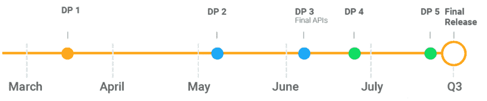

# 以下是谷歌 Pixel/XL & Pixel 2/XL[第二部分]在 Android P DP1 中的所有新特性

> 原文：<https://www.xda-developers.com/android-p-dp1-google-pixel-xl-pixel-2-xl-minor-features/>

很大程度上被认为是在圆周率日(3 月 14 日)宣布，Android P 开发者预览版 1 于本周 3 月 7 日[意外推出](https://www.xda-developers.com/android-p-developer-preview-1-google-pixel-xl-pixel-2-xl/)。第一个 Android P 预览版支持 Google Pixel、Google Pixel XL、Google Pixel 2 和 Google Pixel 2 XL，遗憾的是，它放弃了对 Google Pixel C、Google Nexus 5X 和 Google Nexus 6P 的支持。Android P 有很多变化，随着后续开发者预览版的发布，还会有更多变化。

 <picture></picture> 

Android P Release Timeline. Source: [Google](https://developer.android.com/preview/overview.html).

我们一直在挖掘 Android P DP1，以了解该版本的所有新内容。我们关于[新特性](https://www.xda-developers.com/everything-new-android-p-developer-preview/)的第一篇文章几乎涵盖了新版本中的所有重要内容，但和往常一样，还是有一些细微的变化逃过了我们最初的评估。因此，这篇文章将涵盖我们在第一次讨论中没有提到的其他特性。

在我们开始之前，我将链接几个帖子，如果你想了解 Android P Developer Preview 1 中的新功能，我建议你阅读这些帖子。我不会重复之前的帖子，所以如果你对其中一个话题感兴趣，我建议你读一读:

最后，如果你有兴趣讨论 Android P 的新变化，[请在我们的讨论帖](https://www.xda-developers.com/android-p-developer-preview-discussion/)中发表评论。现在，让我们开始吧。

* * *

## 谷歌 Pixel/XL 和 Pixel 2/2 XL 的 Android P DP1 的微小变化

### 智能电池管理器

先说一个我在其他地方没见过提到的东西:Android P 的智能电池管理器。这不是一个您可以切换的特性(至少，不是没有一点欺骗)，因为它应该在您没有意识到的情况下工作。默认情况下，该功能是激活的，它的作用是“根据使用情况自动调整应用程序的用电量”如果您发出下面的 ADB 命令，您可以公开这个特性的接口(尽管您没有真正的理由想要这样做):

```
 adb shell settings put global app_standby_enabled 0 
```

### 充电声音管用，还可以自定义！

当我收到我的 [OnePlus 5](https://www.xda-developers.com/oneplus-5-xda-first-impressions-upgrade/) 时，我喜欢 OxygenOS 的一个小方面是当你将手机插入兼容的充电器时，它会发出整齐的[快速充电](https://www.xda-developers.com/charging-comparison-oneplus-huawei/)声音。虽然我在那部手机上切换到了 [LineageOS 15.1](https://www.xda-developers.com/lineageos-15-android-oreo-officially-announced/) ，但由于快速修改，我仍然可以使用那个音频文件来播放我的充电声音。不幸的是，这在我运行 Android Oreo 的非 root 谷歌 Pixel 2 XL 上不起作用，因为不管出于什么原因，Oreo 中的充电声音只在手机无线充电时播放...这是最初的 Google Pixel 和 Pixel 2 都不支持的。

幸运的是，Android P 开发者预览版 1 已经改变了这一点。如果您在“设置”下的“声音”偏好设置中切换充电声音，现在当您连接充电器时，您将听到快速的声音。更好的是，你现在可以定制这种声音...至少是非正式的！

一个简单的 ADB 命令和一个你选择的音频文件就是你所需要的。如果你想要一个例子，我已经上传了 OxygenOS 的股票 Dash Charge 声音供你尝试。

[**下载一加突进冲锋声**](https://www.androidfilehost.com/?fid=890129502657589530)

解压缩上述音频文件，并将其放在您的 Google Pixel 或 Pixel 2 的内部存储中的任何位置(我选择了根目录作为示例。)然后，在命令提示符或终端中，输入以下内容:

```
 adb shell settings put global wireless_charging_started_sound /sdcard/DashChargingSound.ogg 
```

将“/sdcard/DashChargingSound.ogg”替换为插入手机时想要播放的任何其他音频文件的路径。我还没有对此进行全面测试，以了解在您可以播放哪些音频文件方面有什么限制，所以如果不是每个文件都有效，请不要感到惊讶。

(有趣的是，该偏好名为“wireless _ charging _ started _ sound ”,这表明谷歌打算让该功能只与 Android Oreo 中的无线充电功能配合使用，但他们尚未将该偏好分为单独的 P 选项。)

### 系统界面调谐器已经不在了，但是你仍然可以自定义锁屏快捷键和导航栏

在之前的 Android 版本中，谷歌在设置中有一个隐藏的“系统界面调谐器”菜单。这个菜单是通过下拉状态栏并长按设置按钮来访问的。然而，在 Android P 中，SystemUI Tuner 不再能够以这种方式访问。我们不确定是否有其他方式访问它(我们正在等待 P DP1 源代码下降以确认)，但几乎所有的功能仍然可以非官方访问。

例如，以前在系统 UI 调谐器中发现的功能，如[锁屏快捷方式定制](https://www.xda-developers.com/customize-lockscreen-shortcuts-android-oreo/)、[导航栏调谐器](https://www.xda-developers.com/customise-the-navigation-bar-android-oreo/)和状态栏图标控制，仍然可以通过 ADB 访问。如果你不想在这里与亚行发生冲突，那么你可以通过使用 XDA 论坛主持人[za chare 1](https://forum.xda-developers.com/member.php?u=7055541)的名副其实的 [SystemUI Tuner app](https://forum.xda-developers.com/android/apps-games/app-systemui-tuner-t3588675) 来规避这个要求。

他的应用程序应该足以控制状态栏图标和锁屏快捷方式，尽管不幸的是它不允许你控制导航栏。为此，我会推荐你获取 XDA 资深会员 [paphonb](https://forum.xda-developers.com/member.php?u=6018897) 的[自定义导航条](https://forum.xda-developers.com/android/apps-games/app-custom-navigation-bar-customize-t3590967)应用的最新测试版更新。有了这个应用程序，你可以交换后退和最近键，或者得到一个更紧凑的[导航条](https://www.xda-developers.com/google-pixel-2-xl-owner-compact-navigation-bar-oneplus-5t/)，或者做更多的事情。

### 建议隐藏的通知

如果你是那种不断拒绝某个应用程序的通知，但从未停下来想一想也许你应该完全阻止那个应用程序的通知的人，这个功能似乎很有用。似乎在拒绝通知足够多次后，Android P 会问你是否想要完全阻止通知。我在 APK 拆卸新的谷歌系统界面应用程序时发现了这一功能的证据，但是来自 T2 ArsTechnica 的 Ron Amadeo 在实际操作中找到了一些真实的例子。

希望 Android P 不会在你告诉它你不感兴趣后一直要求你阻止来自应用程序的通知。

### 开车时自动打开蓝牙

隐藏在开发者选项中，有一个有趣的新菜单叫做“特性标志”在中，您可以切换一些开发中的功能。其中一个名为“设置 _ 蓝牙 _ 当 _ 驾驶”，当启用时，会在连接偏好设置中显示一个名为“驾驶时使用蓝牙”的新切换这个特性非常简单明了，但它是你从自动化应用程序如 [Tasker](https://www.xda-developers.com/tasker-joao-dias-autoapps-development/) 中期待的那种东西。虽然，Android Oreo 为 Wi-Fi 连接引入了一个[类似的功能，所以看到蓝牙有这样的功能并不奇怪。](https://www.xda-developers.com/turn-on-wifi-automatically-nexus5x-nexus6p/)

不幸的是，这个新特性现在可能还不能工作。我在运行第一个 Android P 开发者预览版的谷歌 Pixel 2 XL 上启用了它，但我从未注意到前几天开车时蓝牙会自动打开。如果你尝试了这个功能，并发现它对你有用，请在下面的评论中告诉我，因为我很乐意在这个问题上出错。

### 滑动时锁屏图案轨迹隐藏

尽管许多新的 Android 智能手机都采用了新的、更奇特的解锁方式，如[虹膜扫描仪](https://www.xda-developers.com/iris-scanners-native-support-android-p/)或[面部识别](https://www.xda-developers.com/samsung-galaxy-s9-intelligent-scan-face-unlock-iris-scanner/)，但许多用户仍然更喜欢 Android 的一套原生认证方法:PIN、密码或模式。不幸的是，模式锁早就有一个缺陷:任何人看你的屏幕都可以很容易地看到你的模式。像 [LineageOS](https://www.xda-developers.com/lineageos-15-feature-list-overview-screenshots-video/) 这样的定制 rom 早就有隐藏锁屏模式痕迹的功能，但现在看来 Android P 将天生具有这样的功能。

*感谢枪手*

### 暂时禁用指纹认证的锁定选项

如果你进入“设置”中的“安全与位置”，然后点击“锁屏偏好设置”，有一个名为“显示锁定选项”的开关此开关在电源菜单中添加了一个新按钮，当点击该按钮时，会锁定手机并禁用指纹验证，直到您使用备用 PIN、密码或模式解锁。

这个按钮显然也关闭了“扩展访问”，但我还不完全确定那是什么。

### 闹钟快速设置磁贴显示下一个闹钟，让您快速添加新的闹钟

快速设置磁贴接受了重大的设计改进，最有争议的改变可能是你不能再扩展磁贴了。然而，并不是所有的改变都是不好的，因为新的闹钟快速设置磁贴有一些非常有用的功能。首先，它可以显示离下一次闹铃的时间。其次，你可以点击它来查看即将到来的警报。最后，你可以长按它来设置一个新的闹钟。

这绝不是一个主要功能，但对于我们这些喜欢极简主屏幕的人来说，这当然是受欢迎的。

### 画中画窗口为设置添加快捷方式

Android Oreo 最大的新功能之一是画中画模式，随着 Android P 的推出，它得到了一个小小的可用性调整，以帮助新用户了解如何在不费力设置的情况下禁用它。如果你点击画中画窗口，有一个新的设置轮齿，带你到应用程序的权限页面，以禁用画中画权限。

* * *

这就是值得注意的，易于使用的面向用户的功能。在未来的一篇文章中，我将深入探讨我发现的 Android P 开发者预览版中的一些隐藏的东西。在此之前，请享受您的 Google Pixel、Google Pixel XL、Google Pixel 2 或 Google Pixel 2 XL 的最新更新！