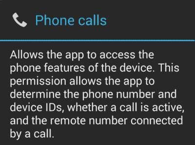

# Android P 中的新权限组使得应用程序何时想读取通话记录或电话号码变得很清楚

> 原文：<https://www.xda-developers.com/android-p-read-call-log-phone-number/>

Android Developer Preview 3(Android P Beta 2)[刚刚取消了](https://www.xda-developers.com/android-p-developer-preview-3/)，随之而来的是一系列的变化——大部分是在幕后。虽然有一些面向用户的更改，但几乎所有的更改都是为最终版本做准备。更新的最大部分是最终确定的 API，这意味着您现在可以构建一个针对 API 28 的应用程序，Android P。在开发者预览版 3 中，添加了一个新的权限组。这个权限组专门针对 Android 通话记录，这意味着当应用程序想要读取您的通话记录或电话号码时，会显示一条突出的面向用户的消息，告诉他们他们正在授予应用程序什么样的访问权限。

首先，当请求新的 CALL_LOG 权限组中的任何权限时，用户将看到这些新的字符串。

```
 <string name="permgroupdesc_calllog">read and write phone call log</string>
<string name="permgrouprequest_calllog">Allow &lt;b>%1$s&lt;/b> to access your phone call logs?</string> 
```

 <picture></picture> 

The permission box that appeared when requesting READ_CALL_LOG, which was previously under the PHONE permission group.

这将如何影响现有的应用程序？Android 使用标记为“危险”的权限分组来管理授予应用程序的访问级别，并选择向用户显示的消息。以前，READ_CALL_LOG 和其他呼叫日志相关的权限显示为一般“访问设备的电话功能”对话的一部分，但该消息非常模糊。不仅如此，还可以说它与你的手机通话记录无关。Android P Developer Preview 3 已经将所有与呼叫日志相关的权限重新分组到一个全新的组中，该组被适当地称为 CALL_LOG，以便当应用程序请求它时，会出现一个更合适的消息。

根据 Android P 开发人员预览文档，如果应用程序需要访问呼叫日志或处理呼出呼叫，它们将需要从 CALL_LOG 组显式请求 CALL_LOG、READ_CALL_LOG、WRITE_CALL_LOG 或 PROCESS_OUTGOING_CALLS 权限。此外，开发人员需要考虑用户何时拒绝应用程序访问通话记录信息。

你也可以从下面反编译的 Android 框架中找到新的权限分组。

```
 <permission-group android:description="@string/permgroupdesc_calllog" android:icon="@drawable/perm_group_phone_calls" android:label="@string/permgrouplab_calllog" android:name="android.permission-group.CALL_LOG" android:priority="450" android:request="@string/permgrouprequest_calllog"/>
<permission android:description="@string/permdesc_accessImsCallService" android:label="@string/permlab_accessImsCallService" android:name="android.permission.ACCESS_IMS_CALL_SERVICE" android:protectionLevel="privileged|signature"/>
<permission android:description="@string/permdesc_readCallLog" android:label="@string/permlab_readCallLog" android:name="android.permission.READ_CALL_LOG" android:permissionGroup="android.permission-group.CALL_LOG" android:protectionLevel="dangerous"/>
<permission android:description="@string/permdesc_writeCallLog" android:label="@string/permlab_writeCallLog" android:name="android.permission.WRITE_CALL_LOG" android:permissionGroup="android.permission-group.CALL_LOG" android:protectionLevel="dangerous"/>
<permission android:description="@string/permdesc_processOutgoingCalls" android:label="@string/permlab_processOutgoingCalls" android:name="android.permission.PROCESS_OUTGOING_CALLS" android:permissionGroup="android.permission-group.CALL_LOG" android:protectionLevel="dangerous"/> 
```

* * *

[**来源:Android P 开发者文档**](https://developer.android.com/preview/behavior-changes#privacy-changes-all)