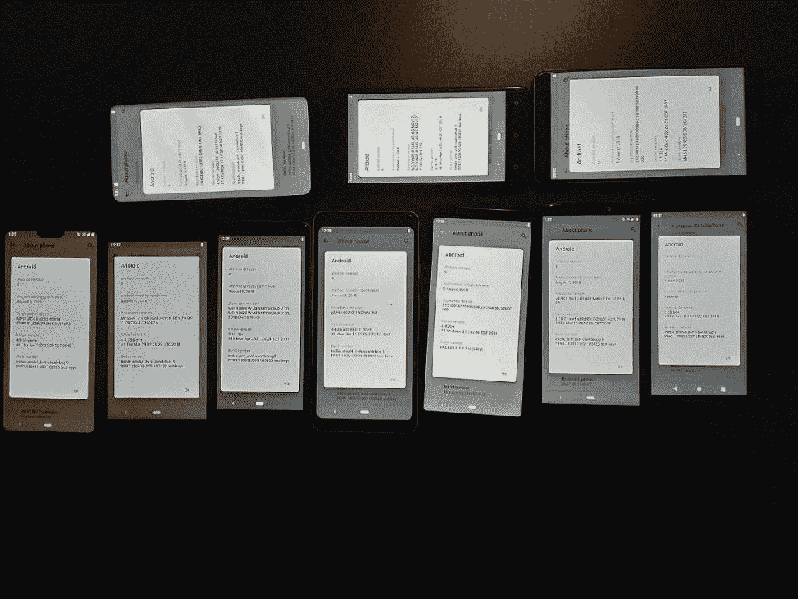

# Android 馅饼 GSI 现在可用于项目高音启用设备

> 原文：<https://www.xda-developers.com/android-pie-gsi-project-treble/>

当谷歌第一次宣布 Android 8.0 奥利奥的 Treble 项目时，社区中有人怀疑 Treble 在为 Android 设备带来更快更新方面的有效性。在看到 Treble 如何帮助[启动定制开发流程](https://www.xda-developers.com/how-project-treble-revolutionizes-custom-roms-android-oreo/)，让受支持的设备能够启动 [AOSP 通用系统映像](https://www.xda-developers.com/flash-generic-system-image-project-treble-device/) (GSI)之后，Treble 支持对 Android 生态系统的益处毋庸置疑。Android P [beta 计划](https://www.xda-developers.com/android-p-beta-program-is-now-available/)的宣布，为 7 款非谷歌设备带来了开发者预览，平息了人们对 Treble 有效性的任何疑虑。现在 Android 9 Pie [已经是官方的](https://www.xda-developers.com/android-pie-google-pixel-google-pixel-2/)并且它的[源代码已经上传](https://www.xda-developers.com/android-pie-source-code-aosp/)到 AOSP，开发者可以从源代码开始为所有支持三重功能的设备构建 GSI。

事实上，XDA 认可的开发者 [phhusson](https://forum.xda-developers.com/member.php?u=1915408) ，这位开发了第一个社区构建的 GSI 的开发者[使得在华为 Mate 9 上启动 AOSP](https://www.xda-developers.com/stock-android-oreo-huawei-mate-9-project-treble/) 成为可能，现在已经发布了他的第一个源代码构建的 Android Pie GSI。与只支持高通骁龙设备的所谓的“[半 GSI](https://www.xda-developers.com/android-p-beta-port-snapdragon-project-treble-devices/) ”相比，phhusson 的 ROM 涉及的黑客攻击要少得多，因为系统映像是基于 AOSP 而不是谷歌 Pixel 的系统映像。因此，phhusson 的 GSI 已经被证实支持来自 4 个 SoC 供应商的 13 种不同的设备——这只是列出了 phhusson 和我自己可以直接访问的设备。

 <picture></picture> 

phhusson's collection of Project Treble-compatible smartphones, all running his Android 9 Pie GSI

大多数 Project Treble 兼容的智能手机或平板电脑带有解锁的 bootloader(意味着，[没有新的华为或 Honor 设备](https://www.xda-developers.com/huawei-stop-providing-bootloader-unlock-codes/))应该可以安装这个 Android 9 Pie GSI。任何搭载 Android 8.0 Oreo 或更新版本的设备都支持 Treble，就像制造商升级到 Oreo 并支持 Treble 的任何设备一样，如这里列出的。(您可以按照我们的指南通过[来检查您的设备是否支持 Project Treble。)目前，ROM 是相当准系统的，因为它是第一个公开发行的版本，只是为了测试稳定性。这里有一个表格，是我根据被测试的设备、它们的 SOC、它们的 Android 操作系统版本以及每种设备的已知缺陷编辑的。](https://www.xda-developers.com/project-treble-android-oreo/)

| 

设备名称

 | 

社会学

 | 

原始操作系统/当前操作系统

 | 

已知错误

 |
| --- | --- | --- | --- |
| Allview V3 Viper | 联发科 MT6737 | 安卓 8.0 奥利奥 | 热点，NFC，RIL |
| 黑景 A320 | 联发科 MT6580M | 安卓 8.1 奥利奥 Go 版 | 热点，NFC |
| 方块 X18 加 | 联发科 MT6750T | 安卓 8.0 奥利奥 | 热点，NFC，RIL |
| 谷歌像素 2 XL | 高通骁龙 835 | 安卓 8.0 奥利奥/安卓 9 派 | 热点、NFC、Android 9 厂商 |
| 荣誉观 10 | 希西林 970 | 安卓 8.0/8.1 奥利奥(视市场而定) | 热点，NFC |
| 华为 Mate 9 | 希西林 960 | 安卓 7.0 牛轧糖/安卓 8.0 奥利奥 | 热点，NFC |
| 华为 Mate 10 Pro | 希西林 970 | 安卓 8.0 奥利奥 | 热点，NFC |
| 库尔尼彩虹 | 联发科 MT6580A | 安卓 8.1 奥利奥 Go 版 | 热点，NFC |
| 摩托罗拉摩托 E5 | 高通骁龙 425 | 安卓 8.0 奥利奥 | 热点、NFC、各种图形故障 |
| 一加 5 | 高通骁龙 835 | 安卓 7.1 牛轧糖/安卓 8.1 奥利奥 | 热点、NFC、AOSP 摄像头 |
| 一加 6 | 高通骁龙 845 | 安卓 8.1 奥利奥/安卓 9 派(测试版) | 热点、NFC、Android 9 厂商 |
| Razer 手机 | 高通骁龙 835 | 安卓 7.1 牛轧糖/安卓 8.1 奥利奥 | 热点、NFC、前置摄像头 |
| 三星 Galaxy S9+ | Exynos 9810 | 安卓 8.0 奥利奥 | 热点，NFC |

## 下载并安装 Android 9 馅饼 GSI 项目高音启用设备

你可以找到指向论坛主题的链接，在那里你可以找到下载 Android 9 Pie 系统映像的链接，如何刷新映像的说明，当前的错误列表等等。请记住，ROM 中没有捆绑 Google Play 应用程序或服务，所以不要指望它会成为你的日常驱动程序。一旦 AOSP GSI 更加稳定，其他开发者将开始移植他们的定制 ROM 框架，所以你将开始得到更多功能丰富的 GSI。截至目前，共有 [19 款基于 AOSP 安卓 8.1 奥利奥的定制 GSI](https://github.com/phhusson/treble_experimentations/wiki/Generic-System-Image-%28GSI%29-list)。

[**下载 AOSP 安卓派 GSI 作项目高音设备**](https://forum.xda-developers.com/project-treble/trebleenabled-device-development/aosp-9-0-phh-treble-t3831915)

[**访问 XDA 项目三宝论坛**](https://forum.xda-developers.com/project-treble/trebleenabled-device-development)

*注意:如果你的设备[支持无缝更新的 A/B 分区](https://www.xda-developers.com/list-android-devices-seamless-updates/)，你将需要刷新 A/B GSI 而不是只有 A 的 GSI。*

虽然我们是 GSIs 的忠实粉丝，但是如果你的设备有 Android 9 Pie 定制 ROM，你应该安装一个。(然而，并不是每个设备都有专门的开发人员社区支持，所以 GSI 是支持较少的设备的用户体验定制 rom 的好方法。)以下是我们已经在门户网站上介绍过的基于 Android Pie 的定制 rom 的简短列表，随着我们清理积压，还会有更多内容: