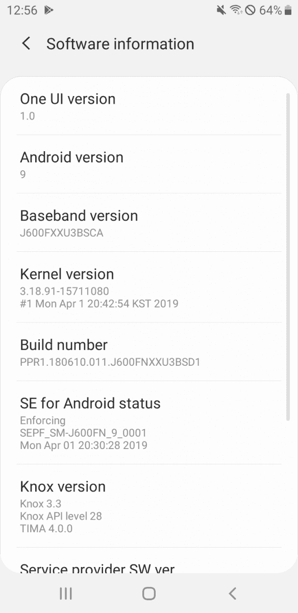

# 只有一个用户界面的安卓派推出了三星 Galaxy Tab S4 和 Galaxy J6

> 原文：<https://www.xda-developers.com/android-pie-one-ui-samsung-galaxy-tab-s4-galaxy-j6/>

2019 年标志着三星移动部门方向的巨大转变。虽然他们的 2018 年旗舰产品因看起来与他们的前辈惊人地相似而受到一些批评，但三星失去了对 2019 年智能手机创新的恐惧: [Galaxy S10 系列](https://www.xda-developers.com/samsung-galaxy-s10-s10-and-s10e-launch-with-the-snapdragon-855-ultrasonic-in-display-fingerprint-scanners-reverse-wireless-charging-and-a-whole-lot-more/)使用 Infinity-O 打孔显示屏作为凹口的替代物，他们的新 [Galaxy A 智能手机](https://www.xda-developers.com/samsung-galaxy-j-renamed-galaxy-a/)使用泪珠凹口，[最近宣布的 Galaxy A80](https://www.xda-developers.com/samsung-galaxy-a80-rotating-camera/) 全力以赴，进入了一个新的 Infinity 无边框显示屏和电动旋转弹出式摄像头的独特领域。One UI 是他们基于 Android Pie 的最新定制皮肤，也代表了与三星之前的三星体验皮肤截然不同的体验。

[**银河标签 S4 XDA 论坛**](https://forum.xda-developers.com/galaxy-tab-s4)

在最初推出包括几款三星旗舰产品，包括 Galaxy S9、Galaxy Note 9、Galaxy S8、Galaxy Note 8 和 Galaxy Note FE/Note 7，甚至包括 Galaxy J8 等某些廉价设备之后，三星新的 One UI 界面现在正在向其他设备扩展。这包括三星的旗舰平板电脑 Galaxy Tab S4，以及三星去年最受欢迎的廉价设备之一 Galaxy J6。

 <picture></picture> 

Galaxy J6

这两款设备的更新包括最新的 Android Pie 版本和其中包含的所有新功能，以及一个 UI 中包含的所有[预期的 UI 变化。这里一个值得注意的遗漏是最新的](https://www.xda-developers.com/samsung-one-ui-review-android-pie-galaxy-s9-galaxy-note-9/)[2019 年 4 月安全补丁](https://www.xda-developers.com/april-2019-android-security-google-pixel-essential-phone/)，因为 Galaxy Tab S4 和 Galaxy J6 都收到了[2019 年 3 月安全补丁](https://www.xda-developers.com/march-2019-android-security-pixel-essential/)。

这两款设备的 Android Pie 更新现在正在某些市场以无线方式向用户推出，可能需要一段时间才能到达全球用户。你总是可以选择下载固件和侧载，但如果你不想与 Odin 乱搞，你最好的选择是寻找即将到来的 OTA 更新到你的设备。

* * *

[**来源 1:银河 Tab S4 XDA 论坛**](https://forum.xda-developers.com/galaxy-tab-s4/how-to/android-pie-avaiable-xef-france-t3920408) [**来源 2: SamMobile**](https://www.sammobile.com/2019/04/11/samsung-releases-galaxy-j6-2018-android-pie-update/)