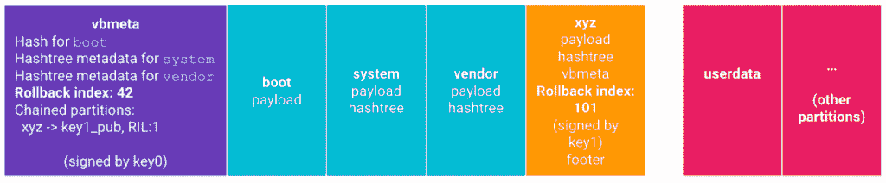

# 使用 Android Pie 的手机需要 Android Oreo 的回滚保护

> 原文：<https://www.xda-developers.com/android-pie-rollback-protection/>

Android Pie (Android 9) [今天刚刚上线](https://www.xda-developers.com/android-pie-google-pixel-google-pixel-2/)谷歌 Pixel，谷歌 Pixel 2，[甚至](https://www.xda-developers.com/essential-phone-android-pie-android-9/)基本手机。我们正在尽可能多地从采访中了解该版本(谷歌 Pixel 3 [将只有手势导航](https://www.xda-developers.com/google-pixel-3-will-only-offer-gesture-navigation-and-not-standard-buttons/)！)、 [AOSP 代码降](https://www.xda-developers.com/android-pie-source-code-aosp/)，最后是兼容性定义文档(CDD)。我们今天早些时候发布了一个关于“重量级”应用的[新功能，但现在我们发现谷歌已经改变了他们对 Android Oreo 中引入的一个功能的措辞:](https://www.xda-developers.com/android-pie-ram-heavy-games-exit/)[回滚保护](https://www.xda-developers.com/android-oreo-rollback-protection/)。该功能是通过 [Android 验证启动 2.0](https://android.googlesource.com/platform/external/avb/) (也简称为验证启动)实现的，然而，OEM 并不需要在奥利奥版本中实现 AVB 2.0。现在，谷歌强制要求所有使用 Android Pie 的设备支持验证启动，并扩展回退保护。

## Android Oreo 中的回滚保护

该功能的要点是，如果它检测到你的手机被降级到一个更早的，现在未经批准的软件版本，该版本因安全漏洞而被认为是不安全的，它将阻止你的手机启动。一个稍微技术性一点的解释是，VBMeta 数据结构保存了引导分区的 hash 和系统和供应商分区的 hashtree 元数据，它使用回滚索引来拒绝具有较旧回滚索引的映像。

 <picture></picture> 

Rollback Protection in Android Verified Boot. Source: [Google](https://android.googlesource.com/platform/external/avb/#Rollback-Protection).

这一功能在谷歌 Pixel 2、Razer Phone 和 OnePlus 6 等设备上存在，但在三星 Galaxy S9 等许多其他设备上不存在(尽管三星确实在 Knox 中提供了自己形式的[回滚保护)。)现在，谷歌正在让任何安装了 Android Pie 的设备都必须具备这一功能。](https://developer.samsung.com/tech-insights/knox/platform-security)

## 在 Android Pie 中验证启动

根据兼容性定义文档中“设备完整性”部分的更新措辞，使用 Android 9 启动的设备必须支持验证启动。

### 9.10.设备完整性

以下要求确保了设备完整性状态的透明度。设备实现:

*   [C-0-1]必须通过系统 API 方法 persistentdatablockmanager . getflashlockstate()正确报告其引导加载程序状态是否允许刷新系统映像。FLASH_LOCK_UNKNOWN 状态是为从 Android 早期版本升级的设备实现保留的，在早期版本中不存在这种新的系统 API 方法。
*   [C-0-2]必须支持设备完整性的验证启动。

如果设备实施已经在早期版本的 Android 上启动，但不支持验证启动，并且不能通过系统软件更新添加对此功能的支持，则可以免除此要求。

...

*   [C-1-10]必须为 Android 使用的分区(如引导、系统分区)实施回滚保护，并使用防篡改存储来存储用于确定最低允许操作系统版本的元数据。
*   应对任何具有永久固件的组件(如调制解调器、摄像头)实施回滚保护，并应使用防篡改存储来存储用于确定最低允许版本的元数据。

正如您在最后两组要点中看到的，有一点需要注意。Android 使用的分区(引导、系统、厂商等)需要回滚保护。)但不适用于具有永久固件(调制解调器、摄像头等)的分区。).前一组分区是大多数安全漏洞被发现和修补的地方，所以很高兴看到保护这些分区是强制性的。然而，也有针对具有持久固件的分区的漏洞，所以我们不确定为什么 Google 不强制对它们进行回滚保护。

XDA 资深成员 [npjohnson](https://forum.xda-developers.com/member.php?u=5848265) 是 LineageOS 团队的成员，他推测，在具有持久固件的分区上要求回滚保护将需要辅助引导加载程序(SBL)和可扩展引导加载程序(XBL)的捆绑，因为这些分区是在引导过程中较早安装的。对于较小的原始设备制造商来说，实现定制的 xbl 来匹配定制的调制解调器和其他持久分区将是昂贵的，所以也许谷歌没有将这作为一项要求，以使设备制造商更容易满足 CDD 的最新要求。

## 如何检查你的手机是否支持 AVB 2.0

有两个亚行外壳命令，你可以用来检查你的手机是否支持 AVB 2.0。

```
 adb shell
dumpsys package | grep "verified_boot" 
```

运筹学

```
 adb shell
getprop | grep "avb" 
```

如果第一个命令的输出是“android.software.verified_boot ”,则支持 AVB 2.0。如果第二个命令的输出显示“[ro.boot.avb_version]”和“[ro.boot.vbmeta.avb_version]”，并列出每个命令的版本号，那么它是受支持的。

## 验证启动和定制开发

Android 验证启动并不会真正影响大多数定制 ROM 用户，尽管它确实增加了额外的安全层，在某些情况下你必须解决这个问题。例如，[刷新通用系统映像](https://www.xda-developers.com/flash-generic-system-image-project-treble-device/)需要禁用 AVB。在 OnePlus 6 上修改某些分区，比如 vendor，也需要禁用 AVB，[，我最近才知道](https://twitter.com/MishaalRahman/status/1024752271228383232)。根据 [npjohnson](https://forum.xda-developers.com/member.php?u=5848265) 的说法，正确实施的 AVB 2.0 使得定制的引导镜像可以与锁定的引导装载程序一起工作。我们将看到搭载 Android Pie 的设备上包含 AVB 2.0 会如何影响景观，但我们希望它不会导致类似小米红米 Note 5 Pro 社区最近出现的[砖块恐慌](https://www.xda-developers.com/miui-10-global-beta-8-7-5-anti-rollback-downgrade-brick-redmi-note-5-pro/)的情况。强制性的 AVB 2.0 只是谷歌[提高 Android 平台安全性](https://www.xda-developers.com/android-p-privacy-updates/)的另一种方式，但在我们看来，最大的变化是[OEM 协议的重新工作，以强制常规安全补丁](https://www.xda-developers.com/google-require-oem-regular-security-patches/)。